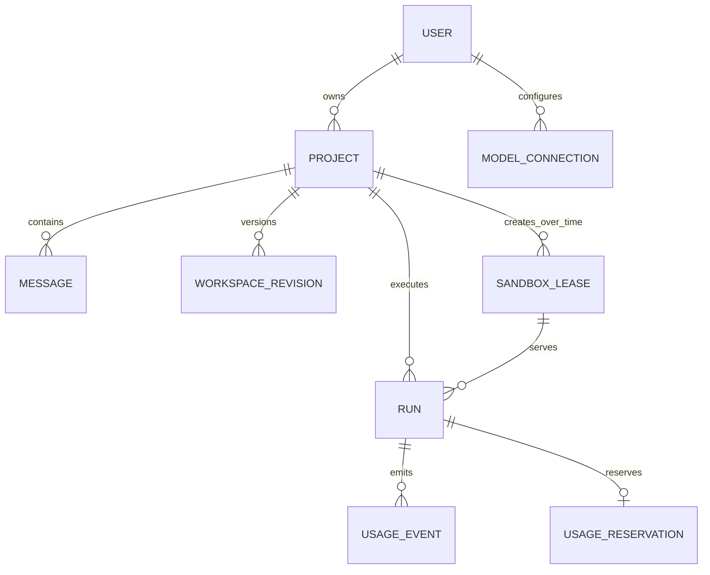

# Pi Online 领域术语

> 状态：架构基线 v0.2。这里定义产品语言、所有权和不变量，不替代实现代码或数据库迁移。

## 产品定义

Pi Online 是浏览器可访问的 Pi Coding Agent 产品。浏览器展示项目、消息、文件、终端和预览；Pi、shell、依赖安装和用户代码实际运行在远程 Linux 沙箱中。

第一版是单用户项目模型：每个登录用户直接拥有项目，不建立团队、组织或 Tenant 层。

## 核心术语

| 术语 | 定义 | 关键边界 |
| --- | --- | --- |
| `User` | 经 Better Auth 认证的人。 | 第一版所有资源直接归属 `user_id`。 |
| `Project` | 用户可恢复的代码项目，也是 UI 中用户进入的一次编码空间。 | 持久对象；保存消息、文件版本和沙箱历史。 |
| `Message` | 用户或 Pi 在某个 Project 中留下的一条持久化消息。 | 第一版不单独建 Thread；消息直接属于 Project。 |
| `SandboxLease` | 应用为 Project 分配的一次临时运行环境租约。 | 不是供应商的真实 sandbox ID；活动期最多一个。 |
| `Run` | Pi 对一条用户任务的实际执行。 | 绑定 Project、活动 SandboxLease、模型选择和用量预留。 |
| `WorkspaceRevision` | 项目工作区的一次不可变版本。 | 内容在 R2，指针和状态在 D1；沙箱磁盘不是事实来源。 |
| `SandboxRuntime` | 创建、恢复、运行和停止 Linux 沙箱的适配器端口。 | 可由 E2B 或 Cloudflare Containers 实现。 |
| `ModelConnection` | 模型来源配置。 | 平台 Gemini 是内建连接；BYOK 是用户拥有的加密连接。 |
| `CredentialLease` | 对一个 Run 短时有效的不透明模型访问令牌。 | Pi 只能拿到它，不能拿到原始 Gemini 或 BYOK Key。 |
| `UsageEvent` | 一条不可变的资源使用记录。 | 用于可观测、限额和成本保护，不等同于订单或账单。 |
| `UsageReservation` | 启动 Run 前预留的最大资源预算。 | 防止并发 Run 绕过用户级配额。 |
| `QuotaPolicy` | 从配置读取的用户级限制。 | 包含并发沙箱数、最长运行时间、请求数和每日预算；不是套餐。 |

## 对应关系

生命周期内，一个 Project 可以创建多个 `SandboxLease`；第一版同一时刻最多只能有一个状态为 `starting`、`ready`、`busy` 或 `idle` 的活动租约。

## 必须始终成立的规则

1. 所有 Project 查询必须以 `(project_id, user_id)` 授权；浏览器传入的 `user_id` 一律不可信。
2. 一个活动 `SandboxLease` 只服务一个 Project，且一个 Project 第一版最多一个活动 Lease。
3. 多条消息和多个连续 Run 复用活动 Lease；一条消息不是一个沙箱生命周期。
4. Lease 到期、停止或故障后，文件状态通过新的 `WorkspaceRevision` 写入 R2；重新打开项目时创建新沙箱冷恢复。
5. 浏览器可见的是应用生成的 `sandboxLeaseId`、状态和能力；`provider_ref`、内部端口、E2B sandbox ID 和 Container ID 均为服务端私有数据。
6. Pi、shell、用户项目和 Pi 扩展都在低信任沙箱内；Hono 控制平面、D1/R2、平台 Key 和 BYOK 密文在沙箱外。
7. `UsageEvent` 只追加，必须有幂等键和来源；修正用新事件表达，不能改写历史使用量。
8. 默认 Gemini 与 BYOK 都经过 `ModelGateway`；浏览器、Pi、终端日志和 R2 snapshot 都不得包含原始 Key。
9. 没有成功的 `UsageReservation` 时，不启动平台模型 Run 或远程沙箱。

## 有意不建模的内容

- 团队、组织、租户、成员角色和邀请。
- 价格、订阅、信用余额、付款、订单和发票。
- 项目多分支并发沙箱。以后需要时，以复制/分支 Project 的方式实现，不能让两个沙箱并发写同一 Revision。
