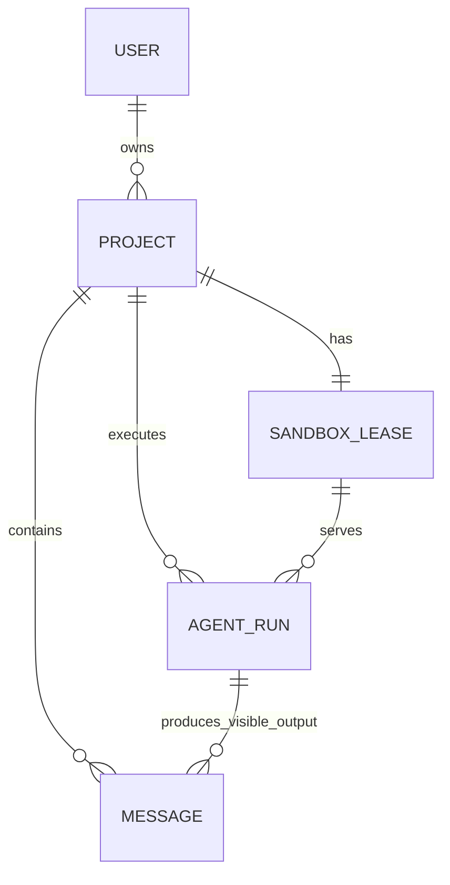

# Agent Online 领域术语

> 状态：D2 已完成私有 Cloudflare Preview 的真实 Pi AgentRun happy path、取消、deadline 和空闲 TTL；受控文件/终端/preview 仍待完成。
> 当前实施顺序：受控只读 Files -> 用量聚合 -> Terminal -> Preview。

## 产品定义

Agent Online 是浏览器可访问的 Coding Agent 产品。浏览器展示 Project、消息、文件、终端和 preview；Agent、shell、依赖安装和用户代码实际运行在远程 Linux 沙箱中。

第一版是单用户项目模型：每个登录用户直接拥有 Project，不建立团队、组织或 Tenant 层。Pi 是唯一实际注册的 AgentRuntime；其他 Runtime 名称只表示未来可扩展接口，不能当作已支持能力。

## 核心术语

| 术语 | 定义 | 关键边界 |
| --- | --- | --- |
| `User` | 经 Better Auth 认证的人。 | 第一版所有资源直接归属 `user_id`。 |
| `Project` | 用户在 UI 中看见的代码项目和对话容器。 | D1 持久化元数据和消息；不保存代码副本。沙箱丢失后可保留 Project，但文件允许丢失。 |
| `Message` | 用户或助手在某个 Project 中可见的一条持久化消息。 | 只保存用户输入和最终可展示回复，不保存原始工具输出或推理。 |
| `SandboxLease` | 应用为 Project 保留的唯一逻辑沙箱记录。 | 不是供应商真实 sandbox ID；同一时刻映射到 0 或 1 个真实沙箱，不保留实例历史。 |
| `AgentRun` | 一个 AgentRuntime 对一次用户任务的短生命周期执行。 | 通常对应一个对话回合，拥有状态、取消、时间和聚合用量。 |
| `AgentRunWorkflow` | 每个 AgentRun 一个的 Cloudflare Workflow 执行所有者。 | 只接收 Project/Run 应用 ID；D1 仍是产品事实，不保存 raw transcript。 |
| `SandboxRuntime` | 创建、附着、执行和停止 Linux 沙箱的适配器端口。 | 不认识 Pi、消息、模型或 D1 业务。 |
| `AgentRuntime` | 把某个 Agent 的输入、进程协议和原始输出映射为统一 Agent 事件的适配器端口。 | 通过受控进程接口运行；当前只注册 Pi。 |
| `ModelGateway` | Worker 内的受控模型代理。 | 持有平台 Gemini Key、验证 Run capability、转发模型请求并累加实际 usage，不管理沙箱文件。 |
| `UsageSummary` | `AgentRun` 上的聚合计量字段。 | 真实 Runtime 写 token、模型请求数和沙箱时长；它不是账单流水或套餐。 |

## 对应关系

`Project.default_agent_runtime_id` 保存默认 Runtime；`AgentRun.agent_runtime_id` 保存该次实际执行的 Runtime。`sandbox_leases.project_id` 唯一，表示一个 Project 没有 Lease 历史表；Provider 实例重建时只更新同一逻辑 Lease 的私有引用和状态。

## 必须始终成立的规则

1. 所有 Project 查询必须以 `(project_id, user_id)` 授权；浏览器传入的 `user_id` 一律不可信。
2. 一个 `SandboxLease` 只服务一个 Project，且 `sandbox_leases.project_id` 唯一；一个 Project 同时最多一个真实 Provider 沙箱。
3. 多个连续 `AgentRun` 可复用仍存活的沙箱；一条消息不是一个沙箱生命周期。
4. 沙箱停止、过期或故障时，当前 Project 文件允许丢失。第一版不写 R2 快照、不恢复文件，也不记录沙箱历史。
5. 同一 Project 最多一个非终态 `AgentRun`。新请求必须得到明确冲突或等待 UI 重试，不能并发修改同一 Project 文件。
6. 浏览器可见的是应用生成的 `sandboxLeaseId`、状态和受控能力；`provider_ref`、内部端口、E2B sandbox ID 和 Container ID 均为服务端私有数据。
7. Agent、shell、用户代码和开发服务在低信任沙箱内；Hono 控制平面、D1 和平台 Gemini Key 在沙箱外。
8. `SandboxRuntime` 只管理沙箱和通用进程，`AgentRuntime` 只管理 Agent 协议；两者都不能直接修改 Project/Run 的 D1 事实。
9. Pi 的模型调用必须经 `ModelGateway`；沙箱只有受限、短时的调用通道，永远不获得原始 Gemini Key。平台不记录私有推理。
10. `AgentRun` 终态写入实际 token、模型请求数和沙箱时长。后台按 `user_id` 聚合这些字段即可得到基础用量视图。
11. 真实执行 owner 是 [ADR-0003](./docs/adr/0003-agent-run-workflow.md) 中每个 Run 一个的 `AgentRunWorkflow`；Workflow 重试不能再次启动已非 `queued` 的 Run。
12. 私有 Preview 只允许部署邮箱 allowlist 中的用户访问；`RUNS_ENABLED` 是紧急停止新执行的服务端开关，设为 `false` 时必须在任何 Message、Lease 或 AgentRun 写入前失败。

## 有意不建模的内容

- R2、`WorkspaceRevision`、Project 文件快照、文件版本、回滚、分支、沙箱历史和原始 Agent transcript。
- `Session` 业务表或长期 Pi Agent 进程；对话连续性来自 Message，AgentProcess 随 `AgentRun` 结束。
- `UsageEvent`、`UsageReservation`、`ModelConnection`、`CredentialLease`、BYOK 密文和复杂配额账本。
- 团队、组织、租户、成员角色和邀请。
- 价格、订阅、信用余额、付款、订单和发票。
- 未安装 AgentRuntime 的 UI 选择项。新增 Goose、Claude Code 或 Codex CLI 前，必须先有独立适配器、能力声明、凭据流和端到端验收。
