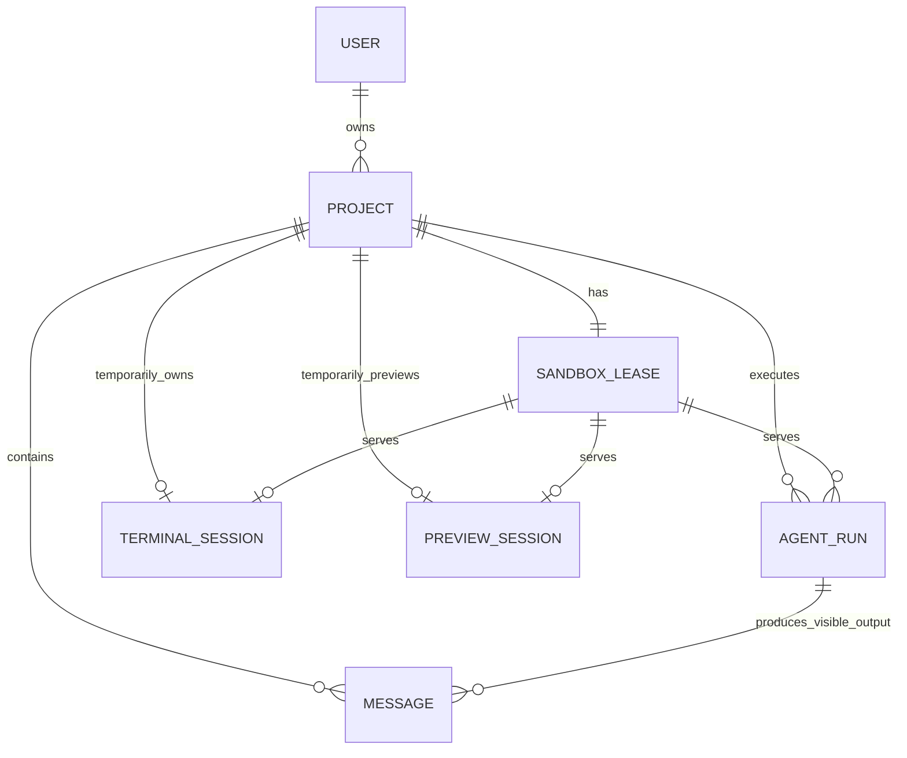

# Agent Online 领域术语

> 状态：D2、D3 和 Goose 私有 spike 已完成既定验收；2026-07-27 已补强 D1 原子完成、跨表完整性、真实迁移测试和统一工程门禁。Goose 浏览器选择仍未开放。

## 产品定义

Agent Online 是浏览器可访问的 Coding Agent 产品。浏览器展示 Project、消息、文件、终端、preview 和当前 Git changes；Agent、shell、依赖安装和用户代码实际运行在远程 Linux 沙箱中。

第一版是单用户项目模型：每个登录用户直接拥有 Project，不建立团队、组织或 Tenant 层。Pi 是默认且已验收的 AgentRuntime；Goose 按 [ADR-0004](./docs/adr/0004-goose-agent-runtime-spike.md) 完成本地与私有 Preview spike，但在浏览器选择和剩余安全复核通过前不能当作公开产品能力。

## 核心术语

| 术语 | 定义 | 关键边界 |
| --- | --- | --- |
| `User` | 经 Better Auth 认证的人。 | 第一版所有资源直接归属 `user_id`。 |
| `Project` | 用户在 UI 中看见的代码项目和对话容器。 | D1 持久化元数据和消息；不保存代码副本。沙箱丢失后可保留 Project，但文件允许丢失。 |
| `Message` | 用户或助手在某个 Project 中可见的一条持久化消息。 | 只保存用户输入和最终可展示回复，不保存原始工具输出或推理。 |
| `SandboxLease` | 应用为 Project 保留的唯一逻辑沙箱记录。 | 不是供应商真实 sandbox ID；同一时刻映射到 0 或 1 个真实沙箱，不保留实例历史。 |
| `AgentRun` | 一个 AgentRuntime 对一次用户任务的短生命周期执行。 | 通常对应一个对话回合，拥有状态、取消、时间和聚合用量。 |
| `AgentRunWorkflow` | 每个 AgentRun 一个的 Cloudflare Workflow 执行所有者。 | 只接收 Project/Run 应用 ID；D1 仍是产品事实，不保存 raw transcript。 |
| `TerminalSession` | 一个 Project 当前临时 PTY 的 D1 互斥记录。 | 关闭即删除；不保存终端输入、输出、滚屏或审计历史，浏览器看不到私有 PID。 |
| `PreviewSession` | 一个 Project 当前临时 Preview 进程的 D1 所有权记录。 | 只保存固定端口、私有进程引用和 expiry；停止即删除，不保存页面、日志、截图或访问历史。 |
| `ProjectChanges` | 当前 Project 沙箱中 Git working tree/index 的受控只读视图。 | 不持久化，不是 Run diff、版本历史或审计记录；不能归因到某一次 AgentRun。 |
| `SandboxRuntime` | Linux 沙箱适配器的能力集合；调用方按生命周期、进程、文件、终端、Preview 和 Changes 等窄接口依赖。 | 不认识 Pi、消息、模型或 D1 业务。fake 文件只在单个 Runtime 实例内存在，也不提供真实 Terminal/Preview/Changes。 |
| `AgentRuntime` | 把某个 Agent 的输入、进程协议和原始输出映射为统一 Agent 事件的适配器端口。 | 通过受控进程接口运行；Pi 已验收，Goose 处于门控 spike。 |
| `ModelGateway` | Worker 内的受控模型代理。 | 持有平台 Gemini Key、验证 Run capability、转发模型请求并累加实际 usage，不管理沙箱文件。 |
| `UsageSummary` | `AgentRun` 上的聚合计量字段，以及由这些字段计算出的当前用户汇总。 | 真实 Runtime 写 token、模型请求数和沙箱时长；`GET /api/usage` 只做全量聚合，它不是账单流水或套餐。 |

## 对应关系

`Project.default_agent_runtime_id` 保存默认 Runtime；`AgentRun.agent_runtime_id` 保存该次实际执行的 Runtime。`sandbox_leases.project_id` 唯一，表示一个 Project 没有 Lease 历史表；Provider 实例重建时只更新同一逻辑 Lease 的私有引用和状态。

## 必须始终成立的规则

1. 所有 Project 查询必须以 `(project_id, user_id)` 授权；浏览器传入的 `user_id` 一律不可信。
2. 一个 `SandboxLease` 只服务一个 Project，且 `sandbox_leases.project_id` 唯一；一个 Project 同时最多一个真实 Provider 沙箱。
3. 多个连续 `AgentRun` 可复用仍存活的沙箱；一条消息不是一个沙箱生命周期。
4. 沙箱停止、过期或故障时，当前 Project 文件允许丢失。第一版不写 R2 快照、不恢复文件，也不记录沙箱历史。
5. 同一 Project 最多一个非终态 `AgentRun` 或一条 `TerminalSession` 硬锁，两者互斥。`expires_at` 只触发 durable cleanup，不能自动解锁；新请求必须得到明确冲突或等待 UI 重试，不能并发修改同一 Project 文件。
6. 浏览器可见的是应用生成的 `sandboxLeaseId`、状态和受控能力；`provider_ref`、内部端口、E2B sandbox ID 和 Container ID 均为服务端私有数据。
7. Agent、shell、用户代码和开发服务在低信任沙箱内；Hono 控制平面、D1 和平台 Gemini Key 在沙箱外。
8. `SandboxRuntime` 只管理沙箱和通用进程，`AgentRuntime` 只管理 Agent 协议；两者都不能直接修改 Project/Run 的 D1 事实。
9. Pi 和任何新增 Runtime 的平台模型调用必须经 `ModelGateway`；沙箱只有受限、短时的调用通道，永远不获得原始 Gemini Key。平台不记录私有推理。
10. `AgentRun` 写入实际 token、模型请求数和沙箱时长；`GET /api/usage` 只按已认证 `user_id` 聚合全部现存 Run。失败、取消或超时 Run 的已记录消耗仍计入，它不是价格或账单。
11. 真实执行 owner 是 [ADR-0003](./docs/adr/0003-agent-run-workflow.md) 中每个 Run 一个的 `AgentRunWorkflow`；Workflow 重试不能再次启动已非 `queued` 的 Run。
12. 私有 Preview 只允许部署邮箱 allowlist 中的用户访问；`RUNS_ENABLED` 是紧急停止新执行的服务端开关，设为 `false` 时必须在任何 Message、Lease 或 AgentRun 写入前失败。
13. 只读 Files 只附着已有、具有 Lease 级文件连续性的沙箱；不因浏览而创建沙箱。它在无活动 Run 时做尽力一致读取，但不是文件系统事务或严格并发锁。
14. Terminal 只通过同源认证 WebSocket 代理当前 E2B PTY；D1 临时行保存硬互斥及私有 sandbox/PTY 终止引用。30 分钟 expiry 和关闭后的 idle cleanup 都由 Workflow 承担持久调度，终端内容不持久化。
15. Preview 只能在无活动 Run/Terminal 且已有存活 Lease 时启动。`starting` 阶段参与 D1 互斥；进入 `running` 后可以与后续 Run/Terminal 共存，但会阻止整沙箱 Stop 和 idle cleanup。
16. Preview 只运行平台固定的 Vite preset、固定 `/workspace` 和固定内部端口。浏览器只拿到绑定 Project/PreviewSession/expiry 的同源短时 capability，不能拿到 Provider host、traffic token、内部端口或任意启动参数。
17. Changes 只读取当前 `/workspace/.git` 的 working tree/index，固定 Git 二进制、参数和环境，并拒绝危险配置、额外 Git config scope 和不受支持的路径。隐藏路径会显式标记，不能误报 clean。它不新建沙箱、不写 D1/R2、不修改 repository、不保存 diff，也不声称变更来自某一次 Run。
18. 成功 Run 的终态、sandbox duration、最终 assistant Message 和 Project `updated_at` 必须在一个 D1 batch 中提交；若取消先改变 Run 状态，成功完成必须失败且不能写 assistant Message。
19. D1 trigger 强制 Run 的 Project/User/Lease/Input Message 归属、Run 状态机、assistant Message 与 succeeded Run 关联，以及 Terminal/Preview 与 Lease 的 Project 归属。application 校验用于友好错误，不能替代数据库约束。

## 有意不建模的内容

- R2、`WorkspaceRevision`、Project 文件快照、文件版本、回滚、分支、沙箱历史和原始 Agent transcript。
- `Session` 业务表或长期 Pi Agent 进程；对话连续性来自 Message，AgentProcess 随 `AgentRun` 结束。
- Preview 历史、多 Preview、公开分享链接、任意命令/端口或持久部署；`PreviewSession` 只是当前临时所有权。
- `UsageEvent`、`UsageReservation`、`ModelConnection`、`CredentialLease`、BYOK 密文和复杂配额账本。
- 团队、组织、租户、成员角色和邀请。
- 价格、订阅、信用余额、付款、订单和发票。
- 未通过验收的 AgentRuntime UI 选择项。Goose 依 ADR-0004 实施并保持门控；Claude Code 或 Codex CLI 仍只有保留 ID，新增前必须有独立 ADR、适配器、能力声明、凭据流和端到端验收。
