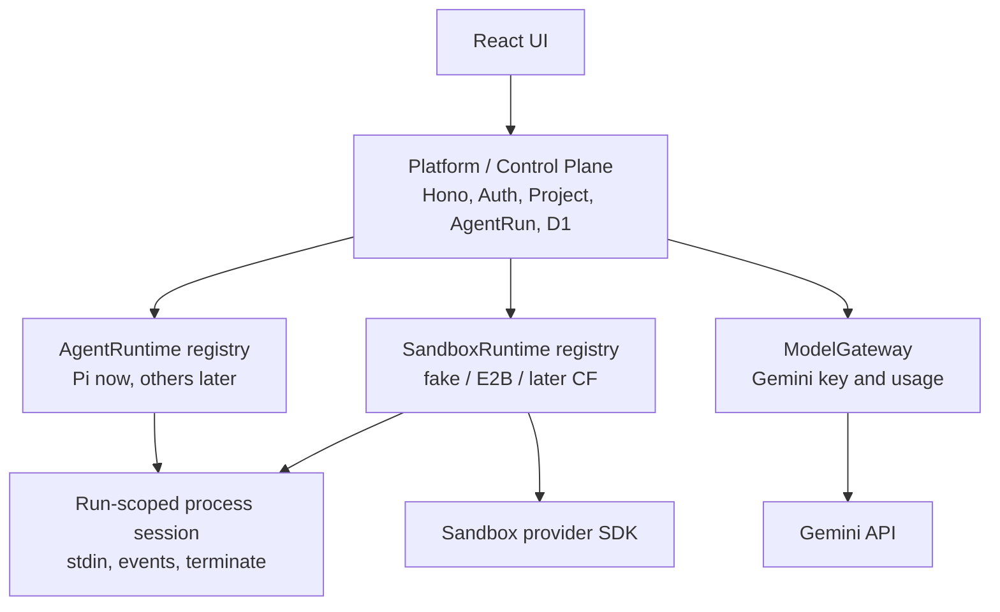
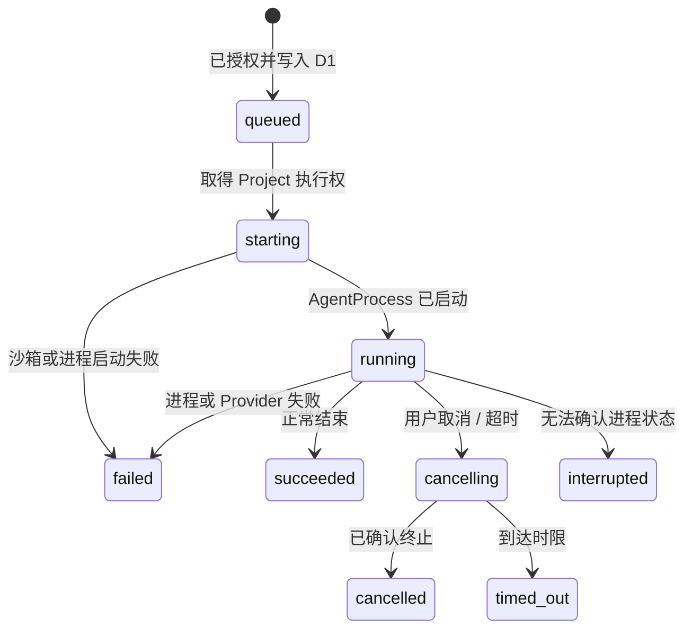
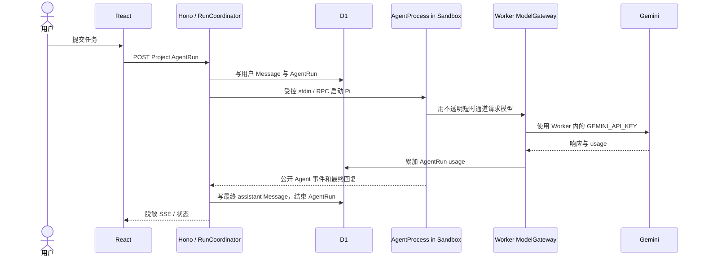

# ADR-0002：轻量 Project、AgentRun 与沙箱边界

- 状态：Accepted
- 日期：2026-07-25
- 关联：[ADR-0001（历史）](./0001-user-project-sandbox-boundary.md) · [领域术语](../../CONTEXT.md) · [系统总览](../architecture/01-system-overview.md) · [运行时](../architecture/02-sandbox-runtime.md)

> 本 ADR 取代 ADR-0001 中关于 R2 Revision、工作区恢复、多个 Lease 历史和复杂用量账本的结论。它是 V1 的实现合同；旧代码与旧迁移可以在实施时直接清理和重建。

## 背景

Agent Online 是个人开发的开源学习项目，不是需要长期保留所有用户文件、会话和审计材料的企业 SaaS。项目需要的是一个可见、可复用的代码沙箱，以及一个可替换的 AgentRuntime 边界；它不需要 Git-like 工作区版本树、沙箱时间线、文件恢复、原始对话归档或完整账单账本。

此前的“多个 Lease + R2 Revision + 用量事件”模型虽然适合更重的产品，却会提前引入快照一致性、对象清理、恢复失败、历史 UI、审计成本和迁移负担。本 ADR 明确接受第一版的取舍：沙箱是代码的唯一副本，沙箱消失时代码可以消失。

## 决策

### 1. 保持一个部署单元，划分四个逻辑层

第一版仍是一个 Cloudflare Worker 部署单元。以下是代码和合同边界，不是现在拆成微服务；业务层不得直接依赖 Pi、E2B、Cloudflare Container 或 Gemini SDK。



| 层 | 唯一职责 | 不能做什么 |
| --- | --- | --- |
| Platform / Control Plane | 鉴权、Project/Run 持久化、唯一执行仲裁、生命周期编排、事件脱敏、用量汇总、选择已允许的 Runtime 组合。 | 实现具体 Agent 协议或直接依赖某个 Sandbox Provider SDK。 |
| `AgentRuntime` | 启动某一 Agent、适配其输入/输出/工具事件/取消协议，并声明所需能力。 | 读写 D1、创建/停止沙箱、取得 Gemini 原始 Key 或知道 Provider ID。 |
| `SandboxRuntime` | 管理物理沙箱和受控进程：创建、附着、stdin、输出、终止、停止。 | 理解 Message、Project 业务、Pi 协议、模型或用量。 |
| `ModelGateway` | 持有平台 Gemini Key、代理模型调用、读取实际 usage、把聚合值写入 Run。 | 管理文件系统、沙箱或 Agent 生命周期。 |

`RunCoordinator` 是 Platform 层中唯一同时协调 D1、SandboxRuntime、AgentRuntime 和 ModelGateway 的模块。它只把受限的进程会话交给 AgentRuntime，不把完整 SandboxRuntime 或平台密钥交给 Agent。

### 2. 一个 Project 只有一个逻辑 SandboxLease，工作区不恢复

```text
一个 Project -> 一条 SandboxLease 记录 -> 0 或 1 个活动 Provider Sandbox
```

- `sandbox_leases.project_id` 必须唯一。该行是 Project 的稳定应用级 `sandboxLeaseId`，不是供应商 sandbox ID，也不保存 Provider 实例历史。
- 项目首次运行时，Platform 创建或附着一个 Provider Sandbox。连续的 AgentRun 可以复用它的文件系统、终端和 preview。
- 空闲 TTL、显式停止、Provider 过期或故障时，Platform 停止物理沙箱并更新同一 Lease 的状态；私有 `provider_ref` 可以清空或替换。
- 下次启动时创建的是一个新的、空的工作区。第一版不将代码、依赖、终端滚屏或 preview 状态恢复到新沙箱。
- 浏览器只看到 `sandboxLeaseId`、公开状态和受控能力；真实 sandbox ID、端口、token 和 Provider 凭据始终留在服务端。

这不是“每条消息新建沙箱”，也不是“永久保留一个沙箱”。它是一个 Project 复用一个尚存的临时环境；环境被释放后，用户明确接受其代码丢失。

### 3. 一个 AgentRun 对应一个短生命周期 AgentProcess

`AgentRun` 是运行、取消、状态和计量的最小单位，通常对应一个用户回合。一个 Run 可以产生多个模型请求和工具调用，但不等同于单次模型调用。

```text
Project
  -> 一条逻辑 SandboxLease
  -> 最多一个非终态 AgentRun
  -> 一个短生命周期 AgentProcess
```

- 每次 AgentRun 在当前沙箱启动一个新的 AgentProcess。Run 成功、失败、取消、超时或中断后，该进程必须终结。
- 对话连续性来自 D1 的 `messages`；文件连续性仅在同一沙箱仍存活时成立。不设计常驻 Pi RPC session 或跨 Run resume。
- 第一版不做任务队列。若 Project 已有 `queued`、`starting`、`running` 或 `cancelling` Run，新建请求返回明确冲突；UI 应禁用重复提交。
- 浏览器断线只代表 viewer detach，不取消 Run。取消必须通过持久化状态和受控进程终止完成。

状态机：



终态为 `succeeded`、`failed`、`cancelled`、`timed_out`、`interrupted`。终态 Run 永不重启；用户重试创建新 Run。

### 4. D1 是唯一持久存储，且只保留产品需要的数据

实施时可直接清理本地开发数据并重建迁移基线，不为当前迁移、R2 fixture 或假历史保持兼容。

| 表 | V1 关键字段 | 用途 |
| --- | --- | --- |
| Better Auth 表 | `user`、`session`、`account`、`verification` | 邮箱密码认证。 |
| `projects` | `id`, `user_id`, `title`, `default_agent_runtime_id`, `created_at`, `updated_at` | 用户可见的工作空间和对话容器。 |
| `sandbox_leases` | `id`, `project_id`, `sandbox_runtime_id`, `provider_ref`, `status`, `created_at`, `updated_at` | 每个 Project 一条当前逻辑 Lease；`provider_ref` 私有且可覆盖。 |
| `messages` | `id`, `project_id`, `agent_run_id`, `sequence`, `role`, `content`, `created_at` | 用户输入和最终可展示助手回复。 |
| `agent_runs` | `id`, `user_id`, `project_id`, `input_message_id`, `sandbox_lease_id`, `agent_runtime_id`, `sandbox_runtime_id`, `model_id`, `status`, token/请求/时长字段、时间戳、稳定 `failure_code` | 一次 Agent 执行的状态、关联和基础计量；失败语义由 ADR-0008 修订。 |

`agent_runs` 至少应保存：`input_tokens`、`output_tokens`、`total_tokens`、`model_request_count`、`sandbox_duration_ms`、`created_at`、`started_at`、`finished_at`。这些来自真实 ModelGateway 和 SandboxRuntime 事件，可按 `user_id` 汇总为内部管理视图和用户基础用量视图。

数据库必须执行关键并发规则：

```sql
CREATE UNIQUE INDEX sandbox_leases_one_per_project
  ON sandbox_leases(project_id);

CREATE UNIQUE INDEX agent_runs_one_active_per_project
  ON agent_runs(project_id)
  WHERE status IN ('queued', 'starting', 'running', 'cancelling');
```

V1 不建立 `workspace_revisions`、`usage_events`、`usage_reservations`、`model_connections`、`credential_leases`、`audit_events` 或 R2 对象布局。原始 Agent 事件、工具输出、私有推理和完整 terminal transcript 不持久化。

### 5. 平台通过显式协议获得可见对话和用量

Agent 在沙箱中不意味着 Platform 看不到产品数据。Platform 不是抓取沙箱文件或终端，而是拥有输入、事件和模型网关协议：



模型网关可以为运行中的 Agent 提供短时、不透明的访问通道，但该通道不等同于 Gemini Key，不作为长期凭据或用户配置持久化。日志、D1、浏览器事件和沙箱环境中均不得出现原始 Key、私有 Provider ID 或用户私有推理。

### 6. 可替换性保留在代码边界，不提前开放产品选项

`AgentRuntime` 和 `SandboxRuntime` 可以独立新增，但不是任意组合。每个 AgentRuntime 声明所需能力，例如流式输出、stdin、进程终止、TTY、网络策略和模型访问模式；每个 SandboxRuntime 声明能提供的能力。Platform 只允许满足需求的已验收组合。

V1 默认只公开 Pi，并安装一个 SandboxRuntime 实现（开发期可为 fake，真实验证优先 E2B）。单个 AgentRun 启动后不切换 Agent 或 Sandbox；Project 只能在没有非终态 Run 时为下一 Run 选择服务端已验收、已门控的 AgentRuntime。更换 Sandbox Provider 或重建 Provider 实例会从空工作区开始，不迁移旧文件。浏览器不暴露任意 Provider、CLI 或命令选择。

[ADR-0004](./0004-goose-agent-runtime-spike.md) 在不改变上述单 Lease/单活动 Run 边界的前提下，批准 Goose 作为第二 Runtime 的受控 spike。它要求 Pi 与 Goose 使用同一个组合模板，因此切换 AgentRuntime 不重建当前 Provider 沙箱；只有切换 Sandbox Provider 或当前沙箱失效时才接受空工作区。Goose 在真实 E2E 前不构成公开产品能力。

### 7. 第一版的模型与管理边界

- 默认且唯一的模型来源是平台 Gemini。`GEMINI_API_KEY` 只存在 Worker Secret 或本地 `.dev.vars`。
- BYOK、多模型管理和第三方登录全部延后。它们需要新的表、加密、撤销和产品决策，不能从 V1 名称预留推断为已经支持。
- 需要内部查看用量时，先用 Worker 配置的 `ADMIN_EMAILS` allowlist 保护管理端点；不为此建立团队、角色或计费系统。

## 拒绝的方案

| 方案 | 原因 |
| --- | --- |
| R2 当前快照、Revision 树或历史 Provider Lease | 个人 V1 不需要恢复/回滚，增加存储、清理、迁移和 UI 复杂度。 |
| 每个 Run 归档原始 Agent transcript | 原始事件包含敏感输入和噪声；基础状态、可见消息和聚合 usage 足够。 |
| 一个 Lease 内常驻 Pi RPC session | 把 resume、凭据轮换、取消和泄漏问题提前带入第一版。 |
| 每条消息创建一个沙箱 | 冷启动、成本和同一 Project 内文件连续性都不可接受。 |
| 浏览器直连 Provider 或模型 | 绕过授权、计量、密钥隔离和可替换性。 |
| 仅靠 Worker 内存锁阻止并发 Run | Worker 可并发或重启，D1 必须仲裁唯一活跃 Run。 |
| 为旧本地 D1/R2 数据维护兼容路径 | 当前个人开发阶段优先正确的新模型。 |

## 后果

### 正面

- 用户心智简单：一个 Project、一个当前沙箱、连续对话和执行记录。
- 项目不再依赖 R2，存储、恢复、对象清理和迁移面显著缩小。
- `AgentRun` 清晰承载状态、取消、用量和管理汇总；不把执行细节塞进 Message 或模糊 Session 概念。
- 仍保留以后替换 Pi、Goose、CLI 或 Sandbox Provider 的边界，同时只把通过独立门槛的 Runtime 暴露为公开产品能力。

### 代价

- 沙箱过期、停止或故障后，用户代码和环境可能不可恢复，产品必须在 UI 中明确这一点。
- 用户不能回滚文件、浏览沙箱历史或要求平台提供完整原始执行审计。
- 如果未来需要持久工作区、BYOK、支付或强审计，应增加新的 ADR 和独立数据模型，而不是把功能偷偷塞回 V1 表中。

## 验收条件

在接入真实模型或真实沙箱前，fake runtime 和 D1 测试必须证明：

1. 每个 Project 只有一条逻辑 Lease 记录；Provider 重建只更新同一记录，不新增历史行。
2. 同一 Project 的并发创建请求最多得到一个非终态 AgentRun；另一个请求得到明确冲突。
3. 连续两个 Run 在同一存活沙箱中能看到前一 Run 的文件结果；停止后重新启动得到空工作区，而不是恢复快照。
4. 用户 Message 和最终 assistant Message 可从 D1 重建对话；原始 Agent 事件不被持久化。
5. ModelGateway 的实际 usage 能聚合到对应 AgentRun；管理员能按 User 汇总，而不需要 `usage_events`。
6. 浏览器断线不取消 Run；显式 cancel 会进入 `cancelling` 并最终进入终态。
7. 未登录或非所有者不能读取、订阅、取消或创建该 Project 的 Run。
8. Worker 配置、迁移和类型中不存在 V1 R2 Binding、WorkspaceRevision 或恢复路径。

## 实施结果

截至 2026-07-26，本 ADR 的 D1 迁移、领域合同、fake runtime、认证 Project、Message、单 Lease/单活动 Run、SSE、基础用量、Gemini ModelGateway 与 E2B + Pi/Goose 均已实现。远程 Preview 还验证了跨 Runtime 连续 Run 文件复用、取消、deadline、空闲 TTL 和手动停止。只读 Files 已通过真实 E2B 验收：只附着现有 Lease，不新增 D1/R2，不公开 Provider 信息；停止后不请求文件或展示陈旧缓存，fake 因缺少跨请求文件连续性而明确不可用。

Terminal 已按 ADR-0005 复用本 ADR 的 Project 授权与单 Lease 边界，并以独立 D1 互斥和生命周期实现。Preview 也已按 ADR-0006 使用固定 preset、独立临时 D1 所有权、同源内容网关和 durable expiry/idle cleanup 完成远端验收；它没有复用 Files 的尽力一致检查作为安全锁。Changes 已按 ADR-0007 以窄 Runtime capability 读取当前 Git working tree/index，不新增 D1/R2、历史或 Run 归因。Sentry 仍只是可选错误观测，不成为运行前提。
