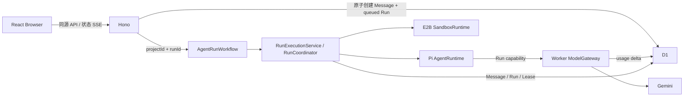

# ADR-0003：每个 AgentRun 一个 Cloudflare Workflow

- 状态：Accepted
- 日期：2026-07-26
- 关联：[ADR-0002](./0002-run-agent-process-and-lease-lifecycle.md) · [系统总览](../architecture/01-system-overview.md) · [运行时边界](../architecture/02-sandbox-runtime.md)

## 背景

真实 E2B + Pi Run 会在普通 Hono 请求返回后继续执行。执行所有者必须：

1. 取得或创建 Project 当前沙箱，启动一次 Pi RPC 进程。
2. 等待远程进程结束，写入最终可见 Message、Run 终态和真实 usage。
3. 接受另一个 HTTP 请求发出的取消。
4. 到达 Run deadline 时停止进程。
5. Run 结束并经过空闲 TTL 后停止 Project 当前沙箱。

普通 Worker 内存、`waitUntil()` 和全局 Promise Map 都不能提供这个生命周期。D1 是产品事实库，但不适合承载活跃进程对象、原始输出流或任务调度器。

曾考虑使用按 Project 命名的 Durable Object。该方案被实现验证否决：DO RPC 返回后，没有请求、响应流、WebSocket 或待处理 I/O 保持对象活跃时，对象可以被回收；`DurableObjectState.waitUntil()` 不延长对象生命周期。让 Hono 请求长期保持与 DO 的调用，又失去了异步接受 Run 的意义。

## 决策

### 1. 一个 AgentRun 对应一个 Workflow instance

同一个 Cloudflare Worker 导出 `AgentRunWorkflow`，通过 `AGENT_RUN_WORKFLOW` Binding 启动。Workflow instance ID 使用应用生成的 `AgentRun.id`；参数只包含：

```ts
type AgentRunWorkflowPayload = {
  kind: "execute" | "idle-cleanup";
  projectId: string;
  runId: string;
};
```

参数中不包含 prompt、模型 Key、Provider ID、进程 ID或用户提交文件。Workflow 必须从 D1 重新读取 Run、输入 Message 和 SandboxLease。



这是一个 Worker 部署单元。Workflow、Hono、ModelGateway、AgentRuntime 和 SandboxRuntime 是同一代码库中的不同责任边界，不是多个后端服务。

### 2. D1 仍是唯一产品事实

每个 Project 同时最多一个非终态 Run，继续由 D1 部分唯一索引保证：

```sql
CREATE UNIQUE INDEX agent_runs_one_active_per_project
  ON agent_runs (project_id)
  WHERE status IN ('queued', 'starting', 'running', 'cancelling');
```

Workflow 不保存第二套 Message、Run、Project、沙箱历史或 transcript。Cloudflare 保存的 Workflow step 状态只用于调度和重试，保留期缩短为一天。

`agent_runs.provider_process_ref` 是服务端私有的当前进程引用，用于跨请求取消。Run 进入终态时立即清空。`sandbox_leases.provider_ref` 仍是服务端私有的当前 Provider 沙箱引用。两者都不能出现在公开 API、浏览器、日志或错误消息中。

### 3. 执行步骤

`execute` Workflow 的主要步骤为：

1. Hono 原子写入用户 Message 和 `queued` Run。
2. Hono 创建以 `run.id` 命名的 Workflow instance，并立即向浏览器返回。
3. Workflow 从 D1 领取 `queued -> starting`。
4. `SandboxRuntime.ensureLease()` 创建或附着当前沙箱。
5. 立即把 Lease 的私有 Provider 引用写为 `ready`，再启动 Agent，缩小异常中断时的无主窗口。
6. `AgentRuntime` 启动 Pi RPC，平台保存当前私有进程引用。
7. Run 进入 `running`；Pi 只能使用短时 Run capability 调用 Worker ModelGateway。
8. ModelGateway 原子累加真实模型 usage。
9. Pi 完成后，平台只写最终用户可见 assistant Message、Run 终态和聚合沙箱时长。
10. Workflow 睡眠空闲 TTL，再尝试原子认领并停止当前 Project 沙箱。

Pi 每个 Run 使用新的无持久 session 进程。对话连续性来自 D1 Message，代码连续性只来自仍存活的 Project 沙箱。

### 4. 重试与恢复

Workflow step 可以重试，但 AgentRun 不能重复启动：

- 只有 `queued` Run 可以启动 Pi。
- step 重试看到 `starting` 或 `running`，说明旧执行所有者已经丢失；平台不恢复 Pi session。
- 有私有进程引用时，优先只停止该进程并保留沙箱；无法精确停止时才停止整个沙箱。
- 原状态为 `cancelling` 时收敛为 `cancelled`；其他失去所有者的非终态 Run 收敛为 `interrupted`。
- 终态 Run 直接返回，不重启。

assistant Message 对 `agent_run_id` 有唯一索引。`sandbox_duration_ms` 使用幂等 `MAX` 写入，避免重试或取消竞态重复累计时长。

### 5. 取消

显式取消由新的 Hono 请求处理：

```text
queued              -> cancelled
starting / running  -> cancelling
                     -> terminate provider process
                     -> cancelled
```

正常路径使用 `SandboxRuntime.terminateProcess()` 只终止当前 Pi 进程，Lease 回到 `idle`，Project 文件继续存在。进程引用缺失或 Provider 无法精确终止时，允许 fail-closed 停止整个沙箱。

D1 收敛后，Hono 尽力终止原执行 Workflow，并创建一个只负责空闲 TTL 的 `idle-cleanup` Workflow。即使这个调度失败，E2B 自身的 sandbox timeout 仍提供最终成本上界。

### 6. Run deadline

应用层从 capability 到期时间计算剩余 Run 时间，到期后通过 `AgentRuntime.cancel("timed_out")` 收敛为 `timed_out`。Workflow step 另设比业务 deadline 多 30 秒的硬 timeout，防止 Provider 创建或网络调用永久挂起。

硬 timeout 后的重试遵循“失去执行所有者”的恢复规则，因此极端中断可能表现为 `interrupted`，不会永久停在非终态。

### 7. 空闲沙箱回收

空闲 Workflow 醒来后不能先检查、再无条件停止，否则可能与新 Run 竞态。D1 必须用一次条件更新原子认领：

- Lease 仍是预期的 `idle` 状态和 Provider 引用；
- Lease 自读取后没有变化；
- 预期 Run 仍是该 Project 最新 Run；
- Project 没有 `queued`、`starting`、`running` 或 `cancelling` Run。

认领成功时先从 D1 清空 Provider 引用并置为 `stopped`，再调用 Provider stop。这样新 Run 只会创建新沙箱，不会附着到正在回收的旧实例。Provider stop 失败时，旧实例最多存活到 E2B 自身 timeout；平台不为它建立历史或恢复逻辑。

### 8. ModelGateway

Gemini Key 只存在于 Worker Secret。Workflow 为每个 Run 签发绑定 `projectId`、`runId`、`modelId`、scope 和过期时间的短时 HMAC capability。Pi 沙箱只得到 capability 和网关 URL，得不到 Gemini Key、Better Auth Secret 或 E2B Key。

## 拒绝的方案

| 方案 | 原因 |
| --- | --- |
| 普通 Worker `waitUntil()` 或全局 Map | 请求返回后生命周期有限，且不同请求/isolate 不共享可靠内存。 |
| Project 级 Durable Object 长时间后台执行 | RPC 返回后 DO 可以被回收，`state.waitUntil()` 不延长生命周期。 |
| 浏览器保持与 DO 的长连接 | 浏览器断线会改变 Run 生命周期，不符合异步产品语义。 |
| Queue consumer | 单次消费有墙钟上限，且还要自行设计 deadline 与空闲调度。 |
| 把 Pi session、原始事件或 transcript 写入 D1/R2 | 超出个人开源项目的数据边界和隐私成本。 |
| 浏览器直连 E2B、Pi 或 Gemini | 泄漏 Provider 控制面并绕过授权与 usage。 |

## 代价与风险

- Cloudflare Workflows 成为 D1、Assets 之外的第三个 Cloudflare Binding。
- Workflows 可用于 Workers Free，但免费层每个 step 的 CPU 上限是 10ms。远程 Pi 输出解析是否稳定落在这个上限内必须通过真实预览部署验证；本地测试和生产构建不能证明这一点。
- 免费层每个 Workflow instance 的外部 subrequest 上限为 50。当前一次 AgentRun 的平台调用应远低于该值，但复杂 Agent 行为仍需观测。
- Workflow 不是 Pi session 恢复系统。执行所有者丢失时当前 Run 会中断，必要时沙箱也会停止。
- 不新增 R2、队列、DO storage、Run 事件表或沙箱历史。

## 验收条件

1. Workflow 参数和输出不含 prompt、最终回复、Provider 引用或凭据。
2. 同一 Project 并发创建最多一个非终态 Run。
3. Workflow 重试不会启动第二个 Pi 进程。
4. 正常取消只停止当前进程并保留沙箱；无法精确终止时才停止整个沙箱。
5. deadline 和执行中断都能让 D1 收敛到终态。
6. 空闲清理不会停止已被新 Run 使用的沙箱。
7. 浏览器刷新后只依赖 D1 恢复 Run、Message 和公开 Lease 状态。
8. D1、Workflow 输出、日志和公开 API 不保存 raw transcript、私有推理或原始 Key。

## 参考

- [Cloudflare Workflows Workers API](https://developers.cloudflare.com/workflows/build/workers-api/)
- [Cloudflare Workflows limits](https://developers.cloudflare.com/workflows/reference/limits/)
- [Cloudflare Workflows pricing](https://developers.cloudflare.com/workflows/reference/pricing/)
- [Cloudflare Durable Object lifecycle](https://developers.cloudflare.com/durable-objects/concepts/durable-object-lifecycle/)
- [DurableObjectState API](https://developers.cloudflare.com/durable-objects/api/state/)
- [Pi RPC Mode](https://pi.dev/docs/latest/rpc)
- [E2B Sandbox lifecycle](https://e2b.dev/docs/sandbox)
