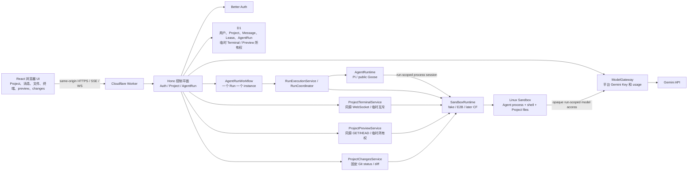
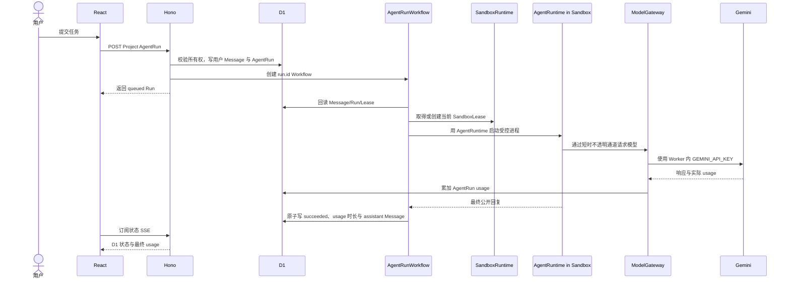

# 系统总览：单 Worker、临时沙箱与 AgentRun

> 状态：D2/D3 与 Goose 真实链路已完成；2026-07-30 已部署受 allowlist 保护的 Pi/Goose UI 选择，并实现受控单文件上传。
> 关联：[ADR-0002](../adr/0002-run-agent-process-and-lease-lifecycle.md) · [ADR-0003](../adr/0003-agent-run-workflow.md) · [ADR-0004](../adr/0004-goose-agent-runtime-spike.md) · [ADR-0005](../adr/0005-controlled-project-terminal.md) · [ADR-0006](../adr/0006-controlled-project-preview.md) · [ADR-0007](../adr/0007-controlled-project-changes.md) · [领域术语](../../CONTEXT.md) · [运行时](./02-sandbox-runtime.md) · [数据与模型](./03-data-auth-and-models.md)

## 1. 产品边界

Agent Online 的第一版不是团队协作平台，也不是浏览器内运行 Agent。它是一个浏览器控制台：用户登录后创建 Project；Project 要执行任务时，Worker 为它创建或复用一个 Linux 沙箱；Agent 在沙箱中操作文件和 shell；浏览器通过同源 API、SSE、受控终端和 preview 观察结果。

参考 CCOnline 的是产品体验：真实 Coding Agent、独立 Linux 环境、终端、文件与 preview。它不代表复制第三方代码，或推断其未公开实现。

Pi 是默认且已验收的 AgentRuntime。Goose 已按 ADR-0004 完成第二 Runtime 的同
Project 文件连续性、模型通道、事件、取消、usage、deadline 和 TTL 真实 E2E；
Preview 的安全 capability 已向 allowlist UI 公布 Pi/Goose。Claude Code 与 Codex
CLI 仍只有保留 ID。

## 2. 总体结构



React 静态资源与 Hono API 同域，由同一个 Worker 部署单元提供。`AgentRuntime` 和 `SandboxRuntime` 是 Worker 代码中的模块边界，不是两个后端项目；第一版不需要 TanStack Start 或单独 API 服务。

## 3. 浏览器、平台与沙箱的职责

### 浏览器

浏览器保存 UI 状态和同源认证 Cookie。它能看到：

- Project 与用户可见消息；
- 应用自己的 `sandboxLeaseId`、状态和可用能力；
- 脱敏后的 Agent 状态；现有 E2B Lease 的受控文件列表、UTF-8 文本、同源 WebSocket 终端流、固定 Vite preset 的同源签名 Preview 内容，以及当前 Git working tree/index 的有界只读 status/diff；
- 自己的基础用量汇总。

它不能看到真实供应商 ID、Provider Key、沙箱内部端口、调度密钥或 Gemini Key，也不能指定任意二进制、Provider 或 shell 命令。

### Worker 控制平面

Hono 负责普通产品 mutation 的同源与请求体边界、鉴权、Project 授权、创建和取消 AgentRun、D1 持久化、Run/Terminal 互斥、沙箱启停编排、PTY WebSocket 中继、Preview 签名与内容网关、Changes 输入与响应边界、事件脱敏、ModelGateway 和基础用量汇总。Worker 只协调活动，不执行 Agent、用户 shell、构建或依赖安装。

Worker 能拿到对话和用量，是因为它明确拥有请求和事件协议：用户输入先写入 D1，再交给沙箱中的 Agent；Agent 的公开事件和最终回复回到 Worker；模型请求必须经过 Worker 的 ModelGateway。平台不会依赖“抓取沙箱”或读取私有推理。

### Linux 沙箱

Agent 进程、shell、Project 文件、终端和用户启动的开发服务都在沙箱中。沙箱是执行边界，而不只是一个目录。当前 `E2BSandboxRuntime` 已实现真实沙箱、进程、Lease 级文件和受控 Git Changes 合同；`FakeSandboxRuntime` 保留给无外部成本的控制面开发，其内存文件不能跨请求读取，也不伪装 Git repository，因此公共 Files/Changes 会明确返回不可用。

沙箱磁盘是 V1 Project 文件的唯一副本。空闲 TTL、显式停止、Provider 过期或故障后，文件可以丢失；Project 的 D1 元数据和对话仍保留，但新沙箱从空目录开始。

## 4. 资源关系

```text
一个 User      -> 多个 Project
一个 Project   -> 一条逻辑 SandboxLease
一个 Lease     -> 0 或 1 个活动 Provider Sandbox
一个 Project   -> 多个连续 AgentRun
一个 Project   -> 同时最多一个非终态 AgentRun
一个 AgentRun  -> 一个短生命周期 AgentProcess
一个 Project   -> 0 或 1 个 TerminalSession 硬锁
一个 Project   -> AgentRun 与 Terminal 不能同时活动
一个 Project   -> 0 或 1 个 PreviewSession
Preview starting -> 与 AgentRun / Terminal 互斥
Preview running  -> 可与后续 AgentRun / Terminal 共存
```

`Project` 没有对话 Session 表，也不包含文件快照。`TerminalSession` 和 `PreviewSession` 只是当前临时进程的协调记录，不是历史。`SandboxLease` 是稳定的应用 ID，Provider 物理实例重建时更新同一行即可。多个连续 Run 可以复用仍存活的沙箱；AgentRun 结束时 AgentProcess 必须终结。运行中的 Preview 会阻止整沙箱手动停止和 idle cleanup，显式停止后才恢复普通 Lease 回收。

## 5. 一次 AgentRun 的流程



浏览器断线不取消 Run。显式取消先将 Run 变为 `cancelling`，再通过 SandboxRuntime 的私有进程引用只终止当前 Agent 进程并写入终态；无法精确终止时才停止整个沙箱。

当前 SSE 在订阅请求内轮询 D1，只发布 `run.status` 和 `run.completed`。它不传递 raw Agent 输出、工具参数或私有推理；终态后页面重新读取可信的 Message 和 usage。执行所有权和恢复规则见 [ADR-0003](../adr/0003-agent-run-workflow.md)。

## 6. API 状态

当前已实现以下同源 API：

| 路径 | 作用 |
| --- | --- |
| `/api/auth/*` | Better Auth。 |
| `/api/projects` 与 `/api/projects/:id` | 创建、列出、读取、重命名或受控硬删除用户自己的 Project。 |
| `/api/projects/:id/messages` | 读取 Project 的可见消息。 |
| `/api/projects/:id/files` | 在没有活动 Run 时列出现有沙箱 `/workspace` 下的受控目录。 |
| `/api/projects/:id/files/content` | 读取受限相对路径指向的 UTF-8 文本文件。 |
| `/api/projects/:id/changes` | 读取现有 E2B `/workspace` 当前 Git working tree/index 的有界 status；不创建沙箱或 repository。 |
| `/api/projects/:id/changes/content` | 只为当前 status 中的精确相对路径读取 staged/unstaged 有界 unified diff。 |
| `/api/projects/:id/agent-runs` | 创建 AgentRun，或读取当前用户该 Project 最近 50 条 Run 事实。 |
| `/api/projects/:id/agent-runs/active` | 读取该 Project 当前的非终态 Run，供页面恢复。 |
| `/api/projects/:id/agent-runs/:runId` | 读取 Run 状态和已聚合用量。 |
| `/api/projects/:id/agent-runs/:runId/events` | 订阅 D1 轮询出的状态和终态，不公开 raw Agent 输出。 |
| `/api/projects/:id/agent-runs/:runId/cancel` | 取消当前 Run。 |
| `/api/projects/:id/sandbox/stop` | 在没有非终态 Run、活动 Terminal 或活动 Preview 时原子脱离并停止当前沙箱；不公开 Provider ID。 |
| `/api/projects/:id/terminal` | 同源认证 WebSocket；打开当前 E2B `/workspace` PTY，代理受限输入/resize/输出/关闭，不公开 Provider ID 或 PID。 |
| `/api/projects/:id/preview` | 读取当前临时 Preview 的公开状态和同源内容 URL；不返回 Provider host、端口或进程引用。 |
| `/api/projects/:id/preview/start` | 在现有空闲 E2B Lease 中启动平台固定的 `vite-v1` Preview。 |
| `/api/projects/:id/preview/stop` | 终止当前固定 Preview 进程、删除临时 D1 行并安排 Lease idle cleanup。 |
| `/api/projects/:id/preview/content/:token/*` | 使用绑定 Project/PreviewSession/expiry 的短时 capability 代理 GET/HEAD 内容；不接受任意端口。 |
| `/api/usage` | 认证后按当前 `user_id` 合并现存 AgentRun 与删除归档，返回 all-time 总计、Project 和 AgentRuntime 聚合，不返回用户或 Provider 私有字段。 |

所有 API 都以应用级资源 ID 工作。公共 API 不接受或返回 `provider_ref`；`agent_runtime_id` 只能由服务端 registry 和策略白名单解析，不能直接转换为 shell 命令。

## 7. 非目标

- R2 Project 文件快照、文件版本、回滚、沙箱历史和完整原始执行归档。
- 团队、组织、成员邀请、Tenant、支付、套餐或订阅 API。
- 浏览器直接连接供应商终端 URL 或模型 API。
- 任意 command/port Preview、公开分享链接或浏览器直连 Provider Preview URL。
- Git 历史托管、Run 归因、任意 revision/pathspec/命令，或把 Changes 保存为平台审计记录。
- 在 Worker 或浏览器中运行 Agent。
- 在没有适配器、能力声明、凭据设计和 E2E 前公开 Goose、Claude Code 或 Codex CLI。
