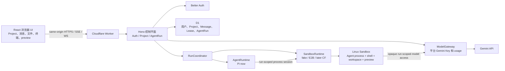
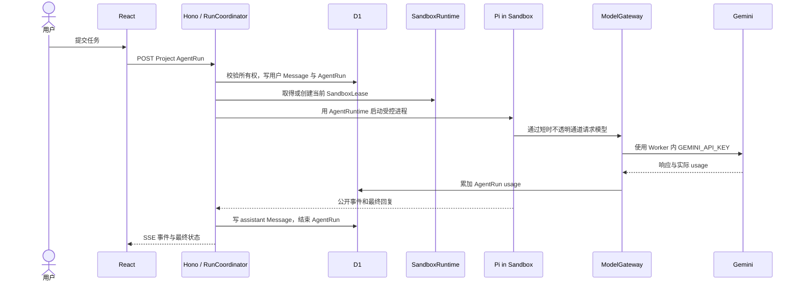

# 系统总览：单 Worker、临时沙箱与 AgentRun

> 状态：目标架构基线 v0.4
> 关联：[ADR-0002](../adr/0002-run-agent-process-and-lease-lifecycle.md) · [领域术语](../../CONTEXT.md) · [运行时](./02-sandbox-runtime.md) · [数据与模型](./03-data-auth-and-models.md)

## 1. 产品边界

Agent Online 的第一版不是团队协作平台，也不是浏览器内运行 Agent。它是一个浏览器控制台：用户登录后创建 Project；Project 要执行任务时，Worker 为它创建或复用一个 Linux 沙箱；Agent 在沙箱中操作文件和 shell；浏览器通过同源 API、SSE、受控终端和 preview 观察结果。

参考 CCOnline 的是产品体验：真实 Coding Agent、独立 Linux 环境、终端、文件与 preview。它不代表复制第三方代码，或推断其未公开实现。

Pi 是第一版唯一实际注册的 AgentRuntime。架构允许以后接入 Goose、Claude Code 或 Codex CLI，但它们的协议、凭据、许可和事件模型不同，必须逐个实现和验收，不能只靠 Runtime 名称切换。

## 2. 总体结构



React 静态资源与 Hono API 同域，由同一个 Worker 部署单元提供。`AgentRuntime` 和 `SandboxRuntime` 是 Worker 代码中的模块边界，不是两个后端项目；第一版不需要 TanStack Start 或单独 API 服务。

## 3. 浏览器、平台与沙箱的职责

### 浏览器

浏览器保存 UI 状态和同源认证 Cookie。它能看到：

- Project 与用户可见消息；
- 应用自己的 `sandboxLeaseId`、状态和可用能力；
- 脱敏后的 Agent 事件、文件列表、终端流和受控 preview URL；
- 自己的基础用量汇总。

它不能看到真实供应商 ID、Provider Key、沙箱内部端口、调度密钥或 Gemini Key，也不能指定任意二进制、Provider 或 shell 命令。

### Worker 控制平面

Hono 负责鉴权、Project 授权、创建和取消 AgentRun、D1 持久化、单 Run 仲裁、沙箱启停编排、事件脱敏、ModelGateway 和基础用量汇总。Worker 只协调 AgentRun，不执行 Agent、用户 shell、构建或依赖安装。

Worker 能拿到对话和用量，是因为它明确拥有请求和事件协议：用户输入先写入 D1，再交给沙箱中的 Agent；Agent 的公开事件和最终回复回到 Worker；模型请求必须经过 Worker 的 ModelGateway。平台不会依赖“抓取沙箱”或读取私有推理。

### Linux 沙箱

Agent 进程、shell、Project 文件、终端和用户启动的开发服务都在沙箱中。沙箱是执行边界，而不只是一个目录。当前真实沙箱尚未接入；`FakeSandboxRuntime` 只用于验证模块合同。

沙箱磁盘是 V1 工作区的唯一副本。空闲 TTL、显式停止、Provider 过期或故障后，文件可以丢失；Project 的 D1 元数据和对话仍保留，但新沙箱从空工作区开始。

## 4. 资源关系

```text
一个 User      -> 多个 Project
一个 Project   -> 一条逻辑 SandboxLease
一个 Lease     -> 0 或 1 个活动 Provider Sandbox
一个 Project   -> 多个连续 AgentRun
一个 Project   -> 同时最多一个非终态 AgentRun
一个 AgentRun  -> 一个短生命周期 AgentProcess
```

`Project` 没有单独 Session 表，也不包含工作区快照。`SandboxLease` 是稳定的应用 ID，Provider 物理实例重建时更新同一行即可。多个连续 Run 可以复用仍存活的沙箱；AgentRun 结束时 AgentProcess 必须终结。

## 5. 一次 AgentRun 的流程



浏览器断线不取消 Run。显式取消先将 Run 变为 `cancelling`，再由 AgentRuntime 和 SandboxRuntime 终止对应进程，并写入终态。

## 6. 目标 API 合同

以下是实现目标，不代表当前脚手架已经提供：

| 路径 | 作用 |
| --- | --- |
| `/api/auth/*` | Better Auth。 |
| `/api/projects` | 创建、列出、读取、删除用户自己的 Project。 |
| `/api/projects/:id/messages` | 读取 Project 的可见消息。 |
| `/api/projects/:id/agent-runs` | 创建 AgentRun；必要时启动沙箱。 |
| `/api/projects/:id/agent-runs/:runId` | 读取 Run 状态和已聚合用量。 |
| `/api/projects/:id/agent-runs/:runId/events` | 订阅脱敏的当前 Run 事件。 |
| `/api/projects/:id/agent-runs/:runId/cancel` | 取消当前 Run。 |
| `/api/projects/:id/sandbox` | 查看应用级 Lease 的公开状态。 |
| `/api/projects/:id/sandbox/stop` | 停止当前沙箱；停止后工作区可丢失。 |
| `/api/usage` | 当前用户的 AgentRun 聚合用量。 |
| `/api/admin/usage` | 仅 `ADMIN_EMAILS` allowlist 使用的基础汇总。 |

所有 API 都以应用级资源 ID 工作。公共 API 不接受或返回 `provider_ref`；`agent_runtime_id` 只能由服务端 registry 和策略白名单解析，不能直接转换为 shell 命令。

## 7. 非目标

- R2 工作区快照、文件版本、回滚、沙箱历史和完整原始执行归档。
- 团队、组织、成员邀请、Tenant、支付、套餐或订阅 API。
- 浏览器直接连接供应商终端 URL 或模型 API。
- 在 Worker 或浏览器中运行 Agent。
- 在没有适配器、能力声明、凭据设计和 E2E 前公开 Goose、Claude Code 或 Codex CLI。
