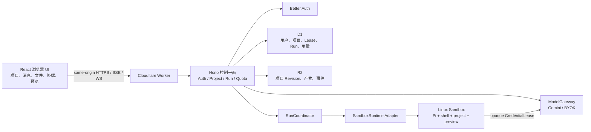
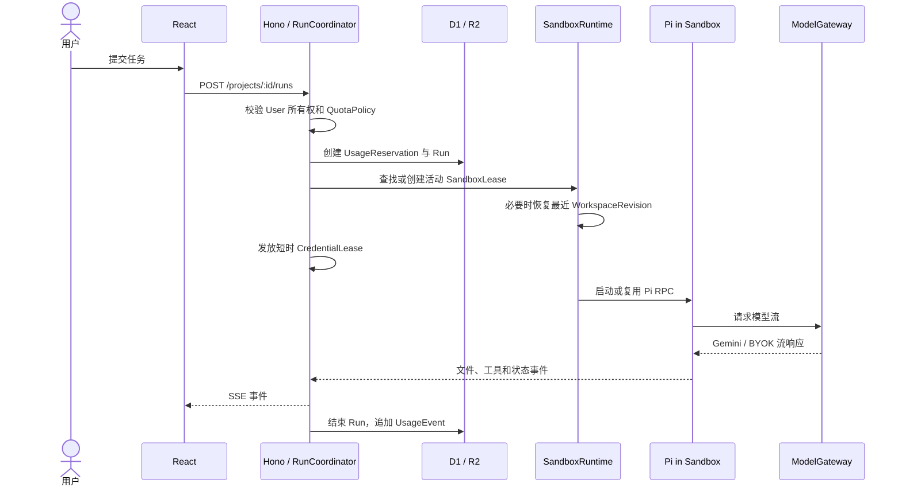

# 系统总览：单用户项目与临时沙箱

> 状态：架构基线 v0.2
> 关联：[领域术语](../../CONTEXT.md) · [运行时](./02-sandbox-runtime.md) · [数据与模型](./03-data-auth-and-models.md)

## 1. 产品边界

Pi Online 的第一版不是团队协作平台，也不是浏览器内运行 Pi。它是一个浏览器控制台：用户登录后创建 Project；项目需要执行任务时，控制平面为它创建或复用一个 Linux 沙箱；Pi 在沙箱中操作文件和 shell；浏览器通过 API、SSE、WebSocket 和受控 preview 观察结果。

参考 CCOnline 的是产品体验：真实 Coding Agent、独立 Linux 环境、终端、文件、预览与可恢复会话。它不代表复制其代码或推断其未公开实现。

## 2. 总体结构



### 浏览器

浏览器只保存 UI 状态和同源认证 Cookie。它能看到：

- Project 和消息；
- 当前 `sandboxLeaseId`、状态、剩余时间和已启用能力；
- 脱敏后的 Pi 事件、文件列表、终端流和受控 preview URL。

它不能看到真实供应商 ID、Provider Key、R2 原始对象键、沙箱内部端口或调度密钥。

### Cloudflare Worker 控制平面

Hono 负责所有可信操作：认证、Project 授权、用量预留、沙箱启动/停止、R2 Revision、ModelGateway 和事件代理。Worker 不执行 Pi、用户 shell、构建或依赖安装。

React 静态资源由同一个 Worker 的 Assets 提供，Hono 处理 `/api/*`。这能保持 Cookie、SSE、WebSocket 和 preview 授权同域，第一版不需要 TanStack Start。

### Linux 沙箱

Pi 进程、shell、项目文件、终端和用户启动的开发服务都在沙箱中。沙箱是完整执行边界，而不只是一个目录或工具调用后端。

## 3. User、Project 与 SandboxLease

```text
一个 User      -> 多个 Project
一个 Project   -> 生命周期内多个 SandboxLease
一个 Project   -> 同时最多一个活动 SandboxLease
一个 Lease     -> 只对应一个 Project
一个 Lease     -> 可服务多个连续 Run
```

沙箱不会在每条消息后销毁，也不会永久绑定项目：

1. 用户创建 Project，初始仅有文件模板和空消息历史。
2. 用户首次运行 Pi 或主动启动环境，`RunCoordinator` 创建 `SandboxLease`，恢复最近 Revision，并启动 Pi。
3. 同一 Project 的后续消息、Run、终端和 preview 复用活动 Lease。
4. 触发空闲 TTL、显式停止、额度耗尽或错误时，控制平面 checkpoint 到 R2 并停止 Lease。
5. 用户重开 Project 时，创建新的 Lease，从 R2 冷恢复。UI 看起来是继续项目，实际沙箱实例已换新。

## 4. 一次 Run 的流程



## 5. 初始 API 合同

| 路径 | 作用 |
| --- | --- |
| `/api/auth/*` | Better Auth。 |
| `/api/projects` | 创建、列出、读取、删除用户自己的 Project。 |
| `/api/projects/:id/messages` | 读取项目消息历史。 |
| `/api/projects/:id/runs` | 创建 Pi Run；必要时启动沙箱。 |
| `/api/projects/:id/sandbox` | 查看项目活动 Lease 的公开状态。 |
| `/api/projects/:id/sandbox/stop` | 保存并停止活动 Lease。 |
| `/api/sandbox-leases/:id/events` | Pi 状态、工具输出和文件事件的 SSE。 |
| `/api/sandbox-leases/:id/terminal` | 受控终端 WebSocket，后续阶段启用。 |
| `/api/usage` | 当前用户的原始用量、预留和配额状态。 |
| `/api/model-connections` | 默认 Gemini 展示与 BYOK 管理。 |

公共 API 永不接受或返回 `provider_ref`。前端的 `sandboxLeaseId` 是本产品的稳定 ID，E2B/Cloudflare 适配器可以随时替换。

## 6. 非目标

- 不做团队、组织、成员邀请或共享 Project。
- 不做 payment、plan、invoice 或 subscription API。
- 不允许浏览器直接连接供应商终端 URL。
- 不在 Worker 中运行 Pi，也不在浏览器中运行 Pi。
