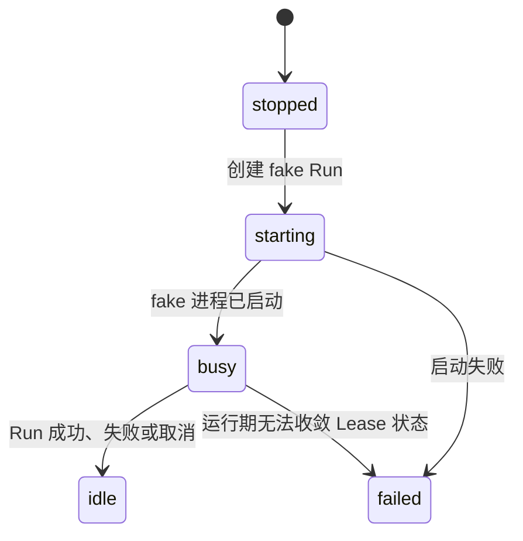

# 运行时边界：SandboxRuntime 与 AgentRuntime

> 状态：fake P1 的当前代码合同；真实 E2B、Pi RPC、模型通道、终端、文件与 preview 属于 D2。
> 关联：[ADR-0002](../adr/0002-run-agent-process-and-lease-lifecycle.md) · [系统总览](./01-system-overview.md) · [数据与模型](./03-data-auth-and-models.md)

## 1. 当前结论

一个 `SandboxLease` 绑定一个 Project 的当前临时环境。应用级 Lease ID 稳定，供应商实例 ID 只保存在服务端 `provider_ref` 中；浏览器永远看不到供应商 ID、端口、Provider Key 或模型 Key。

运行期有两个独立端口：

| 端口 | 负责什么 | 不负责什么 |
| --- | --- | --- |
| `SandboxRuntime` | 取得当前沙箱、启动通用进程、读写 stdin、读取进程事件、终止进程与停止沙箱。 | Pi 协议、D1、Message、模型调用。 |
| `AgentRuntime` | 以受控进程接口启动某个 Agent，并映射为统一 Agent 事件。 | 创建供应商沙箱、D1 写入、取得 Provider/Gemini 原始 Key。 |

当前只注册 `pi` 和 `fake`。`fake` 是本地控制面验证实现，不是 Linux 沙箱，也不执行 Pi 二进制。

## 2. 当前代码合同

以下类型与 [runtime/contract.ts](../../src/runtime/contract.ts) 和 [agent/contract.ts](../../src/agent/contract.ts) 一致：

```ts
type RuntimeKind = "fake" | "e2b" | "cloudflare-container";

type EnsureLeaseInput = {
  projectId: string;
  sandboxLeaseId: string;
};

type SandboxCommand = {
  agentRunId: string;
  args: readonly string[];
  command: string;
  cwd: string;
};

interface SandboxProcessSession {
  events(): AsyncIterable<SandboxProcessEvent>;
  terminate(reason: "cancelled" | "timed_out" | "failed"): Promise<void>;
  write(input: string): Promise<void>;
}

interface SandboxRuntime {
  readonly kind: RuntimeKind;
  ensureLease(input: EnsureLeaseInput): Promise<RuntimeHandle>;
  startProcess(handle: RuntimeHandle, command: SandboxCommand): Promise<SandboxProcessSession>;
  stop(handle: RuntimeHandle, reason: "idle" | "manual" | "failed"): Promise<void>;
}
```

```ts
type AgentRuntimeCapabilities = {
  modelGateway: boolean;
  processTermination: boolean;
  stdin: boolean;
  streamingOutput: boolean;
  tty: boolean;
};

interface AgentExecution {
  cancel(reason: "cancelled" | "timed_out" | "failed"): Promise<void>;
  events(): AsyncIterable<AgentEvent>;
}

interface AgentRuntime {
  readonly capabilities: AgentRuntimeCapabilities;
  readonly id: "pi" | "goose" | "claude-code" | "codex-cli";
  start(context: { processes: { start(command: SandboxCommand): Promise<SandboxProcessSession> } }, input: AgentRunInput): Promise<AgentExecution>;
}
```

`AgentRunInput` 只带 Project、Run、应用 Lease ID、工作目录和用户任务。它不包含 Provider 管理凭据、真实 sandbox ID 或 Gemini Key。当前 Pi 适配器只证明受控进程启动、输入写入、输出映射与取消；真实 Pi JSON-RPC 和模型通道仍未实现。

## 3. fake P1 生命周期

当前 `RunCoordinator` 的实际状态收敛是：



当前 fake P1 能验证：

1. 每个 Project 只有一条逻辑 Lease。
2. D1 部分唯一索引保证每个 Project 同时最多一个非终态 Run。
3. Pi 适配器通过受控进程接口得到事件；本地开发服务让 fake 进程短暂保持活动，便于验收 D1 的取消状态转换。
4. SSE 在自己的请求内轮询 D1，只返回应用级 `sandboxLeaseId`、Run 状态和终态；不跨请求搬运原始进程输出。

当前 fake P1 不实现空闲 TTL、wall-clock timeout、每用户活动沙箱上限、真实文件、终端、preview、跨 Worker isolate 协调或跨请求的物理进程取消。取消请求会先写入 `cancelling`，fake 进程结束后协调器才收敛为 `cancelled`。`timed_out` 是为真实运行时保留的状态，不能宣称 fake 已覆盖它。

## 4. 已注册与预留 Runtime

| Runtime | 当前状态 | 能否让用户选择 |
| --- | --- | --- |
| Pi | 唯一已注册的 AgentRuntime；仅 fake 合同验证。 | 暂不提供选择 UI。 |
| Goose | 仅预留 Runtime ID。 | 不可以。 |
| Claude Code | 仅预留 Runtime ID。 | 不可以。 |
| Codex CLI | 仅预留 Runtime ID。 | 不可以。 |

新增适配器前必须独立验收镜像安装、模型凭据路径、事件映射、取消、日志脱敏、网络策略和沙箱隔离。不能因为 Runtime ID 已存在就把它暴露给用户。

## 5. D2 扩展要求

真实 E2B 实现会保持相同的 `SandboxRuntime` 接口，但必须额外解决：

- 跨 Worker isolate 的执行所有权、事件订阅与取消；fake P1 只轮询 D1 状态，不保有跨请求的执行 registry。
- 真实 Provider sandbox ID 和 process reference 的私有持久化与失效处理。
- Pi RPC 的最终回复、受控 ModelGateway 通道和真实 usage 聚合。
- wall-clock timeout、空闲 TTL、每用户并发上限与明确的资源释放路径。
- 经授权的文件、终端与 preview 网关；停止后不恢复任何工作区文件。

这些要求的持久协调设计由后续 D2 ADR 固化。此前不得把 `e2b` 设为默认运行时，也不得向浏览器开放 Provider 或任意 shell 命令。

## 6. 非目标

- R2 快照、工作区版本、沙箱历史或完整原始执行归档。
- 浏览器直连 Provider、模型 API 或沙箱内部端口。
- 常驻 Pi session、跨 Run resume 或未授权的任意 CLI。

## 7. 外部依据

- [Pi RPC](https://pi.dev/docs/latest/rpc) 与 [Pi Provider 配置](https://github.com/earendil-works/pi/blob/main/packages/coding-agent/docs/models.md)
- [E2B Sandbox 文档](https://e2b.dev/docs/sandbox)
- [Cloudflare Containers](https://developers.cloudflare.com/containers/)
