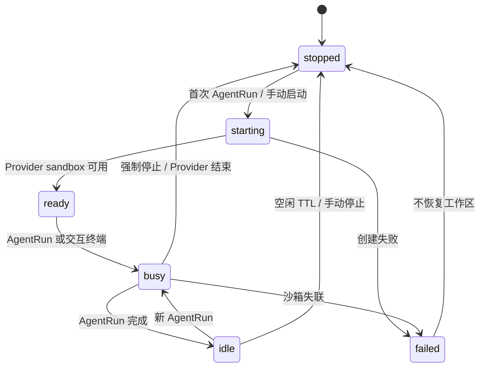
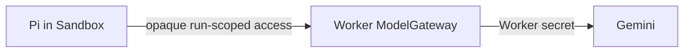

# 运行时边界：SandboxRuntime 与 AgentRuntime

> 状态：目标架构基线 v0.4
> 关联：[ADR-0002](../adr/0002-run-agent-process-and-lease-lifecycle.md) · [系统总览](./01-system-overview.md) · [数据与模型](./03-data-auth-and-models.md)

## 1. 决策

一个 `SandboxLease` 绑定一个 Project 的当前临时运行环境。该 Lease 可以服务多个连续 AgentRun，直到空闲、停止、超时或故障。Project 的代码只在沙箱磁盘中存在；沙箱消失后不恢复工作区。

为避免把 Agent 协议和云供应商耦合，运行期拆为两个端口：

| 端口 | 负责什么 | 不负责什么 |
| --- | --- | --- |
| `SandboxRuntime` | 创建/附着/停止沙箱，启动通用进程，输入、输出、终止和受控 preview/文件访问。 | Pi、Goose 或任一 Agent 协议、模型选择、D1 写入。 |
| `AgentRuntime` | 选择 Agent 启动方式，映射 Agent 协议和原始输出为统一 `AgentEvent`，声明能力。 | 创建供应商沙箱、暴露原始 Key、绕过授权或用量统计。 |

当前实际注册的 AgentRuntime 只有 Pi。以后增加 Goose、Claude Code 或 Codex CLI 时，只能新增独立 AgentRuntime 适配器，不能把特定 CLI 行为写进 SandboxRuntime。

## 2. Lease 生命周期



规则：

1. `sandbox_leases.project_id` 唯一；一个 Project 同时最多一个活动 Provider sandbox。
2. Lease 只服务一个 Project，不同 Project 必须使用不同沙箱。
3. 浏览器关闭不立即销毁 Lease；空闲 TTL 由 `RUNTIME_IDLE_TTL_SECONDS` 控制。
4. 停止或失联时不 checkpoint。平台标记 Lease 已停止或失败，更新私有 `provider_ref`，并明确告知用户新环境不会恢复旧文件。
5. 重新进入已停止的 Project 时保留同一应用级 Lease ID，但启动新的、空的 Provider sandbox。

## 3. `SandboxRuntime` 端口

业务层不依赖 E2B 或 Cloudflare SDK 的类型。目标合同聚焦当前沙箱与运行中的进程：

```ts
type RuntimeKind = "fake" | "e2b" | "cloudflare-container";

type SandboxCommand = {
  command: string;
  args: readonly string[];
  cwd: string;
  agentRunId: string;
};

type SandboxProcessEvent =
  | { type: "process.started"; sandboxLeaseId: string; processId: string }
  | { type: "process.output"; sandboxLeaseId: string; stream: "stdout" | "stderr"; chunk: string }
  | { type: "process.completed"; sandboxLeaseId: string; exitCode: number };

interface SandboxProcessSession {
  write(input: string): Promise<void>;
  events(): AsyncIterable<SandboxProcessEvent>;
  terminate(reason: "cancelled" | "timed_out" | "failed"): Promise<void>;
}

interface SandboxRuntime {
  readonly kind: RuntimeKind;
  ensureLease(input: EnsureLeaseInput): Promise<RuntimeHandle>;
  startProcess(handle: RuntimeHandle, command: SandboxCommand): Promise<SandboxProcessSession>;
  stop(handle: RuntimeHandle, reason: StopReason): Promise<void>;
}
```

约束：

- `RuntimeHandle`、`processId` 和供应商 `sandboxId` 仅在服务端适配器中存在。
- `EnsureLeaseInput` 绑定 `projectId`、应用级 `sandboxLeaseId`、镜像版本、网络策略和最大时长。
- `SandboxCommand` 由已注册的 AgentRuntime 或受控终端服务构造，浏览器不能提交任意命令。
- Runtime 事件必须带 Lease/Run 标识，便于 D1 状态更新、脱敏和计量。
- Runtime 不调用 D1，也不实现文件快照、恢复或 R2 写入。

## 4. `AgentRuntime` 端口与能力

```ts
type AgentRuntimeId = "pi" | "goose" | "claude-code" | "codex-cli";

interface AgentRuntime {
  readonly id: AgentRuntimeId;
  readonly requirements: {
    streamingOutput: boolean;
    stdin: boolean;
    processTermination: boolean;
    tty: boolean;
    modelGateway: boolean;
  };
  start(context: AgentExecutionContext, input: AgentRunInput): AsyncIterable<AgentEvent>;
  cancel(context: AgentExecutionContext): Promise<void>;
}
```

`AgentRunInput` 包含任务文本、Project、Run、应用 Lease ID 和工作目录等必要上下文。平台 Gemini Key、Provider 管理凭据和私有 sandbox ID 永远不在其中。Agent 若需要模型，只能使用 RunCoordinator 为当前 Run 提供的短时、不透明 ModelGateway 通道。

| Runtime | 当前状态 | 能否让用户选择 |
| --- | --- | --- |
| Pi | 唯一已注册的默认适配器；当前仅 fake 合同测试。 | 暂不提供选择 UI。 |
| Goose | 仅预留 Runtime ID。 | 不可以。 |
| Claude Code | 仅预留 Runtime ID。 | 不可以。 |
| Codex CLI | 仅预留 Runtime ID。 | 不可以。 |

每个新适配器至少验证镜像安装、模型通道、非交互/交互模式、事件映射、取消、日志脱敏、网络策略和 E2E 沙箱隔离。

## 5. 供应商选择

| 实现 | 用途 | 说明 |
| --- | --- | --- |
| `fake` | 单元和集成测试 | 模拟进程事件、超时、失败和 Run 生命周期。 |
| `e2b` | 早期真实远程运行时 | 开发期优先，用真实 Linux 验证 Pi、终端和 preview。 |
| `cloudflare-container` | 以后公开部署候选 | 保持同一 Adapter 合同；是否可用与计费需在接入时重新核对。 |

本地 Worker 不直接访问 Docker socket。以后若确实需要本机 Docker，应增加只在开发机运行的 `local-runtime-bridge`，同样实现 `SandboxRuntime`；生产 Worker 不依赖本机环境。

## 6. Agent、模型与网络

Pi 以无头进程运行在 `/workspace`。默认基础镜像固定 Pi、Node、git、rg 和必要构建工具的版本；第一版不允许用户安装任意 Agent 扩展。



Agent 工具、用户 shell 和依赖安装都在低信任边界。网络策略至少要明确模型网关和包仓库访问；不同 Provider 能否强制该策略必须由其适配器如实声明，不能由产品文案假设。

## 7. 终端、文件与 preview

用户应能“看到沙箱”，但只能通过产品网关：

- `sandboxLeaseId`：前端用于订阅状态、事件和终端，不是真实 sandbox ID。
- 文件：Worker 在完成 `(user_id, project_id, sandboxLeaseId)` 授权后，从当前存活沙箱读取或写入；停止后不提供历史文件。
- 终端：浏览器连接 Hono 的受控 WebSocket；网关验证所有权后代理 PTY 流。
- preview：使用独立 origin 的 PreviewGateway，不能与主应用 Cookie 同域；Lease 停止后访问失效。

## 8. 适配器验收

一个 SandboxRuntime 或 AgentRuntime 只有通过以下测试后才能用于用户：

1. 能从空工作区创建 Lease，并把应用 Lease ID 与 Provider 私有 ID 隔离。
2. 同一存活 Lease 上连续两次 AgentRun 能看到彼此前一次的文件结果。
3. Lease 被强制停止后，新环境不错误宣称恢复了旧文件。
4. 同一 Project 的并发启动请求不会产生两个活动 Lease 或两个非终态 Run。
5. 未注册 Runtime 或任意浏览器命令不能进入沙箱执行。
6. 浏览器、事件、日志和 D1 中没有 Provider Key、Gemini Key、短时模型访问值或供应商内部 token。
7. 到达 Run 时间上限时，控制平面能终止对应进程并写入终态。

## 9. 外部依据

- [Pi RPC](https://pi.dev/docs/latest/rpc) 与 [Pi Provider 配置](https://github.com/earendil-works/pi/blob/main/packages/coding-agent/docs/models.md)
- [E2B Sandbox 文档](https://e2b.dev/docs/sandbox)
- [Cloudflare Containers](https://developers.cloudflare.com/containers/)
