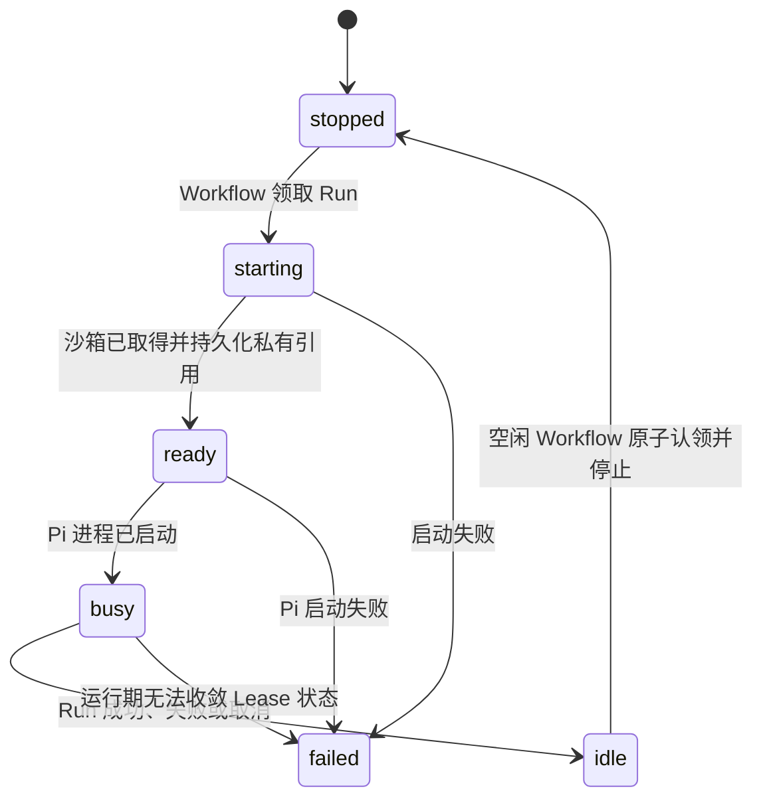

# 运行时边界：SandboxRuntime 与 AgentRuntime

> 状态：E2B、Pi RPC、模型通道、进程取消与 Workflow 空闲回收已通过远程 Preview；只读 Files 已完成本地实现，远程验收、终端和 preview 待完成。
> 关联：[ADR-0002](../adr/0002-run-agent-process-and-lease-lifecycle.md) · [系统总览](./01-system-overview.md) · [数据与模型](./03-data-auth-and-models.md)

## 1. 当前结论

一个 `SandboxLease` 绑定一个 Project 的当前临时环境。应用级 Lease ID 稳定，供应商实例 ID 只保存在服务端 `provider_ref` 中；浏览器永远看不到供应商 ID、端口、Provider Key 或模型 Key。

运行期有两个独立端口。`SandboxRuntime` 在代码中进一步按能力拆为生命周期、进程和文件接口，application 模块只依赖所需能力：

| 端口 | 负责什么 | 不负责什么 |
| --- | --- | --- |
| `SandboxRuntime` | 取得当前沙箱、启动通用进程、读写 stdin、读取进程事件、终止进程、受控文件 IO 与停止沙箱。 | Pi 协议、D1、Message、模型调用。 |
| `AgentRuntime` | 以受控进程接口启动某个 Agent，并映射为统一 Agent 事件。 | 创建供应商沙箱、D1 写入、取得 Provider/Gemini 原始 Key。 |

当前 AgentRuntime 只注册 `pi`。SandboxRuntime 可安装 `fake` 或 `e2b`；`fake` 是本地控制面验证实现，不是 Linux 沙箱，也不执行 Pi 二进制。

## 2. 当前代码合同

以下类型与 [runtime/contract.ts](../../src/runtime/contract.ts) 和 [agent/contract.ts](../../src/agent/contract.ts) 一致：

```ts
type RuntimeKind = "fake" | "e2b" | "cloudflare-container";

type EnsureLeaseInput = {
  providerRef: string | null;
  projectId: string;
  sandboxLeaseId: string;
};

type SandboxCommand = {
  agentRunId: string;
  args: readonly string[];
  command: string;
  cwd: string;
};

interface SandboxProcessSession {
  readonly providerProcessRef: string;
  events(): AsyncIterable<SandboxProcessEvent>;
  terminate(reason: "completed" | "cancelled" | "timed_out" | "failed"): Promise<void>;
  write(input: string): Promise<void>;
}

interface SandboxRuntime {
  readonly kind: RuntimeKind;
  readonly filesystemScope: "lease" | "runtime-instance";
  ensureLease(input: EnsureLeaseInput): Promise<RuntimeHandle>;
  listDirectory(handle: RuntimeHandle, path: string): Promise<SandboxFileEntry[]>;
  readFile(handle: RuntimeHandle, path: string): Promise<Uint8Array>;
  startProcess(handle: RuntimeHandle, command: SandboxCommand): Promise<SandboxProcessSession>;
  terminateProcess(handle: RuntimeHandle, providerProcessRef: string, reason: ProcessTerminationReason): Promise<void>;
  stop(handle: RuntimeHandle, reason: "idle" | "manual" | "failed"): Promise<void>;
  writeFile(handle: RuntimeHandle, path: string, content: string): Promise<void>;
}
```

```ts
type AgentRuntimeCapabilities = {
  modelGateway: boolean;
  processTermination: boolean;
  stdin: boolean;
  streamingOutput: boolean;
  tty: boolean;
};

interface AgentExecution {
  readonly providerProcessRef: string;
  cancel(reason: "completed" | "cancelled" | "timed_out" | "failed"): Promise<void>;
  events(): AsyncIterable<AgentEvent>;
}

interface AgentRuntime {
  readonly capabilities: AgentRuntimeCapabilities;
  readonly id: "pi" | "goose" | "claude-code" | "codex-cli";
  start(context: { processes: { start(command: SandboxCommand): Promise<SandboxProcessSession> } }, input: AgentRunInput): Promise<AgentExecution>;
}
```

`AgentRunInput` 只带 Project、Run、应用 Lease ID、工作目录、用户任务和短时 ModelGateway capability。它不包含 Provider 管理凭据、真实 sandbox ID 或 Gemini Key。Pi 适配器实现 RPC JSONL、最终可见文本提取、工具事件归一化、abort 与进程终止。

## 3. 当前生命周期

当前 `RunCoordinator` 的实际状态收敛是：



当前实现能验证：

1. 每个 Project 只有一条逻辑 Lease。
2. D1 部分唯一索引保证每个 Project 同时最多一个非终态 Run。
3. Pi 适配器通过受控进程接口得到事件；E2B 适配器支持重连当前沙箱、启动进程、按 PID 终止和停止沙箱。
4. SSE 在自己的请求内轮询 D1，只返回应用级 `sandboxLeaseId`、Run 状态和终态；不跨请求搬运原始进程输出。
5. Cloudflare Workflow 拥有长生命周期执行、deadline 和空闲 TTL；取消请求使用 D1 中的私有进程引用跨请求终止 Pi。

当前仍不实现每用户活动沙箱上限、终端或 preview。

## 4. 只读 Files 边界

`ProjectFilesService` 只接受 Project ID 和相对 `/workspace` 的路径。它不会调用
`ensureLease()`，因此浏览文件不会创建或替换沙箱。只有 `filesystemScope=lease`
且 Lease 状态为 `idle` 或 `ready` 的 Runtime 可以读取；fake 的文件仅存在于
一次 `createServerServices()` 创建的实例内，跨请求没有连续性，所以返回
`sandbox_unavailable`。

第一版限制为：

- 路径最多 512 字符、32 层，逐段拒绝空段、`.`、`..`、反斜线、控制字符和 `.git`；
- 逐层列目录并拒绝符号链接，目录最多返回 500 项；
- 文件最多 256 KiB，只返回合法 UTF-8 文本并拒绝明显二进制内容；
- Project 有非终态 Run 时返回 `project_busy`；
- API 和 UI 不返回 Provider ID、内部绝对路径或符号链接目标。

活动 Run 检查、Lease 读取和 Provider 文件读取不是一个原子事务；逐层检查与最终
读取也存在低概率 TOCTOU。个人项目阶段把 Files 定义为无活动 Run 下的尽力一致
只读视图，不把它当作严格并发锁。Terminal 和 Preview 必须有自己的生命周期与
授权约束。

## 5. 已注册与预留 Runtime

| Runtime | 当前状态 | 能否让用户选择 |
| --- | --- | --- |
| Pi | 唯一已注册的 AgentRuntime；支持 fake 与 E2B 执行。 | 暂不提供选择 UI。 |
| Goose | 仅预留 Runtime ID。 | 不可以。 |
| Claude Code | 仅预留 Runtime ID。 | 不可以。 |
| Codex CLI | 仅预留 Runtime ID。 | 不可以。 |

新增适配器前必须独立验收镜像安装、模型凭据路径、事件映射、取消、日志脱敏、网络策略和沙箱隔离。不能因为 Runtime ID 已存在就把它暴露给用户。

## 6. 后续扩展要求

已完成：

- Cloudflare Workflow 的执行所有权、重试恢复、跨请求取消、deadline 和空闲 TTL。
- 真实 Provider sandbox ID 和 process reference 的私有持久化与失效处理。
- Pi RPC 的最终回复、受控 ModelGateway 通道和真实 usage 聚合。
- E2B template 必须以 `E2B_TEMPLATE_ID` 指向项目维护的精确 build，预装固定 Node/Pi 版本和可写 `/workspace`；不能在每个 Run 下载 Node 或安装 Pi，也不能把任何模型 Key 烘焙进 template。
- wall-clock timeout、空闲 TTL 与明确的资源释放路径。

待完成：

- 每用户并发上限和基础 usage 管理视图。
- 经授权的终端与 preview 网关；停止后不恢复任何 Project 文件。
- Cloudflare 远程环境中更复杂任务对 Workflow Free CPU 和 subrequest 上限的持续验证。

执行协调设计见 [ADR-0003](../adr/0003-agent-run-workflow.md)。在受控 API 完成前，不得向浏览器开放 Provider ID、内部端口或任意 shell 命令。

## 7. 非目标

- R2 快照、Project 文件版本、沙箱历史或完整原始执行归档。
- 浏览器直连 Provider、模型 API 或沙箱内部端口。
- 常驻 Pi session、跨 Run resume 或未授权的任意 CLI。

## 8. 外部依据

- [Pi RPC](https://pi.dev/docs/latest/rpc) 与 [Pi Provider 配置](https://github.com/earendil-works/pi/blob/main/packages/coding-agent/docs/models.md)
- [E2B Sandbox 文档](https://e2b.dev/docs/sandbox)
- [Cloudflare Containers](https://developers.cloudflare.com/containers/)
