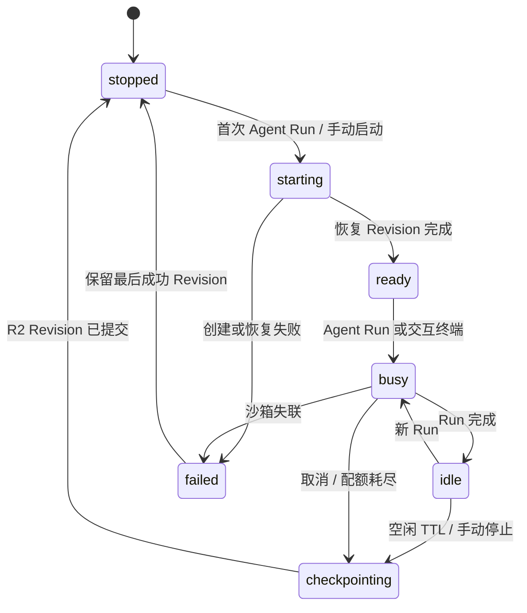
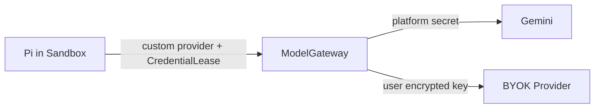

# 运行时边界：SandboxRuntime 与 AgentRuntime

> 状态：架构与工程基线 v0.3
> 关联：[系统总览](./01-system-overview.md) · [数据与模型](./03-data-auth-and-models.md) · [ADR-0001](../adr/0001-user-project-sandbox-boundary.md)

## 1. 决策

一个 `SandboxLease` 绑定一个 Project 的一次活动运行期；该 Lease 可以服务多个连续 Agent Run，直到空闲、停止、超时或故障。Project 的持久状态不依赖 Lease 是否还活着。

为避免把 Agent 协议和云供应商耦合，运行期拆为两个端口：

| 端口 | 负责什么 | 不负责什么 |
| --- | --- | --- |
| `SandboxRuntime` | 创建/恢复/停止沙箱，执行通用命令，输出进程流，checkpoint 工作区。 | Pi、Goose 或任一 Agent 的协议、模型选择、D1 写入。 |
| `AgentRuntime` | 选择 Agent 命令，映射 Agent 协议和原始输出为统一 `AgentEvent`，声明能力。 | 创建供应商沙箱、暴露原始 Key、绕过授权或配额。 |

当前注册的 `AgentRuntime` 只有 Pi。Pi 运行于 Linux 沙箱中；未来添加 Goose、Claude Code、Codex CLI 时，只能新增独立 AgentRuntime 适配器，不能修改 SandboxRuntime 的通用合同。

这比“每条消息一个沙箱”更连续、冷启动更少；也比“每个 Project 永久一个沙箱”更可控、成本更低。

## 2. Lease 生命周期



规则：

1. `Project` 同时最多一个活动 Lease（`starting`、`ready`、`busy`、`idle`）。
2. Lease 只服务一个 Project；不同 Project 必须使用不同沙箱。
3. 用户关闭浏览器标签不立即销毁 Lease；由空闲 TTL 决定。第一版默认值由 `RUNTIME_IDLE_TTL_SECONDS` 配置。
4. 停止前尽力 checkpoint。checkpoint 失败时仍停止沙箱，但保留最后成功 Revision，并明确向用户报告可能丢失的未保存改动。
5. 重新进入已停止 Project 时得到新的 Lease 和新的供应商实例，不尝试热迁移旧虚拟机。

## 3. `SandboxRuntime` 端口

业务层不依赖 E2B 或 Cloudflare SDK 的类型：

```ts
type RuntimeKind = "fake" | "e2b" | "cloudflare-container";

type SandboxCommand = {
  command: string;
  args: readonly string[];
  cwd: string;
  runId: string;
};

type SandboxProcessEvent =
  | { type: "process.started"; sandboxLeaseId: string; processId: string }
  | { type: "process.output"; sandboxLeaseId: string; stream: "stdout" | "stderr"; chunk: string }
  | { type: "process.completed"; sandboxLeaseId: string; exitCode: number };

interface SandboxRuntime {
  readonly kind: RuntimeKind;
  create(input: CreateLeaseInput): Promise<RuntimeHandle>;
  restore(handle: RuntimeHandle, revision: WorkspaceRevision): Promise<void>;
  execute(handle: RuntimeHandle, command: SandboxCommand): AsyncIterable<SandboxProcessEvent>;
  checkpoint(handle: RuntimeHandle, reason: CheckpointReason): Promise<WorkspaceArtifact>;
  stop(handle: RuntimeHandle, reason: StopReason): Promise<void>;
}
```

约束：

- `RuntimeHandle` 和供应商 `sandboxId` 仅在服务端适配器中存在。
- `CreateLeaseInput` 绑定 `projectId`、`sandboxLeaseId`、镜像版本、网络策略和最大时长。
- `SandboxCommand` 由已注册的 AgentRuntime 或受控终端服务构造，不能由浏览器直接提供任意命令。
- Runtime 不能直接更新 D1 的 Project 指针；它只返回快照产物，由控制平面提交 Revision。
- Runtime 事件必须带 Lease/Run 标识，便于去重和用量结算。

## 4. `AgentRuntime` 端口与可用性

```ts
type AgentRuntimeId = "pi" | "goose" | "claude-code" | "codex-cli";

interface AgentRuntime {
  readonly id: AgentRuntimeId;
  readonly capabilities: {
    interactiveTerminal: boolean;
    resumableSession: boolean;
    structuredEvents: boolean;
  };
  start(context: AgentExecutionContext, input: AgentRunInput): AsyncIterable<AgentEvent>;
}
```

`AgentRunInput` 只包含 Project、Run、应用 Lease ID 和工作目录等业务上下文。平台 Gemini Key、BYOK 原文和供应商管理凭据永远不在该输入中；需要模型访问时只通过短时、可撤销的 `CredentialLease` 与 ModelGateway。

| Runtime | 当前状态 | 能否让用户选择 |
| --- | --- | --- |
| Pi | 已注册的默认适配器；fake runtime 测试覆盖其命令与事件映射。 | 设计上可以；完整产品 API 尚未实现。 |
| Goose | 仅预留 Runtime ID。 | 不可以。 |
| Claude Code | 仅预留 Runtime ID。 | 不可以。 |
| Codex CLI | 仅预留 Runtime ID。 | 不可以。 |

预留 ID 是数据/接口的前瞻兼容，不是功能承诺。每个新适配器至少要验证镜像安装、凭据通道、非交互/交互模式、事件映射、取消、恢复、模型条款和 E2E 沙箱隔离。

## 5. 供应商选择

| 实现 | 用途 | 说明 |
| --- | --- | --- |
| `fake` | 单元和集成测试 | 可模拟进程事件、超时、失败和快照中断。 |
| `e2b` | 早期真实远程运行时 | 开发期优先，用真实 Linux 验证默认 Pi、终端、preview 和恢复。 |
| `cloudflare-container` | 以后公开部署候选 | 保持同一 Adapter 合同；需要 Workers Paid。 |

本地 Worker 不应直接访问 Docker socket。若以后需要本机 Docker，增加一个只在开发机运行的 `local-runtime-bridge`，同样实现 `SandboxRuntime`；不要让生产 Worker 依赖本机 Docker。

## 6. Agent、模型与网络

Pi 以无头 RPC 进程形式运行于 `/workspace`。默认基础镜像固定 Pi、Node、git、rg 和必要构建工具的版本；用户不能在第一版安装任意 Agent 扩展。

Pi 的模型请求经过 Worker 中的 `ModelGateway`：



Agent 工具、用户 shell 和依赖安装都在低信任边界。网络默认只允许模型网关、恢复/快照所需端点和显式许可的包仓库；E2B 适配器必须如实报告其能否强制这一策略。

## 7. 终端、文件与 preview

用户应能“看到沙箱”，但只能通过产品网关：

- `sandboxLeaseId`：前端用于订阅状态、事件和终端；不是真实 sandbox ID。
- 文件：通过 Project API 和当前 Revision 读取；Run 期间编辑器应只读或排队，避免与 Agent 双写。
- 终端：浏览器连接 Hono 的受控 WebSocket；网关验证 `(user_id, project_id, sandboxLeaseId)` 后代理 PTY 流。
- preview：使用独立 origin 的 `PreviewGateway`，不能和主应用 Cookie 同域；Lease 停止后访问失效。

## 8. 适配器验收

一个 SandboxRuntime 或 AgentRuntime 只有通过以下测试后才能用于用户：

1. 能从空模板和既有 `WorkspaceRevision` 创建 Lease。
2. 同一 Lease 上连续两次 Agent Run 可看到彼此前一次的文件结果。
3. Lease 被强制停止后，最后成功 Revision 仍能恢复。
4. 同一 Project 的并发启动请求不会产生两个活动 Lease。
5. 未注册 Runtime 或任意浏览器命令不能进入沙箱执行。
6. 浏览器、事件、日志和 snapshot 中没有 Provider Key、CredentialLease 明文或供应商内部访问 token。
7. 到达用户级时间、并发或预算上限时，控制平面能强制停止 Lease。

## 9. 外部依据

- [Pi RPC](https://pi.dev/docs/latest/rpc) 与 [Pi Provider 配置](https://github.com/earendil-works/pi/blob/main/packages/coding-agent/docs/models.md)
- [E2B Sandbox 文档](https://e2b.dev/docs/sandbox) 与 [Snapshot](https://e2b.dev/docs/sandbox/snapshots)
- [Cloudflare Containers](https://developers.cloudflare.com/containers/)
