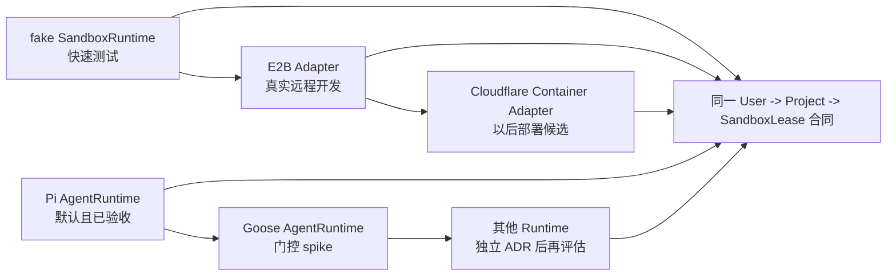

# 交付阶段、运行时选择与成本边界

> 状态：D2、D3 Files 已通过远程 Preview；D4 Goose adapter/组合模板已通过私有 Preview 受控 spike，但公开能力仍受门控；当前用户跨 Run 用量聚合已完成本地验收、待发布 Preview。
> 关联：[ADR-0002](../adr/0002-run-agent-process-and-lease-lifecycle.md) · [ADR-0003](../adr/0003-agent-run-workflow.md) · [ADR-0004](../adr/0004-goose-agent-runtime-spike.md) · [系统总览](./01-system-overview.md) · [运行时](./02-sandbox-runtime.md) · [环境变量](../setup/environment-variables.md)

## 1. 结论

Cloudflare Worker/Assets 和 D1 是 V1 平台基线；R2 不在第一版。真实 Linux 沙箱是独立运行时依赖：本地和早期真实验证优先用 E2B，未来若迁移 Cloudflare Containers，仍保持同一 `SandboxRuntime` 合同并在当时复核产品可用性与价格。

项目是开源、个人学习用的完整 Agent 产品实现，但支付/订阅完全不在范围内。D1 上的 Run 用量只服务于产品展示、内部观察和将来的计费接口准备。

运行时有两条独立演进轴：`SandboxRuntime` 决定 Linux 沙箱来自哪里，`AgentRuntime` 决定沙箱中启动什么 Agent。不要用一个 Provider 配置同时决定两者。

## 2. 阶段

| 阶段 | 目标 | 必做 | 不做 | 通过条件 |
| --- | --- | --- | --- | --- |
| D0 | 重建轻量合同 | 按 ADR-0002 清理 R2/Revision 模型，重建 D1 迁移、领域合同与 fake 测试。 | 真实 Provider、真实模型、BYOK。 | 单 Lease、单活动 AgentRun、文件不恢复和状态机测试通过。 |
| D1 | fake 控制面闭环 | Better Auth 邮箱密码登录、Project、用户输入、AgentRun、Lease、SSE、取消与零值 usage UI。 | 团队、支付、公开 BYOK、第三方登录、伪造 assistant 回复。 | 注册登录、创建 Project、fake Pi Run、取消和 D1 Run 状态可见。 |
| D2 | 真实 Agent 路径 | 按 ADR-0003 实现 AgentRunWorkflow、Gemini ModelGateway、E2B Adapter、真实 Pi、最终回复、取消、deadline 和 TTL。 | 匿名开放注册、R2 恢复、raw event 归档。 | 同 Project 连续 Run 复用存活沙箱；取消/TTL 收敛；远程 Workflow 免费层运行通过。 |
| D3 | 受控 Project 能力与基础观测 | 文件浏览、终端、preview、changes、可选 Sentry、每用户上限和 `ADMIN_EMAILS` 用量视图。 | 任意 shell 公共入口、日志全量归档、Session Replay、商业计费。 | Worker/沙箱/模型失败可定位，受控能力不泄漏 Provider ID、端口、prompt、文件或密钥。 |
| D4 | 第二个 Runtime 或 Provider | 一个独立适配器、能力矩阵、凭据流、取消和隔离 E2E。 | 同时接入多个 CLI。 | 不假定 Pi 特性；不支持的能力明确拒绝。 |
| D5 | 公共部署候选 | 重新审阅注册滥用、限额、网络策略、成本上限和完整 E2E。 | 支付系统。 | 真实成本、异常路径和隔离演练通过。 |

当前进度：D0/D1/D2 已完成。D2 已实现并远程验证 E2B、Pi RPC、ModelGateway、最终 assistant Message、真实 usage、私有进程取消、Run deadline、Workflow 重试恢复、原子空闲回收、Preview 邮箱 allowlist 和全局 Run 开关。D3 只读 Files 已完成授权 API、E2B 文件适配、路径/大小/文本限制、明确状态、测试和远端 UI/手动停止验收；当前用户全量 Usage API/UI 已完成代码、测试和本地浏览器验收，未新增表或外部依赖，尚待发布 Preview。D4 已完成 Goose adapter、服务端门控、组合模板，以及 D1/Workflow/usage/取消/deadline/TTL 的私有 Preview spike；Goose 因剩余安全和浏览器门槛仍不是公开产品能力。Terminal、preview 和 changes 当前仍禁用。

D3 按“受控只读 Files -> 跨 Run 用量聚合 -> Terminal -> Preview -> Changes”推进。Files 和当前用户全量用量聚合已完成；下一步先做 Runtime capability 接口与 Hono/use-case 边界的小范围加固，再实现受控 Terminal。维护者用量、日期筛选和配额仍留待后续。

## 3. 当前与未来 Runtime 的边界

- `fake`：测试 RunCoordinator、重复启动、失败、取消和 D1 状态收敛；不模拟真实 wall-clock timeout，内存文件也不具备跨请求连续性，因此公共 Files 不可用。
- `e2b`：开发测试真实 Pi 和 Linux；`E2B_API_KEY` 只在服务端环境中使用。终端和 preview 需要额外受控 API，不能因 E2B 已接入就直接开放。
- `cloudflare-container`：以后需要 Cloudflare 原生生产 Runtime 时接入；不要因其名称把业务层绑定到 Containers。
- Pi：默认且已验收的 AgentRuntime，也是当前公开执行路径。
- Goose：按 ADR-0004 实施独立 adapter 和 Pi + Goose 组合模板；远端执行门槛已通过，但 capability 输出脱敏和浏览器选择验收前仍不可出现在 UI 中。
- Claude Code、Codex CLI：仍是后续候选，保留 ID 不表示已支持。

## 4. D2/D3 成本与滥用护栏

以下是公开部署前的护栏。单 Run 生命周期、私有 Preview 访问和紧急停用已实现；每用户并发上限与管理聚合视图仍待 D3：

1. 每个 User 默认最多一个活动 Lease，配置化而非硬编码。
2. 每个 AgentRun 设置最大 wall-clock 时间；真实沙箱接入后记录 `sandbox_duration_ms`。
3. 空闲 TTL 到期后停止沙箱，避免 Project 因打开标签页长期占用资源；停止不做快照。
4. ModelGateway 从 Gemini 实际响应写入 token 和请求数，不把模型成本估算藏在 UI 状态中。
5. 出现 Provider 错误或异常用量时，维护者可用服务端 `RUNS_ENABLED` 总开关暂停新 Run；admin 用量视图和精细配额以后再设计。
6. 早期真实沙箱通过部署邮箱 allowlist 只对自己或受邀测试账号开放；开源不等于开放匿名计算资源。
7. 每个新 AgentRuntime 独立评估镜像体积、冷启动、模型请求路径、凭据持有方式和出网能力，不能沿用 Pi 的成本假设。
8. Cloudflare Workflows Free 当前每次调用的 CPU 边界为 10ms、每 instance 最多 50 个外部 subrequest；预览环境必须持续验证典型 Pi Run，并在超限时停止公开注册。

截至 2026-07-26，当前 Cloudflare Worker、Static Assets、D1、Workflows 和 Workers Logs 均可使用 Workers Free 额度。E2B Hobby 虽无月费，但沙箱计算按秒计费，只有一次性 $100 credits；因此当前系统不是“所有外部算力永久免费”。未来切换 Cloudflare Sandbox/Containers 需要 Workers Paid，最低平台费用不再为 $0。完整口径见 [D2 阶段基线](../status/2026-07-26-d2-baseline.md)。

## 5. 支付不是延后实现项，而是范围外

本仓库不设计：

- 价格和套餐；
- credit / 充值余额；
- 订阅生命周期；
- 支付、退款、发票、税务和 webhook；
- Stripe 或任何支付 Provider。

若未来需要商业化，应从 `AgentRun` 聚合用量重新设计计费领域，而不是把商业对象提前混进 Project、Lease 或权限模型。

## 6. 上线前复核

成本、配额和产品可用性会变化。准备启用真实 Runtime 或公开注册前，复核：

- [Cloudflare Workers 限制](https://developers.cloudflare.com/workers/platform/limits/)
- [Cloudflare D1 定价](https://developers.cloudflare.com/d1/platform/pricing/)
- [Cloudflare Workflows 限制](https://developers.cloudflare.com/workflows/reference/limits/) 与 [定价](https://developers.cloudflare.com/workflows/reference/pricing/)
- [Cloudflare Containers](https://developers.cloudflare.com/containers/)
- [E2B Pricing](https://e2b.dev/pricing) 与 [Billing and limits](https://e2b.dev/docs/billing)
- [Sentry Pricing](https://sentry.io/pricing/)
