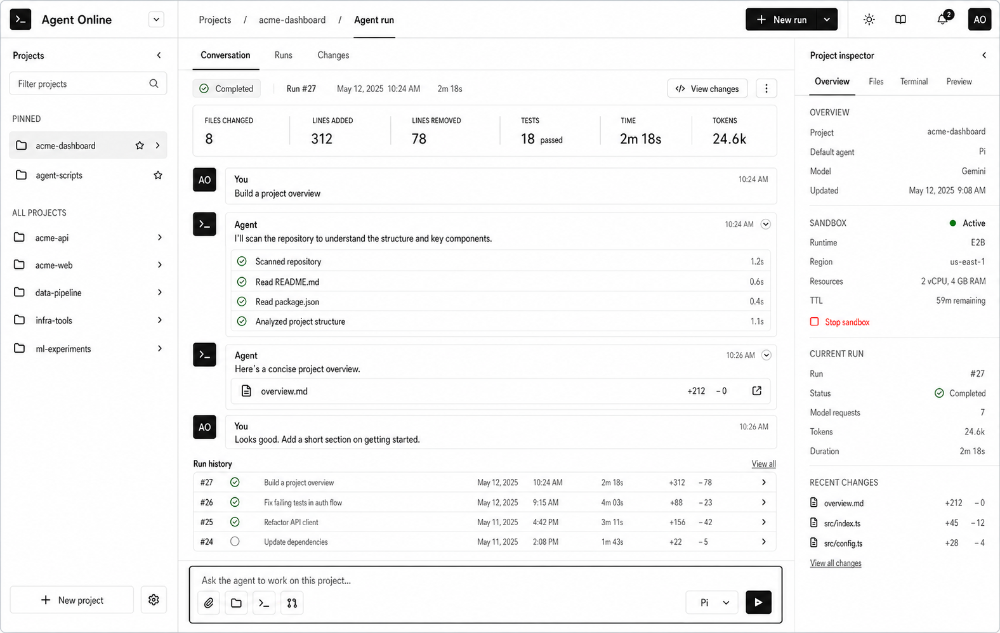

# 视觉与产品目标

> 状态：已确认的产品方向基准。效果图约束后续界面和功能组织，但不代表图中所有能力已经实现。
> 当前进度：D2、D3 已远程验收；Goose 已完成私有 Preview spike，但 UI 仍只公开 Pi。
> 关联：[视觉基准图](./assets/agent-online-visual-target.png) · [系统总览](../architecture/01-system-overview.md) · [交付阶段](../architecture/04-delivery-and-cost.md)

## 1. 产品体验目标

Agent Online 的首屏是可操作的 Coding Agent 工作台，而不是营销落地页。用户登录后应能在一个连续界面中完成：

1. 选择或创建 Project。
2. 与当前 Project 的 Agent 对话并观察 Run 状态。
3. 查看当前沙箱的公开状态和基础用量。
4. 在对应后端能力完成后，查看文件、终端和 preview。

界面只是沙箱内真实 Agent 的控制与可视化层。不能用前端模拟内容冒充 Pi 回复、文件、终端、diff、用量或沙箱状态。

## 2. 稳定布局

桌面端采用三栏工作台：

| 区域 | 责任 | 数据来源 |
| --- | --- | --- |
| 左栏 | 品牌、Project 导航、创建入口、账号。 | Better Auth 和 `GET /api/projects`。 |
| 中栏 | 当前 Project、Conversation、AgentRun 状态和任务输入。 | D1 Message、AgentRun 与 SSE。 |
| 右栏 | 当前 Project 检查器；显示 Project、Sandbox、AgentRun 和真实 usage，并按后端能力逐步启用文件、终端、preview 标签。 | D1 公开事实和受控 Sandbox API。 |

移动端按顺序折叠为顶部账号栏、Project/Conversation 主内容和 Project 检查器。固定格式区域需要稳定尺寸和滚动容器，不能因状态文字、消息长度或按钮出现而导致整体跳动。

## 3. 视觉规则

- 使用明亮中性底色、白色工作面、石墨黑主操作和细分隔线；界面应紧凑、安静、适合反复使用。
- 绿色只表示成功、健康、在线或正在生成等语义状态。导航、主要按钮、选中标签和大面积背景不使用绿色。
- 红色只表示取消、停止、失败和其他破坏性状态；警告使用低饱和琥珀色。
- 卡片圆角不超过 `8px`，优先使用无嵌套的面板和全宽分区。
- 面板标题使用紧凑字号；只有页面级标题可以使用较大的显示字号。
- 图标优先使用 Lucide；熟悉的操作使用图标或图标加短文本，并提供可访问名称。
- 不使用渐变、装饰光球、紫色主色、深蓝单色主题或营销式大 Hero。

当前颜色和基础密度由 `src/client/styles.css` 中的设计变量控制。新增界面应复用变量，不在模块中散落新的主题色。

## 4. 功能映射

效果图中的界面必须按后端事实分阶段出现：

| 阶段 | 可以展示 | 不能伪造 |
| --- | --- | --- |
| 当前 D2 + Files | 邮箱密码认证、真实 Project、Message、Run 历史、E2B + Pi、最终 assistant Message、真实 usage、取消、deadline、空闲 TTL、受控停止和只读 Files。 | 终端、preview、changes 或任何未经网关授权的数据。 |
| D3 后续 | 终端、preview、用户/维护者基础用量视图。 | 工作区恢复、R2 快照、商业账单。 |
| 后续 | 基于真实 Provider 能力的 diff、仓库集成，以及通过全部公开门槛的第二个 Runtime。 | 仅凭预留 ID 或私有 spike 暴露 Goose、Claude Code 或 Codex CLI。 |

右栏只显示真实的 Lease、AgentRuntime、SandboxRuntime、模型和 Run usage。Files 已使用真实 API 启用；Terminal 和 Preview 仍必须等对应授权路径完成后再启用。

## 5. 当前实现优先级

1. 维持已确认的三栏 Project 控制台，并保持所有 loading/empty/error/disabled 状态真实。
2. 已启用受控只读 Files：目录、文本读取和真实无沙箱/过期/错误状态。
3. 后续实现用量聚合、Terminal 和 Preview，不让浏览器接触 Provider ID、内部端口或未受控命令入口。

视觉验收至少覆盖 `1440x900` 桌面和 `390x844` 移动视口，检查无水平溢出、文本遮挡、布局跳动和无语义的大面积绿色。
