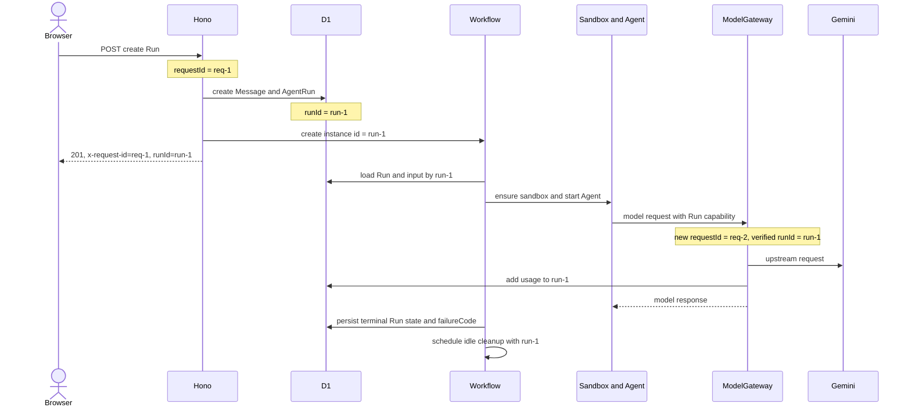

# 执行关联、错误语义与架构优化路线

> 文档状态：P0 已由 ADR-0008 接受并实现；P1/P2 仍是候选路线
>
> 校准日期：2026-07-27
>
> 适用范围：当前单 Worker、D1、Cloudflare Workflows、E2B、Pi/Goose 架构
>
> 非目标：本提案不引入新产品功能、第二个后端、R2、raw transcript、计费或团队模型

> 当前实现基准见 [ADR-0008](../adr/0008-errors-and-execution-correlation.md) 和
> [2026-07-27 错误语义与结构化日志](../status/2026-07-27-errors-and-observability.md)。
> 本文后续“建议”措辞保留原始设计过程，不应覆盖当前代码和 reference 文档。

本文基于当前代码审计，回答三个问题：

1. 怎样把一次用户任务从创建请求关联到 AgentRun 最终完成。
2. 怎样建立一套稳定、可审计且不会泄露 Provider 细节的错误码体系。
3. 在保持个人开源项目边界的前提下，还有哪些架构优化值得后续实施。

## 1. 建议结论

### 1.1 不新增与 AgentRun 重复的持久化 `trace_id`

一次 AgentRun 会跨越多个独立执行单元：

- 创建 Run 的 HTTP 请求；
- Cloudflare Workflow；
- E2B Sandbox 和 Agent 进程；
- Agent 发起的多个 ModelGateway HTTP 请求；
- 浏览器的 SSE、查询和取消请求；
- Run 结束后的 idle cleanup Workflow。

它们不能共享一个持续数分钟的进程内 span。当前 Cloudflare Workers 自定义 span 也暂时不支持手工取得
span context、指定父 span 或跨异步边界手工连线。因此，第一阶段不应伪造一个“平台上完整连续的
trace tree”。

推荐使用现有标识形成两级关联：

| 标识 | 范围 | 作用 |
| --- | --- | --- |
| `requestId` | 一次 Worker HTTP/WebSocket upgrade invocation | 定位一次传输请求、公开错误响应和该 invocation 内的日志。 |
| `runId` | 一次 AgentRun 从创建到终态的完整业务执行 | 关联创建、Workflow、Sandbox、Agent、ModelGateway、取消、完成和 Run idle cleanup。 |

`AgentRun.id` 已经是 D1 主键、公开 Run ID、ModelGateway capability 中的 Run 标识，同时也是 execute
Workflow instance ID。它就是当前最稳定的业务关联根。另建 `trace_id` 只会制造两个需要永久保持一致的
身份，而不会自动得到真正的分布式 trace。

Terminal、Preview 等非 AgentRun 活动使用其现有 `terminalSessionId`、`previewSessionId` 作为对应的
业务关联根，不把它们伪装成 AgentRun trace。

### 1.2 Cloudflare Trace 是辅助视图，结构化日志是跨 invocation 主线

推荐同时使用两种机制：

- Cloudflare 自动 trace 和 custom span：查看单次 Worker invocation 内的 D1、fetch 和应用阶段耗时。
- 结构化 Workers Logs：所有 invocation 都携带同一个 `runId`，形成可查询的完整执行时间线。

即使 trace 被 head sampling 丢弃，`runId` 仍能关联结构化日志。D1 只保存 Run 终态和稳定失败码，不保存
高频 trace event。

### 1.3 错误体系分层，不使用一个全局异常类吞并所有语义

推荐保留 application 当前已经使用的 discriminated union result，把错误分成四层：

1. application outcome：用例内部的预期结果，例如 `project_busy`。
2. public API error：浏览器可以稳定依赖的错误码。
3. persisted Run failure：AgentRun 终态上可长期聚合的失败码。
4. diagnostic error：只进入受控日志的内部失败码。

Provider 原始异常只作为瞬时 `cause`，不得直接进入浏览器、D1 或日志。

### 1.4 优先使用 Cloudflare 原生观测，不立即接入 Sentry

当前项目流量低、部署在 Cloudflare，Workers Logs 已启用。Cloudflare 现在能自动采集 trace，并提供
custom span；Free 层当前包含每日观测事件额度和短期保留。第一阶段直接使用原生 Logs/Traces 足够。

外部 OpenTelemetry 导出当前不适用于 Workers Free，单独引入 Sentry SDK 还会增加依赖、配置和数据脱敏
边界。只有原生日志保留时间确实不够，或需要告警、跨服务聚合时再评估。

## 2. 当前实现审计

| 领域 | 当前事实 | 主要缺口 |
| --- | --- | --- |
| 请求关联 | `src/server/app.ts` 为每个请求生成 UUID，并返回 `x-request-id`。 | 只覆盖一个 HTTP invocation，Workflow、ModelGateway 和 cleanup 没有统一业务关联事件。 |
| Run 关联 | `AgentRun.id` 已贯穿 D1、Workflow instance、capability 和公开 API。 | 日志没有稳定使用 `runId`，无法直接查询完整执行链。 |
| 平台观测 | Preview 的 Workers Logs 为 100% sampling，trace 明确关闭。 | 只有极少量自定义日志，没有业务 span。 |
| 日志 | 运行时代码只有 unhandled request、Preview failure 和 ModelGateway upstream rejection 等少数日志点。 | 多数 catch 只做状态收敛，丢失了可诊断的失败阶段和内部分类。 |
| 普通 API 错误 | `src/shared/api.ts` 定义字符串 union；浏览器映射中文文案。 | `app.ts`、Project、Changes、Preview、Terminal、Usage 各自存在响应构造逻辑，状态与错误码映射容易漂移。 |
| 错误粒度 | `not_found`、`internal_error`、`sandbox_unavailable` 被多个场景复用。 | “无活动沙箱”和“Provider 暂时故障”等恢复动作不同的场景无法区分。 |
| Terminal 错误 | WebSocket 使用独立控制协议。 | 与普通 API 的底层失败没有一个显式映射表。 |
| ModelGateway 错误 | 保持 OpenAI-compatible error envelope。 | 该协议错误与平台内部错误码、Run 日志之间没有统一关联。 |
| Run 失败 | `agent_runs.failure_reason` 保存受控英文自由文本。 | 不适合稳定聚合、统计和客户端本地化；同类失败可能出现不同文本。 |
| Provider 异常 | Runtime 有少量 typed error，其他位置仍大量使用普通 `Error`。 | Provider、协议、持久化和不变量失败没有统一的内部诊断码。 |

## 3. 执行关联设计

### 3.1 三种身份不能混用

| 概念 | 推荐标识 | 是否持久化 | 是否返回浏览器 |
| --- | --- | --- | --- |
| 传输请求 | `requestId` | 否 | 响应头；错误体中返回。 |
| Agent 业务执行 | `runId` | 是，现有 `agent_runs.id` | 是，现有 AgentRun DTO。 |
| Cloudflare 平台 invocation/span | `faas.invocation_id`、Cloudflare trace/span ID | 由平台保存 | 否。 |

规则：

- 服务端总是生成自己的 `requestId`，不信任浏览器或沙箱传入的 `x-request-id`。
- `runId` 由平台创建，不允许浏览器指定。
- ModelGateway 从已验证的 Run capability 取得 `runId`，不能信任 Agent 自定义 header。
- 不把 Cloudflare Ray ID、Provider sandbox ID 或 process ID写入产品表。
- 不把 `requestId` 当幂等键；它每次重试都应不同。

### 3.2 一次 AgentRun 的关联流程



查询 `runId=run-1` 应能看到这次业务执行的所有受控日志；查询 `requestId=req-2` 应只定位某一次
ModelGateway invocation。

### 3.3 统一诊断上下文

建议增加一个 Provider 无关的最小内部合同：

```ts
type DiagnosticContext = {
  requestId?: string;
  runId?: string;
  terminalSessionId?: string;
  previewSessionId?: string;
};

type DiagnosticEvent = DiagnosticContext & {
  event: string;
  stage?: string;
  outcome: "started" | "succeeded" | "rejected" | "failed";
  durationMs?: number;
  errorCode?: DiagnosticErrorCode;
  attempt?: number;
};
```

约束：

- `event` 和 `stage` 来自代码内固定 union，不接受用户输入。
- 平台自动提供时间戳，不重复记录高精度用户时间。
- 不记录 prompt、Agent 输出、文件内容、文件路径、Project 标题、邮箱、Cookie、Authorization、capability、
  Provider reference 或环境变量。
- 可以记录 `agentRuntimeId`、`sandboxRuntimeId`、`modelId`、Run 状态、受控 token 数和 duration。
- 原始异常只保留 `error.name` 或已经白名单化的 Provider 状态/分类，不记录 `error.message` 和 stack 到
  普通结构化事件。
- stack 只由平台未捕获异常和 source map 机制处理，不能进入公开错误体。

### 3.4 最小事件目录

第一阶段只记录状态边界和失败，不记录每个小函数：

| Event | 触发位置 | 必要字段 |
| --- | --- | --- |
| `agent_run.created` | queued Run 和 Message 原子创建后 | `requestId`、`runId`、Runtime ID。 |
| `agent_run.dispatch_failed` | Workflow 创建失败 | `requestId`、`runId`、diagnostic code。 |
| `agent_run.execution_started` | Workflow 取得执行所有权 | `runId`、Workflow attempt。 |
| `agent_run.execution_finished` | Run 进入任一终态 | `runId`、status、failureCode、usage、duration。 |
| `agent_run.cancel_requested` | 取消 API 通过授权后 | `requestId`、`runId`、原状态。 |
| `model_gateway.request_failed` | 模型鉴权、上游或 usage 写入失败 | `requestId`、`runId`、受控错误分类。 |
| `sandbox.idle_cleanup_finished` | idle cleanup 完成 | `runId`、stopped、detached。 |
| `sandbox.idle_cleanup_failed` | cleanup 无法收敛 | `runId`、diagnostic code。 |

成功模型调用不需要额外写一条日志；custom span 和 D1 usage 已经覆盖。这样可以避免每个 Agent 回合制造过多
日志事件。

### 3.5 Cloudflare custom span

在每个独立 invocation 内使用粗粒度 span：

```text
agent_run.create
agent_run.execute
  sandbox.ensure
  agent.start
  agent.consume
  run.persist_completion
agent_run.cancel
model_gateway.complete
sandbox.idle_cleanup
```

每个 span 只设置低敏感度属性：

```text
agent_online.run_id
agent_online.stage
agent_online.agent_runtime
agent_online.sandbox_runtime
agent_online.run_status
agent_online.error_code
```

Cloudflare 当前不提供 custom span 的 `spanContext()` 和手工父子连线，因此不自行生成 `traceparent`，也不从
浏览器或 Sandbox 接受 `traceparent` 作为可信执行身份。

Preview 环境建议：

- Workers Logs 保持 `head_sampling_rate=1`。
- Trace 初始使用 `head_sampling_rate=0.1`，真实 E2E 调试窗口可临时提高到 `1`。
- 日常关联以结构化日志的 `runId` 为准，不能假设一个 Run 的每个 invocation 都被 trace sample 命中。
- 任何远程配置修改和部署仍需明确批准。

### 3.6 不建立 D1 trace event 表

不推荐增加 `trace_events`、`spans` 或 `agent_run_events` 表：

- 每次模型请求和生命周期阶段都会增加 D1 写放大；
- 它会形成新的保留、分页、清理和隐私责任；
- 当前产品不承诺 raw transcript 或长期执行审计；
- Cloudflare Logs/Traces 已适合短期诊断；
- D1 只需长期保存 Run 状态、usage 和稳定 `failure_code`。

如果未来确实需要长期审计，应先定义保留期、可见主体、脱敏规则和成本，再单独做 ADR。

## 4. 错误码体系

### 4.1 设计原则

1. 错误码描述产品语义，不描述具体 Provider SDK。
2. HTTP status、错误码、客户端文案、日志等级分别管理。
3. 预期业务拒绝继续使用 result union，不通过 throw 控制流程。
4. 不把 application 的 `kind` 直接透传成公共错误码；必须显式映射。
5. 公共错误码发布后不能改义；新增可以，复用旧码表达新语义不可以。
6. 客户端按 `code` 选择中文文案，不能解析 `message`。
7. `retryable` 只表示 UI 可以提供人工重试，不允许客户端自动重试非幂等 POST。
8. Provider 原始错误、SQL 文本、内部状态和 stack 永不进入公共响应。

### 4.2 四层错误语义

| 层级 | 示例 | 所有者 | 稳定性 |
| --- | --- | --- | --- |
| Application outcome | `{ kind: "project_busy" }` | 对应用例模块 | 内部合同，可随重构调整。 |
| Public API error | `project.busy` | HTTP adapter 和 `src/shared/` | 公开稳定合同。 |
| Run failure | `run.agent_protocol_failed` | AgentRun 生命周期 | D1 持久化并可返回浏览器。 |
| Diagnostic error | `AGENT_PROTOCOL_INVALID` | adapter/application 观测层 | 只用于日志和内部聚合。 |

Better Auth 保持自身错误合同；Terminal 保持 WebSocket 控制协议；ModelGateway 保持 OpenAI-compatible
error envelope。这些协议通过显式 adapter 映射到 diagnostic code，不强行共用同一个 JSON shape。

### 4.3 普通 JSON API 响应

推荐将普通产品 API 错误改为：

```ts
type ApiErrorResponse = {
  error: {
    code: PublicErrorCode;
    retryable: boolean;
  };
  requestId: string;
};
```

示例：

```json
{
  "error": {
    "code": "project.busy",
    "retryable": true
  },
  "requestId": "7db7bf5a-04a2-4fab-afc6-bf89ffad0da1"
}
```

不建议第一阶段完整迁移到 RFC 9457 `application/problem+json`。当前 API 是同源浏览器内部合同，引入 type
URI、title、detail 和内容协商的收益很小。若以后发布第三方 API，再单独评估 RFC 9457。

### 4.4 公共错误码目录

推荐使用小写点分命名，强制公共合同与 application 的 snake_case `kind` 显式解耦：

| Code | HTTP | Retryable | 客户端动作 |
| --- | --- | --- | --- |
| `auth.unauthorized` | 401 | false | 回到登录。 |
| `request.forbidden` | 403 | false | 拒绝跨源或不允许的请求。 |
| `request.invalid` | 400 | false | 修正输入。 |
| `resource.not_found` | 404 | false | 刷新或返回列表；继续隐藏非所有者资源。 |
| `project.busy` | 409 | true | 等待当前 Run/Terminal 释放后人工重试。 |
| `run.creation_disabled` | 503 | false | 显示维护者暂停状态，不自动重试。 |
| `agent_runtime.unavailable` | 409 | false | 选择公开可用 Runtime。 |
| `sandbox.not_active` | 409 | false | 先运行 Agent 创建/恢复沙箱。 |
| `sandbox.provider_unavailable` | 503 | true | Provider 暂时不可用，允许人工重试。 |
| `project_path.not_found` | 404 | false | 刷新 Files/Changes。 |
| `project_path.unsupported` | 400 | false | 不再请求该路径。 |
| `file.too_large` | 413 | false | 在 Terminal 中处理或缩小文件。 |
| `file.content_unsupported` | 415 | false | 不做文本预览。 |
| `preview.unavailable` | 503 | true | 检查 Vite 条件后人工重试。 |
| `service.unavailable` | 503 | true | 通用依赖暂时不可用。 |
| `internal.unexpected` | 500 | true | 显示 `requestId`，允许人工重试或定位日志。 |

重要变化：

- 把当前 `sandbox_unavailable` 拆成“Project 当前没有可用沙箱”和“Provider 调用失败”。
- 把 `internal_error + 503` 改为明确的 `service.unavailable`，避免同一个 code 同时表达 500 和 503。
- `resource.not_found` 继续统一隐藏 Project/Run 所有权，不因细分错误码造成资源枚举。

### 4.5 Run failure code

建议用 `failure_code` 替代 `failure_reason` 自由文本：

```ts
type AgentRunFailureCode =
  | "run.start_failed"
  | "run.sandbox_failed"
  | "run.agent_protocol_failed"
  | "run.agent_process_failed"
  | "run.model_failed"
  | "run.no_visible_reply"
  | "run.timed_out"
  | "run.interrupted"
  | "run.internal_failed";
```

规则：

- `succeeded` 和 `cancelled` 的 `failureCode` 必须为 `null`。
- `failed` 必须有 `failureCode`。
- `timed_out` 固定为 `run.timed_out`。
- `interrupted` 固定为 `run.interrupted`。
- Agent exit code、Provider status 等诊断信息进入结构化日志，不进入 `failureCode`。
- 客户端从 code 映射可见文案，不在 D1 保存英文 UI 文本。

当前项目允许重建本地开发数据，但远程 Preview D1 不能未经批准清洗。实施时应使用正常 additive migration 或在
明确批准后做远程数据处理。

### 4.6 Diagnostic error code

内部 code 不需要一开始枚举每个 SDK 异常，只覆盖需要定位和聚合的边界：

```ts
type DiagnosticErrorCode =
  | "RUN_DISPATCH_FAILED"
  | "RUN_INPUT_UNAVAILABLE"
  | "RUN_STATE_CONFLICT"
  | "LEASE_INCONSISTENT"
  | "SANDBOX_ENSURE_FAILED"
  | "SANDBOX_PROCESS_FAILED"
  | "AGENT_PROTOCOL_INVALID"
  | "AGENT_PROCESS_FAILED"
  | "MODEL_CAPABILITY_INVALID"
  | "MODEL_UPSTREAM_REJECTED"
  | "MODEL_UPSTREAM_TIMEOUT"
  | "MODEL_USAGE_WRITE_FAILED"
  | "PERSISTENCE_CONSTRAINT_UNEXPECTED"
  | "PREVIEW_START_FAILED"
  | "TERMINAL_RUNTIME_FAILED"
  | "UNEXPECTED";
```

每个 diagnostic definition 统一声明：

- `code`
- `severity`: `info | warn | error`
- `retryable`
- `safeAttributes`
- 对应的 Run failure/public error 映射

禁止把原始 `error.message` 当 code，也禁止动态拼接用户、路径或 Provider ID。

### 4.7 模块边界

建议的最小模块位置：

```text
src/shared/error-codes.ts
  PublicErrorCode、ApiErrorResponse、AgentRunFailureCode

src/server/http/api-errors.ts
  HTTP status/retryable registry、唯一 JSON error renderer

src/observability/contract.ts
  DiagnosticContext、DiagnosticEvent、DiagnosticReporter、DiagnosticErrorCode

src/server/observability/cloudflare-reporter.ts
  结构化 console event 和 Cloudflare custom span adapter
```

约束：

- `src/domain/` 不依赖 observability。
- application 只依赖窄 `DiagnosticReporter` port，不能 import Cloudflare API。
- Runtime/Agent adapter 负责把 Provider/协议异常归一化，但不决定 HTTP 状态。
- Hono route 只把 use-case result 映射成 public error。
- Terminal 和 ModelGateway 使用自己的协议 renderer，但复用 diagnostic catalog。

不建议建立一个可以从任意层抛出的全能 `AppError`。它会把 HTTP、Provider、领域和持久化语义重新耦合起来。

### 4.8 必要测试

1. 每个 `PublicErrorCode` 恰好有一个 HTTP status 和 retryable definition。
2. 浏览器对每个 public code 都有可见文案，switch 必须穷尽。
3. 普通 JSON API 只通过统一 renderer 返回错误。
4. 每个错误响应都有同一个 response header/body `requestId`。
5. Provider error message、sandbox/process reference、Key、prompt 和文件内容不会进入响应或诊断事件。
6. Terminal failure 到 WebSocket code 的映射穷尽。
7. ModelGateway 保持 OpenAI-compatible envelope，同时记录正确 diagnostic code 和 `runId`。
8. AgentRun 状态与 `failureCode` 组合由 D1 CHECK/trigger 和 repository test 双重验证。

## 5. 其他优化候选

优先级定义：

- P0：当前两项基础设计，下一轮应先做。
- P1：不新增产品能力的高收益加固。
- P2：公开注册或数据量上升前完成。
- Deferred：当前不值得增加复杂度。

### 5.1 候选矩阵

| 优先级 | 候选 | 当前证据 | 推荐原因 | 预计成本 |
| --- | --- | --- | --- | --- |
| P0 | 执行关联和结构化日志 | 只有 requestId 和三个主要运行时日志点。 | 能真实定位 Workflow、Sandbox、Agent 和模型失败，是后续优化的观测基础。 | 中 |
| P0 | 公共/持久化/内部错误码分层 | 至少六处普通错误 renderer，Run 保存自由文本。 | 消除状态映射漂移，支持稳定 UI、失败聚合和安全日志。 | 中 |
| P1 | ModelGateway 显式 deadline | 上游 `fetch` 有体积限制，但没有应用级 AbortSignal deadline。 | 防止单次模型请求长期占用 Worker/Agent，明确超时归属。禁止盲目自动重试模型 POST。 | 低至中 |
| P1 | 依赖 timeout/retry ownership 表 | Workflow、E2B、Preview、Changes 各自已有不同重试和 timeout。 | 避免 Workflow 和 adapter 双重重试造成重复成本，明确哪些操作幂等。 | 低 |
| P1 | 所有变更请求统一同源保护 | Terminal 和 Preview start/stop 检查 Origin，Project/Run/cancel/stop 尚未统一。 | Better Auth cookie 默认为 SameSite=Lax，但自定义产品路由仍应有一致的纵深防护。 | 低 |
| P1 | 普通 JSON 请求体总字节上限 | 字段有字符上限，普通 API 没有统一 raw body limit。 | 在 JSON/Zod 解析前阻止异常大请求，减少内存和 CPU 风险。ModelGateway 保留独立 4 MiB 限制。 | 低 |
| P1 | 主应用安全响应头 | Preview 内容已有 CSP/nosniff/referrer policy，主 React/普通 API 没有统一基线。 | 减少 clickjacking、MIME sniffing 和不必要 referrer 暴露。 | 低 |
| P1 | Readiness 与配置诊断 | `/api/health` 只证明 Worker handler 可响应。 | 区分 liveness 与 D1 schema/binding/config readiness，部署错误可以在创建 Run 前暴露。不得调用付费 Provider 做健康检查。 | 低至中 |
| P1 | 不变量失败结构化告警 | 协调漂移目前主要依赖人工恢复文档。 | 在 Lease/Run/Terminal/Preview 出现不可能组合时记录固定 diagnostic code，比自动修复更适合个人项目。 | 低 |
| P1 | E2B adapter 内部按 capability 拆文件 | `e2b-runtime.ts` 约 1,200 行，同时实现 lifecycle/process/files/terminal/preview/changes。 | 保留一个公开 adapter，同时让各能力的修改和测试更局部；不改变 runtime 合同。 | 中 |
| P1 | ModelGateway 协议模块内聚 | `model-gateway.ts` 约 700 行，包含 HTTP handler、限流读取、Gemini/OpenAI 转换、tool protocol 和 usage 解析。 | 把安全边界、协议转换和 orchestration 分开，降低模型适配修改的回归面。 | 中 |
| P1 | Source map 与异常定位校验 | unhandled exception 目前只记录 error name。 | 在不记录用户数据的前提下保留可读代码位置；需要确认构建和 Cloudflare 上传行为。 | 低 |
| P2 | Project/Message cursor pagination | 当前两个列表都无分页，文档已接受为个人阶段风险。 | 防止历史增长后 D1 扫描、响应体和 React 渲染持续变大。 | 中 |
| P2 | Mutation idempotency | 双击或网络重试时，第二次创建 Run通常表现为 `project.busy`。 | 公开使用后可让同一个 client command 返回原 Run，而不是制造含糊冲突。需要 D1 唯一键和保留策略。 | 中 |
| P2 | Run/模型/沙箱资源预算保护 | 当前只有真实 usage 观察，没有产品级配额。 | 公开注册前必须防止单用户意外消耗 E2B/Gemini 资源；它是安全上限，不等于计费系统。 | 中 |
| P2 | 产品路由 rate limit | Better Auth 有自己的认证保护，Run 等高成本路由没有应用级限制。 | 公开注册前保护沙箱和模型成本；私有 allowlist 阶段不必提前引入。 | 中 |
| P2 | Lease generation/epoch | Files/Changes 和 Provider 操作存在检查后状态变化的尽力一致窗口。 | Provider sandbox 被替换后可拒绝旧 handle/旧操作，降低 stale lease 风险。当前低并发阶段可继续接受。 | 中至高 |
| Deferred | 外部 Sentry/OTel export | Cloudflare 原生 Logs/Traces 已覆盖当前部署，Free 层不支持 OTel destination export。 | 等真正需要长保留、告警或跨服务查询再增加外部依赖。 | 中 |
| Deferred | 完整 OpenAPI/RFC 9457 | 当前只有同源 React 客户端。 | 第三方 API 发布前收益有限，会增加 schema、文档和兼容责任。 | 中 |
| Deferred | 自动漂移 reconciler/Cron | 现有 Workflow、条件更新、Provider timeout 和人工恢复路径已存在。 | 自动修复外部状态容易误杀仍存活活动；先用观测确认真实频率。 | 高 |

### 5.2 推荐的 P1 组合

如果完成 P0 后只做一轮非功能优化，建议按以下组合实施：

1. ModelGateway deadline 和统一 timeout/retry ownership。
2. unsafe method 同源检查和 JSON body limit。
3. 主应用安全响应头。
4. readiness/config 检查。
5. E2B/ModelGateway 两个大文件的内部拆分。

这组工作不改变产品模型，不增加外部存储，也不会把项目演进成重型 SaaS。

### 5.3 公开注册前的最低门槛

只有准备把 `ACCESS_MODE` 从 allowlist 改为 open 时，才需要把以下项提升为阻塞：

- Product route rate limit。
- 每用户并发、Run wall time、token 和 sandbox duration 的安全预算。
- Project/Message pagination。
- 创建 Run 的幂等语义。
- 可观测事件额度和日志采样复核。
- 登录、Run 创建、ModelGateway 和 Sandbox Provider 的滥用测试。

这些属于公开成本边界，不需要现在预建套餐、支付或账单。

## 6. 明确不推荐的方案

| 方案 | 不推荐原因 |
| --- | --- |
| 给每个 Run 额外持久化一个 `trace_id` | 与 `AgentRun.id` 重复，当前 Cloudflare 也不能用它手工拼接完整平台 trace。 |
| 把浏览器传入的 `traceparent`/`x-request-id` 当可信身份 | 用户可以伪造，可能污染日志关联或尝试关联其他用户执行。 |
| D1 保存所有 trace/span/event | 写放大、保留和隐私责任与当前个人项目不匹配。 |
| 把 Provider error message 直接返回浏览器 | 可能泄露 sandbox ID、内部路径、请求正文、上游细节或凭据。 |
| 把所有预期失败都改成 throw `AppError` | 会破坏 application 当前清晰的 result union，并把 HTTP 语义带入内层。 |
| 自动重试所有 Provider/模型请求 | 模型 POST 和部分进程启动不是天然幂等，可能重复扣费或启动重复进程。 |
| 为观测拆第二个日志服务/Worker | 当前单 Worker 和 Cloudflare 原生观测足够。 |
| 因错误码体系保存 raw Agent transcript | 错误诊断不需要持久化用户完整对话或私有推理。 |

## 7. 推荐实施顺序

错误码是结构化日志的字段基础，所以代码实施顺序建议与用户提出顺序略有不同。

### 阶段 A：错误语义基础

1. 新建 public、Run failure 和 diagnostic code catalog。
2. 新建唯一普通 JSON API error renderer。
3. 迁移 Project、Run、Files、Changes、Usage、Preview 和 app fallback。
4. 保持 Terminal、ModelGateway、Better Auth 的协议 envelope，只增加显式映射。
5. 增加 `agent_runs.failure_code`，更新 DTO、repository、D1 约束和客户端文案。
6. 完成 catalog exhaustiveness、安全响应和 D1 状态组合测试。

### 阶段 B：执行关联与观测

1. 定义 `DiagnosticReporter` port 和 Cloudflare adapter。
2. `requestId` 中间件记录单次请求上下文。
3. 创建 Run 时写一条同时含 `requestId` 和 `runId` 的结构化事件。
4. Workflow、RunExecution、RunCoordinator、ModelGateway、取消和 cleanup 统一使用 `runId`。
5. 对关键阶段增加 custom span，不记录用户内容。
6. 在本地测试事件 schema 和脱敏，在获批后开启 Preview traces。

### 阶段 C：非功能加固

1. ModelGateway deadline 和 dependency retry matrix。
2. 同源 mutation guard、body limit 和安全响应头。
3. readiness/config 诊断。
4. E2B/ModelGateway 内部模块拆分。

### 阶段 D：公开使用准备

1. Pagination。
2. Idempotency。
3. Rate limit 和资源预算。
4. 根据真实日志量决定是否需要外部观测平台。

## 8. 验收标准

### 8.1 执行关联

- 创建 Run 的响应仍包含 `x-request-id` 和 `runId`。
- 使用一个 `runId` 能查询到 create、Workflow execute、模型失败或成功、终态和 idle cleanup 事件。
- 每个 ModelGateway invocation 有自己的 `requestId`，并通过已验证 capability 关联正确 `runId`。
- 取消请求使用新 `requestId`，但仍关联原 `runId`。
- sampling 未命中时，结构化日志关联仍成立。
- 日志、trace attributes 和错误响应中没有 Provider reference、Key、prompt、Agent 输出或文件内容。

### 8.2 错误码

- 普通产品 API 不再各自构造 `{ error, requestId }`。
- 每个 public code 都有唯一 status、retryable 和客户端文案。
- 同一个 code 不同时映射 500 和 503。
- `sandbox.not_active` 与 `sandbox.provider_unavailable` 可区分。
- failed/timed_out/interrupted Run 有合法 `failureCode`；succeeded/cancelled 没有。
- Terminal 和 ModelGateway 的 wire protocol 不因普通 API 改造而破坏。
- 未知异常统一公开为 `internal.unexpected`，日志有 diagnostic code 和关联 ID。

### 8.3 工程门禁

- import boundary 仍成立，`src/domain/` 不依赖观测实现。
- unit、D1、API、browser smoke 和 production build 全部通过。
- 增加一条 fake Run 的关联测试和一条真实 E2B/Gemini opt-in E2E。
- 远程 Preview 验收前再次执行凭据扫描和日志脱敏检查。

## 9. 外部依据

以下链接校准于 2026-07-27，Cloudflare 价格、限额和 beta 能力仍可能变化：

- [Cloudflare Workers Traces](https://developers.cloudflare.com/workers/observability/traces/)
- [Cloudflare Workers Custom Spans](https://developers.cloudflare.com/workers/observability/traces/custom-spans/)
- [Cloudflare Workers Tracing Known Limitations](https://developers.cloudflare.com/workers/observability/traces/known-limitations/)
- [Cloudflare Workers Logs](https://developers.cloudflare.com/workers/observability/logs/workers-logs/)
- [Cloudflare Workflows Rules](https://developers.cloudflare.com/workflows/build/rules-of-workflows/)
- [Cloudflare Workflows Metrics and Analytics](https://developers.cloudflare.com/workflows/observability/metrics-analytics/)
- [W3C Trace Context](https://www.w3.org/TR/trace-context/)
- [RFC 9457: Problem Details for HTTP APIs](https://www.rfc-editor.org/rfc/rfc9457.html)
- [Better Auth Security](https://better-auth.com/docs/reference/security)

## 10. 提案生效方式

本文的 P0 已完成审计、接受和实现，ADR-0008 固定了以下决策：

1. `runId` 是 AgentRun 业务关联根，不新增持久化 `trace_id`。
2. `requestId` 只代表单次 invocation。
3. 公共错误、Run failure 和 diagnostic error 分层。
4. D1 不保存 trace event。
5. Cloudflare native Logs/Traces 是第一阶段观测后端。

当前代码已实现公共/持久化/诊断错误分层、`failure_code`、统一 JSON renderer 和
结构化 console 日志；尚未启用 Cloudflare trace sampling/custom spans，也未接入
Sentry。第 5 项当前只实现 Workers Logs 部分，Traces 与本文 P1/P2 候选仍需以后单独
批准。
