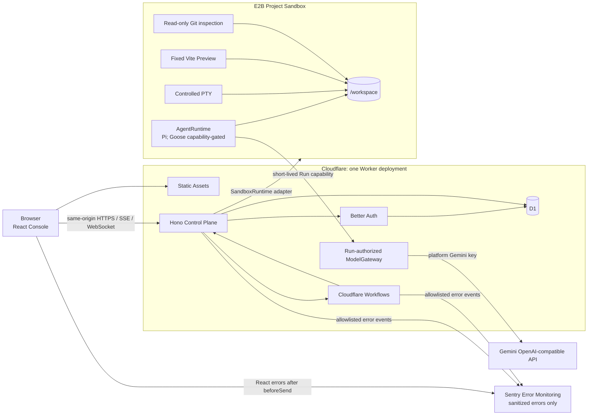
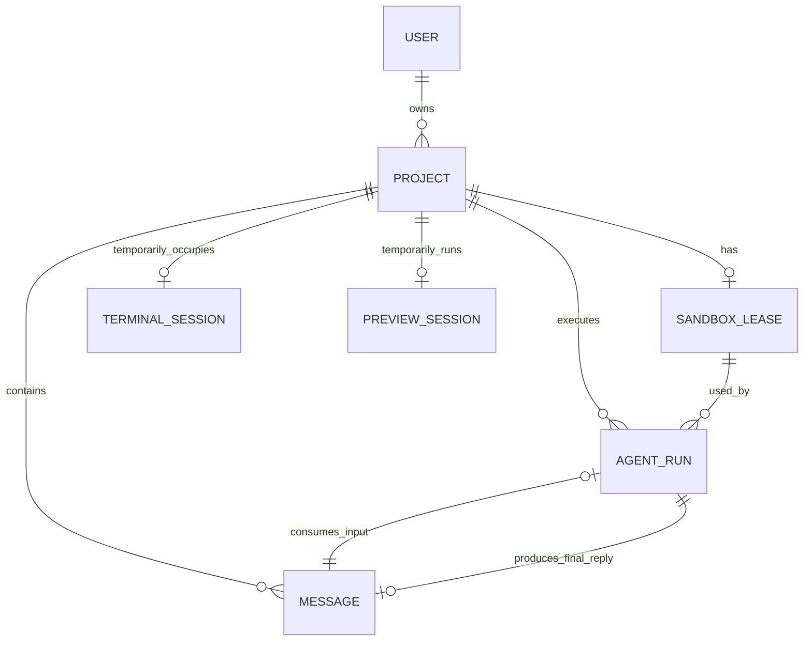

# 当前项目架构

> 文档状态：当前实现基准
>
> 校准日期：2026-09-09（代码与远程验收基准）
>
> 适用范围：仓库当前代码、下一次 Cloudflare Preview 配置和 E2B 组合模板；远程已部署事实以资源台账为准

本文描述 Agent Online **现在实际运行的架构**。ADR 负责记录决策原因，阶段文档负责保存验收证据；本文只回答当前系统由什么组成、各层负责什么以及数据如何流动。

## 1. 产品定位

Agent Online 是一个个人开发、开源导向的 Hosted Coding Agent SaaS 学习项目。用户通过浏览器注册、创建 Project，并在远程隔离沙箱中运行 Coding Agent。

浏览器中展示的是 Agent 控制台，不是“浏览器内 Agent”。真实 Pi/Goose 进程、工具调用和 Project 文件都位于沙箱内；Cloudflare Worker 位于沙箱外，负责产品控制面。

当前产品边界：

- 单用户直接拥有 Project，没有 Team、Tenant、Organization 或 Membership。
- 一个 Project 是一组用户可见消息、多个短生命周期 AgentRun 和一条逻辑 SandboxLease 的聚合。
- Project 可重命名或由所有者硬删除。删除拒绝活动 Run、Terminal/Preview，先停止空闲
  Provider sandbox，再级联删除 D1 子记录；没有回收站。
- Project 文件只存在于当前沙箱文件系统；D1 不保存文件内容，R2 不参与当前版本。
- Pi 是默认 Runtime；私有 Preview 的安全能力接口公布 Pi/Goose，已登录 allowlist 用户可按 AgentRun 选择。
- 计量只做真实用量观察，不包含套餐、账单、支付或配额扣减。

## 2. 部署拓扑

一个仓库只产生一个 Worker 部署单元：

- React 静态资源由 Workers Assets 提供。
- `/api/*` 先进入 Hono。
- Hono、Better Auth、ModelGateway 和 Workflow 入口属于同一个可信 Worker 边界。
- D1 是唯一产品数据库。
- E2B 是当前真实 Sandbox Provider，不是第二个业务后端。

### 2.1 当前技术选型

| 层面 | 技术 | 当前职责 |
| --- | --- | --- |
| 前端与构建 | React、TypeScript、Vite、pnpm | 浏览器控制台与单 Worker 产物。 |
| 路由与数据 | TanStack Router / Query | 页面导航、服务端数据缓存与刷新；持久事实以 D1 为准。 |
| 对话 UI | React 消息列表与受控表单 | 直接展示 Message 与活动 Run；草稿按 Project 隔离，提交失败保留，支持 Ctrl/Cmd+Enter 和跟随底部滚动。 |
| 通用交互 | shadcn / Base UI、Tailwind CSS | Menu、Dialog、AlertDialog、Select、Tabs 的焦点、键盘与模态行为。 |
| 布局与终端 | react-resizable-panels、xterm.js | 桌面面板布局与偏好、真实终端的浏览器展示。 |
| 表单与合同 | React Hook Form、Zod、Hono Zod validator | 认证/创建表单、共享请求响应与 SSE schema；服务端仍单独执行授权。 |
| Markdown | react-markdown、remark-gfm | 最终回复的安全 GFM 展示；原始 HTML 和远程图片不渲染。 |
| API 与认证 | Hono、Better Auth | 同源边界、会话认证、Project 授权和公开 DTO。 |
| 数据访问 | D1、Drizzle、条件 SQL/batch | Drizzle 映射现有 12 张表并访问 Project/Message；复杂生命周期保留原子 SQL。迁移仍是物理 schema 真相源。 |
| 执行 | Cloudflare Workflows、E2B、Pi/Goose adapter | Workflow 拥有 Run；Agent 进程及用户代码只在沙箱。 |
| 模型协议与令牌 | ModelGateway、eventsource-parser、jose | 上游 SSE 边界解析、Gemini 协议转换、实际 usage 与短时 HS256 JWT。 |
| 验证与观测 | Vitest、Workers D1 tests、Playwright、Biome、Sentry | 工程门禁和脱敏 Error Monitoring。 |

实际依赖版本以 [package.json](../../package.json) 和锁文件为准。
标准库接入与真实环境验证见 [2026-09-08 发布记录](../status/2026-09-08-standard-library-adoption.md)。

## 3. 资源模型

核心关系和不变量：

| 资源 | 含义 | 关键不变量 |
| --- | --- | --- |
| User | Better Auth 用户 | 直接拥有 Project；所有产品查询都按当前用户过滤。 |
| Project | 代码项目、对话和运行记录的容器 | 不存在额外 Workspace/Session 聚合。 |
| SandboxLease | Project 的逻辑沙箱槽位 | 每个 Project 最多一行 Lease；同一时刻最多一个活动 Provider 沙箱。 |
| AgentRun | 一次短生命周期 Agent 执行，通常对应一个用户回合 | 每个 Project 同时最多一个非终态 Run。 |
| Message | 用户输入或最终可见 assistant 回复 | 不保存 raw Agent transcript、私有推理或逐 token 输出。 |
| TerminalSession | 当前 Project 的临时 PTY 占用 | 每个 Project 最多一个；与 AgentRun 硬互斥。 |
| PreviewSession | 当前固定 Vite Preview 进程 | 每个 Project 最多一个；只保存临时控制状态。 |

SandboxLease 是逻辑记录，不表示沙箱永久存在。连续 Run 可以复用仍存活的 `/workspace`；沙箱停止、过期或 Provider 故障后，Project 文件允许丢失。

## 4. 代码分层

| 路径 | 职责 | 不能承担的职责 |
| --- | --- | --- |
| `src/client/` | React UI、查询缓存、同源 API/SSE/WebSocket 客户端 | 不能导入 `src/server/`，不能接触 Provider 标识或密钥。 |
| `src/server/` | 按 Project、Files、AgentRun、Terminal、Preview、Changes、Usage 拆分的 Hono 路由，及鉴权、公开 DTO、配置、D1 adapter、ModelGateway、Workflow 入口 | 路由只做鉴权、校验、调用与响应映射，不拼接任意 Agent/沙箱命令。 |
| `src/application/` | Project/Run/Files/Changes/Terminal/Preview/Usage 用例编排 | 不依赖 Hono 或浏览器状态。 |
| `src/domain/` | AgentRun、SandboxLease 等 Provider 无关规则 | 不依赖框架、D1、E2B 或具体 Agent。 |
| `src/observability/` | Provider 无关的诊断码、受控事件字段和 `DiagnosticReporter` 接口 | 不依赖 Hono、Cloudflare console、D1 或外部观测 SDK。 |
| `src/runtime/` | Sandbox 生命周期、进程、文件、PTY、Preview、Changes 能力接口和 E2B/fake adapter | 不理解 Pi/Goose 协议或产品鉴权。 |
| `src/agent/` | AgentRuntime 合同，以及 Pi/Goose CLI 协议归一化 | 不直接持有 Gemini Key，不管理 SandboxLease。 |
| `src/shared/` | 最低层的公开协议字面量，以及浏览器和 Worker 共享的 DTO | 不导入内部 application/server 实现，不包含 Provider 私有字段。 |
| `worker/` | Cloudflare Worker 导出入口 | 不承载业务用例实现。 |

`AgentRuntime` 和 `SandboxRuntime` 是可替换的代码边界，不是独立服务：

- `AgentRuntime` 决定如何启动 Agent CLI、解析事件、提取最终回复和取消当前 Agent 进程。
- `SandboxRuntime` 决定如何创建/连接沙箱、启动通用进程、访问文件、PTY 和 Preview。
- 具体 E2B adapter 可以由一个类实现多种 capability，但 application 用例只依赖所需的窄接口。

服务端内部继续按变更原因拆分：`src/server/persistence/d1-repositories.ts` 只是稳定的
导出入口，Project/Message、SandboxLease、AgentRun、Terminal、Preview 和 Usage
adapter 分别位于独立模块，公共 snake_case 映射集中在 `d1-records.ts`；
`ProjectReadService` 统一执行 owner-scoped Project/Message/Run/Lease 查询，
`ProjectManagementService` 统一执行 Project 创建、重命名和硬删除，Hono 不直接取得
原始 repository；
`run-execution-dispatcher.ts` 单独拥有 Workflow 创建、取消和 expiry/idle 调度，
`e2b-runtime-factory.ts` 只构造当前 E2B 配置与 adapter，避免 Files/Terminal/Preview
请求间接初始化完整 RunExecution；`services.ts` 只装配这些端口。E2B adapter 的会话、
Git Changes、Preview 和 SDK 类型分别位于内部模块，公开入口仍只有
`E2BSandboxRuntime`。ModelGateway 的 HTTP 编排、协议转换和有界流读取也分离，
上游模型 POST 使用 120 秒 deadline 且不自动重试。Run、Terminal、Preview 和手动 Stop
释放沙箱时共用 `SandboxReclaimer` 的条件脱离与 Provider stop 顺序。客户端
`router.tsx` 只声明路由和 App shell，认证、Project 列表和创建页面由各自组件承担；
Project 活动状态把排他的 Run/Terminal/Preview-starting 与可并行的 running Preview
分为两个状态轴。

## 5. 主要执行流

### 5.1 创建 AgentRun

1. 浏览器向 `POST /api/projects/:projectId/agent-runs` 提交用户消息。
2. Hono 先执行普通产品 mutation 的同源和 256 KiB 请求体边界，再验证登录、Project 所有权、部署开关和 AgentRuntime policy。
3. application 在 D1 中取得或创建 SandboxLease，并原子写入用户 Message 和 `queued` AgentRun。
4. Cloudflare Workflow 成为真实执行所有者。
5. Workflow 从 D1 回读输入，签发只绑定当前 Run/Project/Model/期限的 ModelGateway capability。
6. `SandboxRuntime.ensureLease()` 连接现有沙箱或创建新沙箱。
7. `AgentRuntime` 在 `/workspace` 内启动 Agent 进程。
8. Agent 使用短时 capability 调用 Worker ModelGateway；ModelGateway 替换成平台 Gemini Key，并把每次模型 usage 累加到 AgentRun。
9. application 以一个 D1 batch 原子提交 succeeded 状态、sandbox duration、最终可见 assistant Message 和 Project touch；取消已抢先改变状态时不写回复。
10. Lease 进入 `idle`，Workflow 在 idle TTL 后以条件更新抢占并停止沙箱。

Run 状态变化由 D1 持久化；SSE 当前发布状态变化和终态 usage，最终回复由 Message API 读取。

真实 Workflow 执行在当前输入 `sequence` 之前读取最多 21 条同 Project 消息，保留最多
20 条、序列化后不超过 64 KiB 的连续近期历史。用户/assistant 角色和当前任务以 JSON
装入瞬时 prompt；这不是 Agent 原生会话恢复。超预算消息整条省略，并明确标记
`historyTruncated`；不会把工具输出或私有推理带回上下文。提示同时要求检查当前文件，
因为旧对话不能证明沙箱文件仍然存在。拼装后的 prompt 不另行持久化或记录日志。

创建请求使用本次 invocation 的 `requestId`，随后所有 Workflow、ModelGateway、取消和
idle cleanup 事件都使用已有 `runId` 作为业务关联根。结构化日志只包含固定事件、
诊断码、阶段、Runtime/Model ID、终态和聚合 usage，不包含 prompt、回复、文件路径、
Provider reference、Key、capability、异常 message 或 stack。

### 5.2 取消和恢复

- 取消优先终止当前 Agent 进程，并保留同一 Project 的沙箱文件。
- 已有进程引用时只精确终止该进程；终止失败保留非终态 Run 和私有进程引用作为
  硬锁，交由 Workflow 恢复或受控运维处理，不能假报取消成功，也不能用整箱停止
  误伤可能已经接替的活动。仅启动/执行所有者恢复尚无进程引用时才停止整个沙箱。
- 启动期间取消先返回 `cancelling`，保留执行 Workflow，让启动所有者处理尚未返回
  句柄的 Provider 操作，确认清理后再完成取消。
- Worker/Workflow 所有者丢失时，确认停止后的 Run 收敛为 `interrupted`；应用超时
  收敛为 `timed_out`。持续 Provider 故障可能保留非终态锁。
- Run 对 Lease 的更新必须同时匹配非终态 Run 所有权、Provider 引用和更新时间快照；
  先释放 Lease 再提交 Run 终态，避免旧执行覆盖后续活动。
- Provider 操作失败不会把密钥或 Provider 错误正文返回浏览器。

### 5.3 Files 和 Changes

- 两者都是当前沙箱的受控只读视图，不创建沙箱。
- Files 只允许读取 `/workspace` 下的安全相对路径和有限大小 UTF-8 文本。
- Changes 只运行平台固定 Git 命令，返回当前 working tree/index 的有界 status 和 diff。
- 活动 AgentRun 或 Terminal 期间拒绝读取，避免把并发中的文件状态宣传成一致快照。
- Changes 是尽力一致的当前视图，不是历史、审计日志或 Run 归因。

### 5.4 Terminal

- 浏览器使用同源 WebSocket 连接 Worker。
- Worker 在现有/可恢复 Lease 中启动固定工作目录 `/workspace` 的 PTY。
- D1 仅保存当前互斥记录和 Worker 私有 Provider 引用；终端输入输出不持久化。
- Terminal 与 AgentRun、Files、Changes、手动 Stop 互斥；断线、显式关闭或到期后释放。

### 5.5 Preview

- Worker 只允许启动只读 `/opt/agent-online/preview` 中的平台固定 `vite-v1`、固定端口
  `3000` 和固定工作目录 `/workspace`。
- 启动前由 Runtime 检查普通文件 `index.html` 和常规项目依赖状态；缺少入口或已声明
  依赖未安装属于产品前置条件，不创建 PreviewSession，也不进入 Sentry。
- 浏览器拿到的是短时签名的同源内容 URL，不是 Provider host、端口或 traffic token。
  Run 与 Preview capability 均由 `jose` 签发/验证 HS256 JWT，使用不同的 HKDF 用途
  派生密钥，并校验 audience、scope、资源标识与期限；JWT 签名不提供 payload 加密。
- Worker 仅代理 `GET`/`HEAD`，过滤请求/响应头，注入 CSP 并改写 HTML 根路径。
- PreviewSession 只记录当前进程所有权；不保存页面内容、日志、截图或访问历史。

### 5.6 错误与观测

- application 预期拒绝继续使用 discriminated union，不通过全局异常类控制流程。
- 普通产品 API 由唯一 renderer 将内部 outcome 显式映射为稳定 public error code、
  HTTP status 和 `retryable`。
- AgentRun 只持久化稳定 `failure_code`；D1 trigger 强制其与 Run status 的合法组合。
- 当前结构化诊断覆盖 Run 创建、分发、执行与协调、ModelGateway、Preview 启动、
  Run 后 idle cleanup 和未处理 HTTP；这些接缝将异常归一化成固定 diagnostic code。
  合同中预留但尚未接线的 code 不代表已有对应观测。原始异常只作为瞬时原因，不进入
  浏览器、D1 或普通结构化事件。
- `src/server/observability/` 将同一受控诊断事件扇出到结构化 console 与可选 Sentry
  adapter；任一 Reporter 失败都不能改变产品执行。Hono 未捕获异常和 Workflow 由
  Sentry Cloudflare/Hono integration 捕获，React 由 Error Boundary 捕获。
- Sentry `beforeSend` 以 allowlist 重建事件，只保留 stack/debug metadata、环境、
  release、固定诊断标签和应用关联/数值上下文；Logs、Tracing、Metrics、Replay、
  breadcrumbs、用户/请求内容与原始异常正文均关闭。
- 诊断 fingerprint 保留固定 `errorCode + stage`，Preview 将 preflight、平台配置、
  command start 和 readiness 分组，避免不同平台故障合并到同一个 Issue。
- Hono API 使用统一安全响应头；静态 Assets 的 CSP、frame、referrer 和 MIME
  防护由 `public/_headers` 声明，production build 会验证该文件进入 `dist`。
- Workflow 重试和取消竞争可能产生重复事件；日志采用至少一次语义，业务终态与 usage
  始终以 D1 为准，不能把日志条数当计费或审计数据。
- Cloudflare invocation trace 只能作为单次执行的辅助视图；跨 invocation 关联以
  `runId` 日志为准，不伪造一个持续数分钟的父子 span tree。

### 5.7 浏览器布局

- 桌面端左侧 Project 导航固定为 240 px，窄桌面为 220 px；Project Inspector 打开后
  作为右侧独立面板压缩核心工作区。
- Project Inspector 默认关闭。`react-resizable-panels` 的 Group/Panel/Separator
  负责拖拽、键盘调整和约束；默认宽度 480 px，最小 280 px、最大 720 px，核心面板
  最少占 Group 的 40%。实际宽度同时受可用空间约束。
- 对话内容和输入框在核心区内保持居中的同一可读最大宽度。用户消息按原文显示；持久化的
  assistant 最终消息在浏览器中使用安全 GFM Markdown 渲染，原始 HTML 与远程图片不进入
  DOM。Conversation 仅显示活动 Run 的可取消状态；终态 Run 的状态、时间和用量以紧凑
  摘要显示在 `Runs` 页。
- 布局偏好由库的 `useDefaultLayout` 保存在当前浏览器 localStorage，不进入 D1。
  只记录用户调整，开关面板和切换视口不会覆盖桌面偏好；再次打开时恢复保存的布局。
- Base UI Tabs 与固定容器的 `keepMounted` Dialog Portal 保留 Terminal/Preview 实例。
  Inspector、Tabs 和 Panel 使用有界 flex 高度链，xterm fit 合并到下一动画帧，避免
  画布持续撑高及远程 resize 请求洪泛。移动端同样使用剩余视口高度。
- `760px` 以下隐藏桌面 separator，Inspector 使用带遮罩、焦点约束和焦点恢复的移动端
  Drawer。

## 6. 数据与信任边界

### 浏览器可以获得

- Project、Message、AgentRun 的公开字段。
- 脱敏后的 SandboxLease 状态和 Runtime 类型。
- 聚合 usage。
- 有界 Files、Changes、Terminal 字节流和签名 Preview 内容 URL。

### 浏览器不能获得

- E2B sandbox ID、Provider process ID、内部 host 或 traffic token。
- `GEMINI_API_KEY`、`E2B_API_KEY`、`BETTER_AUTH_SECRET` 或 Run capability 原文。
- raw Agent transcript、私有推理、任意环境变量或任意命令执行接口。

### D1 保存

- Better Auth 用户、账号、会话和验证数据。
- Project 元数据。
- 用户可见 Message。
- AgentRun 生命周期、稳定 failure code、聚合 usage 与私有模型准入计数/在途锁。
- 每用户一行当前小时启动/当前日模型准入计数，Project 删除不重置。
- 已删除 Project 的最小 per-Run usage 归档，不含消息或 Provider 引用。
- SandboxLease 和当前 Terminal/Preview 的临时协调行。

### D1/R2 不保存

- Project 文件或快照。
- raw Agent transcript、逐 token 输出、工具完整日志。
- 终端滚屏。
- Preview 页面、截图或请求历史。
- Git diff 历史。

## 7. 当前能力状态

| 能力 | 当前状态 |
| --- | --- |
| 邮箱密码注册/登录 | 已实现；可配置 open/allowlist。 |
| Project、Message、AgentRun | 已实现。 |
| Pi + Gemini | 已公开并通过真实 E2E。 |
| Goose | adapter、组合模板和远端真实链路已完成；私有 Preview UI 按服务端能力向已登录用户公开。 |
| Files | E2B 下受控读取；fake 下明确 unavailable。 |
| File upload | E2B 下向现有空闲沙箱根目录上传一个受控文件；不创建沙箱或持久副本。 |
| Usage | 合并现存 Run 与删除归档的当前用户 all-time 聚合；无计费语义。 |
| Terminal | E2B 下受控 PTY。 |
| Preview | E2B v4 下平台固定 Vite、入口/依赖预检与同源内容网关。 |
| Changes | E2B 下当前 Git 状态和有界 diff。 |
| Sentry | Preview 已启用脱敏 Error Monitoring 和 Worker/React 源码映射；不是产品运行前提。 |
| R2、BYOK、支付、团队 | 未实现，且不属于当前版本。 |

## 8. 工程门禁

`pnpm check` 是本地和 CI 的统一验收入口，覆盖：

- AST import boundary 和源码/构建产物凭据扫描；
- Biome lint、格式检查和严格 TypeScript（可选属性、数组索引、override、未使用代码等）；
- Node 单元/API 测试；
- Cloudflare Workers 运行时中的真实 D1 migrations、trigger 和 batch 测试；
- production build、构建产物凭据扫描和静态 `_headers` 校验；
- Chromium 中注册、创建/重命名/删除 Project、fake Run 取消、刷新恢复和 tab 键盘导航 smoke。

门禁同时覆盖 public error catalog 完整性、错误响应 request ID、一致的 Run failure
状态组合、结构化日志 schema 和敏感字段缺失。

真实 E2B/Gemini 测试仍是显式 opt-in，不属于每次提交门禁，避免产生外部沙箱和模型成本。

架构图 HTML 带有 Archify 生成器的完整运行时代码，只对该精确文件关闭 Biome lint；
业务源码仍执行全部规则，架构 JSON 继续接受格式检查，HTML 继续接受仓库凭据扫描。
不要手工批量改写生成器运行时代码来迎合业务源码 lint；图的内容变更应维护 JSON 源。

## 9. 相关基准

- [D1 表设计](./database-schema.md)
- [HTTP、SSE 与 WebSocket 接口](./http-api.md)
- [平台限制与限制对象](./platform-limits.md)
- [系统 ADR](../adr/0002-run-agent-process-and-lease-lifecycle.md)
- [Workflow ADR](../adr/0003-agent-run-workflow.md)
- [Terminal ADR](../adr/0005-controlled-project-terminal.md)
- [Preview ADR](../adr/0006-controlled-project-preview.md)
- [Changes ADR](../adr/0007-controlled-project-changes.md)
- [协调状态恢复](../operations/coordination-recovery.md)

## 2026-09-20 本地优化补充

Project/Run/Message 已使用每页 50 条游标分页，消息刷新只取 sequence 增量；查看历史 Run
与当前活动 Run 分离。SSE 健康时每 30 秒校验详情，错误后每 2 秒查询；终态回读完整事实后
集中刷新一次。Files 可下载当前显示文本，不是项目备份。结构化性能测量不包含用户内容。
用户级执行护栏由 [ADR-0012](../adr/0012-user-resource-admission.md) 和 migration 0009 定义。
这些本地变更尚未发布，不能据此推断当前远程 Preview 行为。
