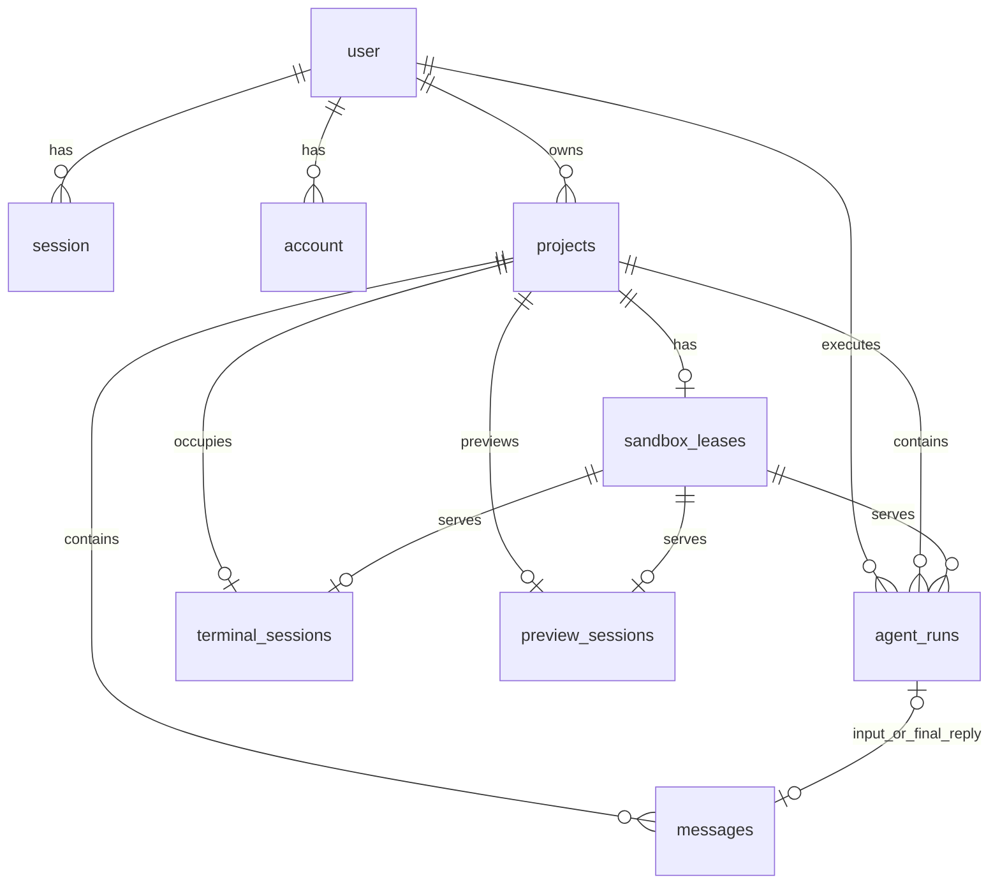

# D1 表设计

> 文档状态：当前 schema 基准
>
> 校准日期：2026-07-28
>
> 权威来源：`migrations/0001_app.sql` 至 `migrations/0007_agent_run_failure_codes.sql`

当前版本只使用 D1 保存产品状态。Project 文件、终端滚屏、Preview 内容、Git diff 和 raw Agent transcript 均不进入 D1，也没有 R2 副本。

## 1. 关系总览



`verification` 是 Better Auth 的独立验证记录，不直接外键到 User。

## 2. 表清单

| 表 | 类型 | 主要用途 | 保留策略 |
| --- | --- | --- | --- |
| `user` | 认证 | Better Auth 用户主体 | 用户存在期间保留。 |
| `session` | 认证 | 登录会话 | 由 Better Auth 创建、过期和删除。 |
| `account` | 认证 | 邮箱密码/未来身份提供方账号 | 当前主要使用 credential password。 |
| `verification` | 认证 | 临时验证 token | 由 Better Auth 管理。 |
| `projects` | 产品 | 用户拥有的 Project 元数据 | 保留到所有者执行受控硬删除。 |
| `sandbox_leases` | 产品控制面 | 每个 Project 的逻辑沙箱槽位和当前状态 | 与 Project 同生命周期；Provider 引用可清空。 |
| `messages` | 产品 | 用户输入和最终可见 assistant 回复 | 作为 Project 对话记录保留。 |
| `agent_runs` | 产品 | 每次 Agent 执行的状态、模型和聚合用量 | 作为运行与计量记录保留。 |
| `terminal_sessions` | 临时协调 | 当前 PTY 互斥、到期时间和私有 Provider 引用 | 关闭、断线清理或到期后删除。 |
| `preview_sessions` | 临时协调 | 当前 Preview 进程所有权和到期时间 | 停止、失效或到期后删除。 |

## 3. Better Auth 表

这些字段名和时间列命名遵循 Better Auth 的 D1 adapter，不应由产品 repository 直接改写。

### 3.1 `user`

| 列 | 类型/约束 | 含义 |
| --- | --- | --- |
| `id` | `TEXT PRIMARY KEY` | 用户 ID。 |
| `name` | `TEXT NOT NULL` | 显示名称。 |
| `email` | `TEXT NOT NULL UNIQUE` | 登录邮箱。 |
| `emailVerified` | `INTEGER NOT NULL` | 邮箱验证状态。 |
| `image` | `TEXT NULL` | 可选头像。 |
| `createdAt` | `DATE NOT NULL` | 创建时间。 |
| `updatedAt` | `DATE NOT NULL` | 更新时间。 |

删除 User 会级联删除 `session`、`account`、`projects` 和 `agent_runs`，并继续通过 Project 外键清理产品子记录。

### 3.2 `session`

| 列 | 类型/约束 | 含义 |
| --- | --- | --- |
| `id` | `TEXT PRIMARY KEY` | 会话 ID。 |
| `expiresAt` | `DATE NOT NULL` | 会话到期时间。 |
| `token` | `TEXT NOT NULL UNIQUE` | Better Auth 会话 token。 |
| `createdAt` / `updatedAt` | `DATE NOT NULL` | 生命周期时间。 |
| `ipAddress` | `TEXT NULL` | 可选来源 IP。 |
| `userAgent` | `TEXT NULL` | 可选 User-Agent。 |
| `userId` | `TEXT NOT NULL`，FK `user.id`，`ON DELETE CASCADE` | 所属用户。 |

索引：`session_userId_idx(userId)`。

### 3.3 `account`

| 列 | 类型/约束 | 含义 |
| --- | --- | --- |
| `id` | `TEXT PRIMARY KEY` | 账号记录 ID。 |
| `accountId` | `TEXT NOT NULL` | Provider 侧账号 ID。 |
| `providerId` | `TEXT NOT NULL` | 身份提供方 ID。 |
| `userId` | `TEXT NOT NULL`，FK `user.id`，`ON DELETE CASCADE` | 所属用户。 |
| `password` | `TEXT NULL` | credential 账号的密码哈希。 |
| `accessToken` / `refreshToken` / `idToken` | `TEXT NULL` | 第三方 Provider token 预留字段。 |
| `accessTokenExpiresAt` / `refreshTokenExpiresAt` | `DATE NULL` | token 到期时间。 |
| `scope` | `TEXT NULL` | Provider scope。 |
| `createdAt` / `updatedAt` | `DATE NOT NULL` | 生命周期时间。 |

索引：`account_userId_idx(userId)`。当前产品没有启用第三方登录，但保留 Better Auth 标准表结构。

### 3.4 `verification`

| 列 | 类型/约束 | 含义 |
| --- | --- | --- |
| `id` | `TEXT PRIMARY KEY` | 验证记录 ID。 |
| `identifier` | `TEXT NOT NULL` | 被验证的标识。 |
| `value` | `TEXT NOT NULL` | 验证值。 |
| `expiresAt` | `DATE NOT NULL` | 到期时间。 |
| `createdAt` / `updatedAt` | `DATE NOT NULL` | 生命周期时间。 |

索引：`verification_identifier_idx(identifier)`。

## 4. 产品核心表

### 4.1 `projects`

| 列 | 类型/约束 | 含义 |
| --- | --- | --- |
| `id` | `TEXT PRIMARY KEY` | Project ID。 |
| `user_id` | `TEXT NOT NULL`，FK `user.id`，`ON DELETE CASCADE` | 直接所有者。 |
| `title` | `TEXT NOT NULL` | Project 标题；API 限制为 1 至 120 个字符。 |
| `default_agent_runtime_id` | `TEXT NOT NULL DEFAULT 'pi'` | 默认 AgentRuntime。 |
| `created_at` / `updated_at` | `TEXT NOT NULL` | ISO 8601 时间。 |

索引：`projects_by_user_updated_at(user_id, updated_at DESC)`。

当前没有 Workspace、Team、Tenant、Session 或 Project member 表。`title` 不要求唯一。
Project 标题可更新；硬删除不新增字段或历史表。

### 4.2 `sandbox_leases`

| 列 | 类型/约束 | 含义 |
| --- | --- | --- |
| `id` | `TEXT PRIMARY KEY` | 逻辑 Lease ID。 |
| `project_id` | `TEXT NOT NULL UNIQUE`，FK `projects.id`，`ON DELETE CASCADE` | 保证一个 Project 最多一行 Lease。 |
| `sandbox_runtime_id` | `TEXT NOT NULL` | 当前 adapter 类型，如 `e2b` 或 `fake`。 |
| `provider_ref` | `TEXT NULL` | Worker 私有的当前 Provider sandbox 引用。 |
| `status` | `TEXT NOT NULL CHECK (...)` | `stopped`、`starting`、`ready`、`busy`、`idle`、`failed`。 |
| `created_at` / `updated_at` | `TEXT NOT NULL` | 生命周期和乐观并发时间戳。 |

索引：`sandbox_leases_by_status(status)`。

重要语义：

- `provider_ref = NULL` 表示当前没有可连接的物理沙箱。
- 公开 Project DTO 只返回 Lease ID、Runtime 类型、状态和更新时间，不返回 `provider_ref`。
- idle 回收和手动停止使用 `provider_ref + updated_at + status` 条件更新抢占所有权，防止旧清理任务停止新活动。

### 4.3 `messages`

| 列 | 类型/约束 | 含义 |
| --- | --- | --- |
| `id` | `TEXT PRIMARY KEY` | Message ID。 |
| `project_id` | `TEXT NOT NULL`，FK `projects.id`，`ON DELETE CASCADE` | 所属 Project。 |
| `agent_run_id` | `TEXT NULL`，FK `agent_runs.id`，`ON DELETE SET NULL` | assistant 最终回复关联的 Run；用户输入创建时为空。 |
| `sequence` | `INTEGER NOT NULL CHECK(sequence >= 0)` | Project 内严格排序号。 |
| `role` | `TEXT NOT NULL CHECK(role IN ('user','assistant'))` | 可见消息角色。 |
| `content` | `TEXT NOT NULL` | 用户输入或最终可见回复。 |
| `created_at` | `TEXT NOT NULL` | 创建时间。 |

约束和索引：

- `UNIQUE(project_id, sequence)`：同一 Project 内序号唯一。
- `messages_by_project_created_at(project_id, created_at ASC)`。
- `messages_one_assistant_per_run`：每个非空 `agent_run_id` 最多一条 assistant Message。

用户输入 Message 与 queued AgentRun 在同一个 D1 batch 中创建。Run 成功时，succeeded 状态、sandbox duration、assistant Message 和 Project `updated_at` 在另一个 D1 batch 中共同提交；若 Run 已进入 `cancelling` 或其他状态，该 batch 不写 assistant Message。

### 4.4 `agent_runs`

| 列 | 类型/约束 | 含义 |
| --- | --- | --- |
| `id` | `TEXT PRIMARY KEY` | AgentRun ID。 |
| `user_id` | `TEXT NOT NULL`，FK `user.id`，`ON DELETE CASCADE` | 所属用户，用于所有权和用量聚合。 |
| `project_id` | `TEXT NOT NULL`，FK `projects.id`，`ON DELETE CASCADE` | 所属 Project。 |
| `input_message_id` | `TEXT NULL`，FK `messages.id`，`ON DELETE SET NULL` | 本次 Run 的用户输入。 |
| `sandbox_lease_id` | `TEXT NOT NULL`，FK `sandbox_leases.id`，`ON DELETE RESTRICT` | 本次 Run 使用的逻辑 Lease。 |
| `agent_runtime_id` | `TEXT NOT NULL` | `pi` 或受控的 `goose`。 |
| `sandbox_runtime_id` | `TEXT NOT NULL` | 创建 Run 时绑定的 SandboxRuntime。 |
| `model_id` | `TEXT NOT NULL` | 创建 Run 时绑定的模型。 |
| `status` | `TEXT NOT NULL CHECK (...)` | Run 状态机。 |
| `input_tokens` / `output_tokens` / `total_tokens` | 非负 `INTEGER`，默认 `0` | ModelGateway 累加的 token usage。 |
| `model_request_count` | 非负 `INTEGER`，默认 `0` | 成功记录 usage 的模型请求数。 |
| `sandbox_duration_ms` | 非负 `INTEGER`，默认 `0` | 真实 Sandbox Run 的执行时长。 |
| `provider_process_ref` | `TEXT NULL` | Worker 私有的 Agent 进程引用。 |
| `failure_code` | 受控 `TEXT NULL` | 稳定 Run 失败码；由状态组合 trigger 约束。 |
| `failure_reason` | `TEXT NULL` | 远程增量迁移保留的遗留物理列；当前产品代码不读取且每次状态迁移都会清空。 |
| `created_at` / `started_at` / `finished_at` | `TEXT` | 生命周期时间；后两者可空。 |

状态集合：

```text
queued -> starting -> running -> succeeded
   |         |          |
   |         +----------+-> cancelling -> cancelled
   +------------------------> cancelled
   +------------------------> failed

starting/running/cancelling -> failed | timed_out | interrupted
```

终态为 `succeeded`、`failed`、`cancelled`、`timed_out`、`interrupted`，终态不可再次迁移。

`failure_code` 组合必须满足：

- `succeeded`、`cancelled` 和全部非终态为 `NULL`；
- `timed_out` 固定为 `run.timed_out`；
- `interrupted` 固定为 `run.interrupted`；
- `failed` 必须是 `run.start_failed`、`run.sandbox_failed`、
  `run.agent_protocol_failed`、`run.agent_process_failed`、`run.model_failed`、
  `run.no_visible_reply` 或 `run.internal_failed`。

约束和索引：

- `agent_runs_one_active_per_project` 是部分唯一索引：同一 Project 在 `queued`、`starting`、`running`、`cancelling` 中最多一行。
- `agent_runs_by_project_created_at(project_id, created_at DESC)`。
- `agent_runs_by_user_created_at(user_id, created_at DESC)`。
- 列表 API 只读取最新 50 条，但表本身不自动删除更早记录。

### 4.5 跨表完整性与状态机 trigger

`0006_integrity_guards.sql` 在外键和唯一索引之外增加以下数据库最终边界：

| Trigger | 强制规则 |
| --- | --- |
| `agent_runs_validate_insert_ownership` | Run 的 `user_id` 必须拥有 Project；Lease 必须属于同一 Project 且 Runtime 一致；输入 Message 必须是同 Project 的未关联 user Message。 |
| `agent_runs_validate_status_transition` | 只允许当前领域状态机中的迁移；终态不能再次迁移。 |
| `agent_runs_validate_failure_code_insert/update` | 强制 Run status 与稳定 `failure_code` 的合法组合，禁止失败自由文本承担产品语义。 |
| `messages_validate_agent_link` | user Message 不能关联 Run；assistant Message 必须关联同 Project 的 succeeded Run。 |
| `terminal_sessions_validate_lease` | TerminalSession 的 Lease 必须属于同一 Project。 |
| `preview_sessions_validate_lease` | PreviewSession 的 Lease 必须属于同一 Project，且私有 Provider sandbox 引用必须与当前 Lease 一致。 |

application 层仍负责提前校验和友好错误，但不能替代这些约束。关键迁移、trigger、D1 batch 回滚和仓储 SQL 由 `@cloudflare/vitest-pool-workers` 在真实 Workers/D1 测试运行时执行，不再只依赖 mock SQL 测试。

## 5. 临时协调表

### 5.1 `terminal_sessions`

| 列 | 类型/约束 | 含义 |
| --- | --- | --- |
| `id` | `TEXT PRIMARY KEY` | TerminalSession ID。 |
| `project_id` | `TEXT NOT NULL UNIQUE`，FK `projects.id`，`ON DELETE CASCADE` | 每个 Project 最多一个 Terminal。 |
| `sandbox_lease_id` | `TEXT NOT NULL`，FK `sandbox_leases.id`，`ON DELETE CASCADE` | 使用的 Lease。 |
| `provider_sandbox_ref` | `TEXT NULL` | 启动阶段绑定的私有 sandbox 引用。 |
| `provider_process_ref` | `TEXT NULL` | 启动完成后的私有 PTY 引用。 |
| `expires_at` | `TEXT NOT NULL` | 强制到期时间。 |
| `created_at` / `updated_at` | `TEXT NOT NULL` | 协调时间戳。 |

`agent_runs_block_active_terminal` trigger 在存在 TerminalSession 时阻止插入 AgentRun，并以 `project_terminal_active` 中止事务。应用层同时做提前检查；数据库 trigger 是最终互斥边界。

Terminal 字节流不进入此表。

### 5.2 `preview_sessions`

| 列 | 类型/约束 | 含义 |
| --- | --- | --- |
| `id` | `TEXT PRIMARY KEY` | PreviewSession ID。 |
| `project_id` | `TEXT NOT NULL UNIQUE`，FK `projects.id`，`ON DELETE CASCADE` | 每个 Project 最多一个 Preview。 |
| `sandbox_lease_id` | `TEXT NOT NULL`，FK `sandbox_leases.id`，`ON DELETE CASCADE` | 使用的 Lease。 |
| `provider_sandbox_ref` | `TEXT NOT NULL` | Worker 私有 sandbox 引用。 |
| `provider_process_ref` | `TEXT NULL` | `starting` 时可空，`running` 时存在。 |
| `status` | `TEXT NOT NULL CHECK(status IN ('starting','running'))` | 当前启动状态。 |
| `port` | `INTEGER NOT NULL CHECK(port = 3000)` | 平台固定 Preview 端口。 |
| `expires_at` | `TEXT NOT NULL` | 强制到期时间。 |
| `created_at` / `updated_at` | `TEXT NOT NULL` | 协调时间戳。 |

`agent_runs_block_starting_preview` trigger 只在 Preview 仍处于 `starting` 时阻止插入 AgentRun。运行中的 Preview 可以与 AgentRun 并行，但 Terminal、停止沙箱和再次启动 Preview 仍受应用层互斥约束。

## 6. 用量模型

系统不新增 usage、ledger 或 invoice 表。用量事实直接存在 `agent_runs`：

```text
input_tokens
output_tokens
total_tokens
model_request_count
sandbox_duration_ms
```

`GET /api/usage` 按当前 `user_id` 对全部 AgentRun 做 all-time 聚合，并分别按 Project 和 AgentRuntime 分组。它用于成本观察，不代表可结算账单：

- 没有价格快照、货币、税、折扣或 Provider 账单对账。
- 没有额度、预授权、余额扣减或超额阻断。
- Provider 返回且成功写入的 usage 才会计入 D1。
- Project 硬删除会级联删除其 AgentRun，因此这些 Run 不再计入 Usage。

## 7. 删除与重建策略

- 删除 User 或 Project 时，外键按上文规则级联；`agent_runs.sandbox_lease_id` 使用
  `RESTRICT`，因此只能删除 Project 聚合，不能先随意直删 Lease。
- 公开 Project 硬删除用例先验证所有权与活动资源，再停止空闲 Provider sandbox，最后
  删除 Project。Message、AgentRun、Usage、Lease 和临时协调行随外键级联删除。
- 没有软删除、回收站、删除历史或恢复副本。已休眠的 Run idle-cleanup Workflow
  发现对应 Run 已删除时直接 no-op。
- `terminal_sessions` 和 `preview_sessions` 是可重建的临时协调状态，不是审计历史。
- 本项目处于个人开发阶段，本地 D1 历史不构成兼容负担。schema 需要调整时，可以重建本地数据库和迁移；远程资源或未知数据不能未经确认删除。

## 8. 明确不建表的概念

当前 schema 有意不包含：

- Workspace、Tenant、Team、Organization、Membership。
- ConversationSession 或持久 Agent Session。
- ProjectRevision、FileSnapshot、SandboxHistory。
- RawTranscript、ToolInvocation、TerminalLog、PreviewHistory、GitChangeHistory。
- Plan、Subscription、Invoice、Payment、Credit、QuotaLedger。
- BYOK credential。

相关边界见 [当前项目架构](./current-architecture.md) 和 [平台限制](./platform-limits.md)。
