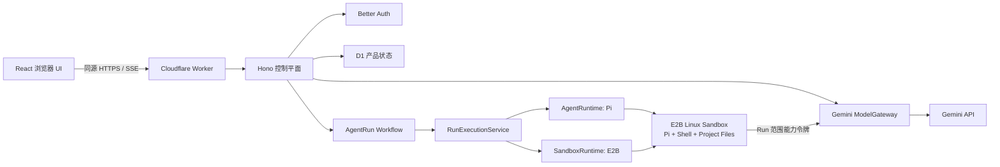
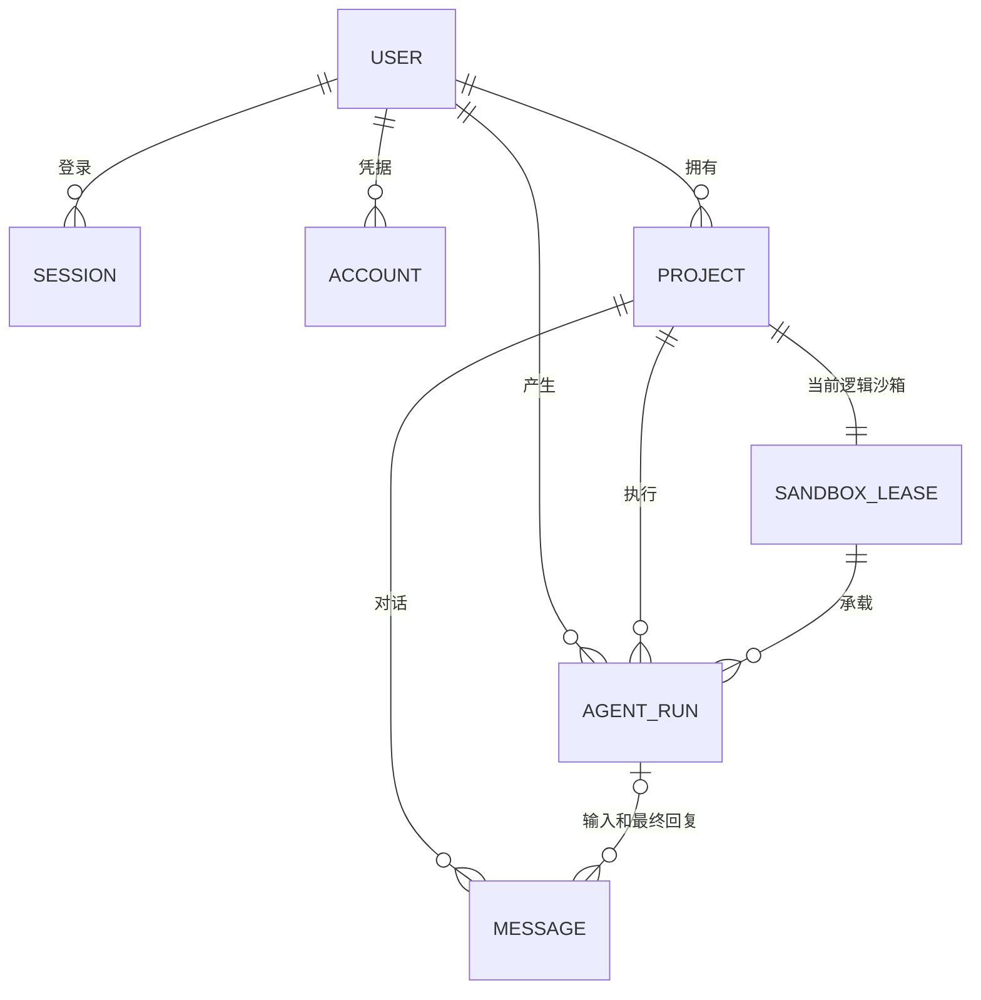

# 2026-07-26 D2 阶段基线

> 状态：D0、D1、D2 已完成；下一阶段进入 D3 受控 Project 能力。
> 本文是阶段性事实快照。长期架构约束仍以 ADR、`CONTEXT.md` 和架构文档为准。
> 后续进度：Files、Usage、Terminal 和 Project Preview 已完成；Goose 已完成门控
> spike。当前状态见 [README](../../README.md) 和更晚的 `docs/status/` 记录。

## 1. 当前产品

Agent Online 是一个单 Worker 部署的 Hosted Coding Agent：

- React 提供浏览器控制台，Hono 提供同源控制面 API；
- Better Auth 负责邮箱密码登录；
- D1 保存认证和产品状态；
- Cloudflare Workflow 拥有每个 AgentRun 的异步生命周期；
- Pi Agent 在 E2B Linux 沙箱内运行；
- Worker ModelGateway 持有平台 Gemini Key，默认模型为 `gemini-3.6-flash`；
- Project 文件只存在于当前沙箱，不写入 D1 或 R2。

## 2. 当前 D1 表

| 表 | 责任 |
| --- | --- |
| `user` | Better Auth 用户。 |
| `session` | 登录 Session、Cookie token 和过期时间。 |
| `account` | 邮箱密码凭据及未来 Provider 账号字段。 |
| `verification` | Better Auth 验证基础表；当前未接邮件验证服务。 |
| `projects` | 用户拥有的 Project 元数据和默认 AgentRuntime。 |
| `sandbox_leases` | 每个 Project 唯一的逻辑沙箱记录和服务端私有 Provider 引用。 |
| `messages` | 用户可见的 user/assistant 消息。 |
| `agent_runs` | 一次 Agent 执行的状态、Runtime、模型、聚合 usage、耗时和私有进程引用。 |

关键约束：

1. 一个 Project 只有一条 `SandboxLease`。
2. 一个 Project 同时最多一个非终态 `AgentRun`。
3. 一个 Run 最多一条最终 assistant Message。
4. Message 在 Project 内使用唯一 `sequence`。
5. token、模型请求数和沙箱耗时直接聚合在 `agent_runs`。
6. 不建立产品 Session、文件、沙箱历史、Revision、usage event 或 BYOK 表。

## 3. D2 远程验收

私有 Cloudflare Preview 已完成：

- Worker、React Assets、D1、Workflow、加密 Secret 和邮箱 allowlist；
- owner 注册、登录、Project 创建和刷新恢复；
- E2B 模板启动 Pi，并通过 Worker ModelGateway 调用 Gemini 3.6 Flash；
- Pi 使用沙箱文件工具，连续 Run 复用仍存活的 Project 文件；
- D1 写入最终 assistant Message 和真实 token、模型请求数、沙箱时长；
- UI 取消只终止当前 Pi 进程，Run 收敛为 `cancelled`；
- 临时 8 秒 deadline 使长任务收敛为 `timed_out`，正式值随后恢复为 1800 秒；
- 正式配置传播后，Workflow `execute agent run` 步骤确认为 1830 秒 timeout；
- 最终 Run 空闲 10 分钟后，Workflow 返回 `detached=true, stopped=true`；
- D1 Lease 收敛为 `stopped` 并清空 Provider 引用，页面同步显示“已停止”。

当前 Preview 仍是私有开发环境，不代表可以开放匿名注册。复杂任务下的
Workflow Free CPU 和 subrequest 限制仍需持续观察。

## 4. 外部依赖与成本

以下结论核对日期为 2026-07-26：

| 依赖 | 当前使用 | 成本结论 |
| --- | --- | --- |
| Cloudflare Worker | Hono API、ModelGateway、同域入口。 | Workers Free 可运行；动态请求和 CPU 有每日/单次限制。 |
| Cloudflare Static Assets | React 构建产物。 | 静态资源请求和存储当前无额外费用。 |
| Cloudflare D1 | 认证和产品状态。 | Free 包含每天 500 万行读取、10 万行写入和总计 5GB。 |
| Cloudflare Workflows | AgentRun owner、deadline、TTL。 | Workers Free 可用；Free 包含每天 3,000 steps 和 1GB Workflow 状态。 |
| Workers Logs | 受控 Worker 日志。 | Free 包含每天 200,000 条事件，保留 3 天。 |
| Better Auth | Worker 内自托管认证库。 | 开源框架，无托管服务费用。 |
| Gemini API | `gemini-3.6-flash`。 | 当前模型有 Free Tier；本项目按 owner 的模型额度不计成本。 |
| E2B | 当前真实 Sandbox Provider。 | Hobby 基础套餐为 $0，但计算按秒计费；只有一次性 $100 credits，不是永久免费算力。 |
| Pi、Hono、React | 开源代码依赖。 | 无单独托管费用。 |

当前开发期通常可以保持账单为 $0，但 E2B credits 是最先可能耗尽的资源。
`RUNTIME_IDLE_TTL_SECONDS=600` 用于限制空闲沙箱消耗。

当前没有使用 R2、KV、Queues、Durable Object、Cloudflare Containers、
Cloudflare Sandbox SDK、Sentry、支付服务、邮件服务或 OAuth Provider。
未来若改用 Cloudflare Sandbox/Containers，需要 Workers Paid，不能再宣称
全部运行在 Cloudflare Free。

官方依据：

- [Cloudflare Workers 定价](https://developers.cloudflare.com/workers/platform/pricing/)
- [Cloudflare Static Assets 计费](https://developers.cloudflare.com/workers/static-assets/billing-and-limitations/)
- [Cloudflare D1 定价](https://developers.cloudflare.com/d1/platform/pricing/)
- [Cloudflare Workflows 定价](https://developers.cloudflare.com/workflows/reference/pricing/)
- [Cloudflare Workers Logs](https://developers.cloudflare.com/workers/observability/logs/workers-logs/)
- [Cloudflare Sandbox SDK](https://developers.cloudflare.com/sandbox/)
- [E2B 定价](https://e2b.dev/pricing)
- [Gemini API 定价](https://ai.google.dev/gemini-api/docs/pricing)
- [Better Auth 定价](https://better-auth.com/pricing)

## 5. D3 实施顺序

D3 按纵切依次推进，不同时开放多个高风险能力：

1. **受控只读 Files**：目录列表、文本读取、路径规范化、大小限制、二进制拒绝和完整 UI 状态。
2. **用量聚合**：实现当前用户 `/api/usage`；随后增加受 `ADMIN_EMAILS` 保护的维护者汇总。
3. **受控 Terminal**：项目级临时命令会话、时长/输出限制、并发仲裁和脱敏事件流。
4. **Preview**：代理沙箱开发服务，但不向浏览器暴露内部端口或 Provider URL。
5. **Changes**：基于沙箱中真实 Git 状态展示受控 diff，不建立平台文件历史。
6. **可选观测**：在严格脱敏后评估 Sentry，不启用 Session Replay 或 transcript 采集。

只读 Files 的第一版不新增 D1 表、R2、第二个 Worker 或第二个后端服务。
Files API 只接受 Project ID 和受限相对路径；浏览器不能提交 Provider ID。

## 6. 仍不在范围内

- 团队、组织、Tenant 和共享 Project；
- 支付、套餐、订阅、credit 和发票；
- R2 文件恢复、Revision、分支沙箱和历史沙箱；
- BYOK、第三方登录和公开模型选择；
- Goose、Claude Code 或 Codex CLI；
- 匿名开放真实 Sandbox Runtime。
